# What Is A Blockchain

## What Is a Blockchain? From Centralized Problems to a Decentralized Solution

To truly grasp what a blockchain is, we must first understand the fundamental problems it was designed to solve. At its core, blockchain technology is a response to the vulnerabilities and limitations inherent in centralized systems, from the way we manage money to how we make collective agreements.

### The Problem: A World Built on Centralized Trust

Our modern world runs on intermediaries. We trust banks to manage our money, tech companies to hold our data, and election committees to count our votes. While often efficient, this reliance on a central authority creates significant issues related to control, permission, and trust.

#### The Flaws of Centralized Money

In the traditional financial system, sending money isn’t a direct exchange. It’s a request to a central intermediary, like a bank, to update their private records. You trust them to debit your account and, in coordination with other banks, credit the recipient's account. This system places immense power in the hands of a few.

-   **Absolute Control:** A central institution has the unilateral power to freeze your assets, block transactions, or deny you service entirely. You must have their permission to use your own money.
-   **Exclusion:** This system can easily exclude people. Consider a freelancer in a country without a robust banking infrastructure. They may not be able to open a bank account without a permanent address—a requirement set by the bank—making it impossible for them to get paid by international clients. They are locked out of the global economy by a centralized gatekeeper.
-   **Lack of Privacy and Censorship:** When Ethereum creator Vitalik Buterin wanted to donate to humanitarian efforts in Ukraine in 2022, using the traditional banking system would have created a public paper trail. This could have alerted hostile governments and put the recipients at risk. By using cryptocurrency on a blockchain, he was able to transfer funds instantly and without a central party that could block, monitor, or censor the transaction.

#### The Challenge of Centralized Agreements

Beyond finance, we rely on central authorities to act as the source of truth for collective agreements. This works only as long as everyone trusts that authority to be fair and honest.

Imagine a simple town election between the Apple, Pear, and Banana parties. A central committee collects and counts all the paper ballots in private. When they announce the Apple Party as the winner, chaos erupts. The losing parties claim the vote was rigged, but they have no way to independently verify the results. The committee holds the "truth," and if trust in them erodes, the entire system's legitimacy collapses.

This isn't just a theoretical problem. When questions of fraud arise in major elections, the underlying issue is the same: citizens cannot independently audit the process. They are forced to trust an intermediary, and when that trust is questioned, there is no mathematical or verifiable way to settle the dispute.

### The Solution: A Trust-Minimized System

Blockchain technology offers a new model for money and agreements—one that doesn't require trusting a person or institution. Instead, it creates a **trust-minimized system** where participants rely on transparent, verifiable mathematics and code. It achieves this through a few core concepts.

#### The Shared, Decentralized Ledger

Instead of each bank maintaining its own secret ledger, a blockchain is a **single, shared, and distributed digital ledger**. Think of it as a global record book that is copied and spread across thousands of computers worldwide. Each computer or participant that holds a copy of this ledger is called a **node**.

These nodes form a decentralized, peer-to-peer (P2P) network. There is no central server or single point of failure. When a new transaction occurs, it is announced to the network and propagates from node to node, almost like gossip, until every participant has an identical, up-to-date copy of the ledger.

#### Blocks: The Pages of the Ledger

Transactions are not added to this shared ledger one by one. Instead, they are collected and bundled together into groups called **blocks**. You can think of a block as a single page in our global record book. Once a page is filled with a list of verified transactions, it is ready to be added to the book.

#### The Chain: A Cryptographic Link of Trust

This is where the "chain" in blockchain comes from. Blocks are linked together chronologically and secured using cryptography, creating a permanent and unbroken history.

Here’s how it works:

1.  **The Hash:** When a block is created, all the transaction data inside it is passed through a cryptographic algorithm to produce a unique code called a **hash**. This hash acts like a digital fingerprint or a "seal of approval" for that specific block. If even a single character in the transaction data is changed, the hash will change completely.
2.  **Linking the Chain:** Each new block contains two key cryptographic elements: its own unique hash and the hash of the _previous_ block. This is the crucial link. By including the previous block’s fingerprint, it creates a mathematical chain connecting every block all the way back to the very first one.

This structure is what makes a blockchain **tamper-proof**, or **immutable**. If a malicious actor tried to alter a transaction on an old block—say, on Page 10 of the ledger—it would change the hash (the "fingerprint") of Page 10. This would instantly "break the seal." Because Page 11 contains the original, valid hash of Page 10, the link between them would sever. This break would cascade down the entire rest of the chain, making the tampering immediately obvious to all other nodes on the network. The network would automatically reject this fraudulent version of the ledger, preserving the integrity of the true record.

#### Digital Currency: The Fuel for the Network

To operate a decentralized financial system without banks, blockchains use their own **digital currencies** (cryptocurrencies). These are currencies that exist purely on the ledger itself, allowing users to transfer value directly and securely within this new trust-minimized framework, without needing permission from any central authority.

In summary, a blockchain is a decentralized, distributed, and shared digital ledger. It is composed of **blocks** of transactions linked together chronologically to form a **chain**. This chain is secured with **cryptography**, making it a permanent and tamper-proof history of all activity. By removing the need for a trusted central intermediary, it empowers users to transact and agree with one another in a more transparent, secure, and open way.

## History Of Blockchain

### The Genesis of Blockchain: From Digital Cash to Bitcoin

To understand the power and purpose of blockchain technology, we must first look to its origins in the long-standing quest for a true digital currency. This journey began not with blockchains themselves, but with the fundamental challenges of creating and transferring value in a digital world. The story starts with a critical problem that stumped computer scientists for decades and culminates in the creation of Bitcoin, the first technology to solve it.

### Bitcoin: The First Decentralized Digital Currency

In 2008, an anonymous person or group known as Satoshi Nakamoto published a paper that introduced Bitcoin. More than just a digital currency, Bitcoin is also the name of the decentralized network—the blockchain—on which it operates. It quickly earned the moniker "digital gold" for a key reason: like the precious metal, it has a provably **finite supply**. The code dictates that a maximum of 21 million Bitcoin will ever be created, making it a scarce digital asset.

Bitcoin's primary innovation was revolutionary: it was the first system that allowed two people, anywhere in the world, to send and store value digitally without relying on a trusted intermediary like a bank, credit card company, or government. While it wasn't the first attempt at digital cash, it was the first to successfully solve a critical flaw known as the double-spend problem.

### Solving the Double-Spend Problem

The double-spend problem is the inherent risk that a unit of digital currency can be spent more than once. With physical cash, this is impossible; once you hand someone a $20 bill, you no longer possess it to spend again. Digital information, however, is different.

Think of it like emailing a photograph. When you send a photo to a friend, you don't lose your copy; you simply create a duplicate. If digital money worked the same way, you could send someone $100, they would receive it, and you would still have the original $100 to spend again. This ability to duplicate money would render any digital currency worthless.

Early attempts at digital currencies, such as DigiCash in the 1980s, tried to solve this. DigiCash’s solution was to use a **central authority**—a single company—to keep a master ledger of all balances and validate every transaction. This worked, but it introduced a fatal flaw. The central entity had absolute control, giving it the power to freeze funds, reject transactions, and censor users. This defeated the core purpose of creating a monetary system free from centralized control and single points of failure.

### The Challenge of Decentralized Trust: The Byzantine Generals Problem

The challenge of building a system that can agree on a single source of truth without a central leader is a classic computer science dilemma known as the **Byzantine Generals Problem**.

The analogy goes like this: A group of Byzantine generals has surrounded an enemy city. They must all agree on a coordinated time to attack. They can only communicate via messengers, but some of the generals or messengers could be traitors who will deliver false information to sabotage the plan. How can the loyal generals reach a consensus and ensure a successful, unified attack?

This is directly analogous to a decentralized network of computers (nodes) trying to maintain a currency ledger. The network must collectively agree on which transactions are valid and in what order they occurred, even if some nodes on the network are malicious and trying to spread false information (like attempting to double-spend).

### Satoshi Nakamoto's Breakthrough: The Bitcoin Whitepaper

Satoshi Nakamoto's 2008 whitepaper proposed an elegant solution to both the double-spend problem and the Byzantine Generals Problem. The solution was Bitcoin, a system built on a new technology: the blockchain.

The core idea was to eliminate the need for a central authority by distributing the transaction ledger to everyone on the network. In this peer-to-peer system, every participant holds a copy of the entire history of transactions. When a new transaction occurs, the network collectively works to verify it, bundle it into a "block," and add it to the "chain" of previous blocks, creating a permanent and unchangeable record.

This design created a **credibly neutral** system.

-   **Neutrality:** The network is impartial. It doesn't know or care about a user's identity, location, wealth, or the purpose of their transaction. It simply processes valid transactions according to the rules written in its code.
-   **Credibility:** The system’s neutrality is not based on trust in a person or institution that could be biased. It is credible because its rules are built into its open-source code and enforced by the entire decentralized network.

The result is a global, permissionless, and censorship-resistant monetary system accessible to anyone with an internet connection. This has life-changing implications for individuals in countries with unstable currencies, restrictive financial systems, or for the billions of people excluded from traditional banking.

### Ethereum: The Evolution to a World Computer

A few years after Bitcoin's creation, a young developer named Vitalik Buterin saw an opportunity to expand on its core concepts. He believed the principle of a credibly neutral system could be applied to more than just money—it could be applied to **agreements**.

In 2015, Buterin and a team of co-founders launched **Ethereum**. Like Bitcoin, Ethereum has its own native digital currency, **Ether (ETH)**, which is used to power the network. But Ethereum's true superpower is its ability to run computer code on the blockchain. This capability allows it to execute "unbreakable agreements" known as smart contracts.

### Smart Contracts: Code as Unbreakable Law

The concept of a smart contract was first described by cryptographer Nick Szabo in 1994, but it was blockchain technology that finally made it practical. A smart contract is a digital agreement where the terms are written directly into lines of code. This code lives on the blockchain, and the network itself automatically enforces the rules and executes the outcomes of the contract.

Consider the difference between a traditional agreement and a smart contract:

-   **Traditional Agreement (Buying a House):** This process involves numerous trusted intermediaries like banks, lawyers, and title agents. It is slow, expensive, and requires you to trust that each party will act honestly and efficiently.
-   **Smart Contract Agreement (Flight Insurance):** Imagine an insurance policy written as a smart contract. The terms are simple: "IF flight is delayed by more than 24 hours, THEN automatically refund the passenger's ticket." The smart contract is connected to a reliable flight data source. If the condition is met, the code executes automatically, sending the refund to your digital wallet within minutes. There is no claim to file, no company to argue with, and no possibility for the insurer to change the terms or refuse to pay. The agreement is enforced by the immutable logic of the code.

### Bitcoin vs. Ethereum: Calculator vs. Computer

A simple analogy helps clarify the fundamental difference between these two pioneering blockchains:

-   **Bitcoin is like a calculator.** It is designed with intentional simplicity to do one thing exceptionally well: serve as a secure, decentralized store of value and medium of exchange. Its functionality is deliberately limited (it is **Turing incomplete**) to maximize security and reliability.
-   **Ethereum is like a world computer.** It can do everything Bitcoin can do, but its purpose is far broader. As a **Turing complete** system, it is designed to be a flexible platform on which developers can build and run a vast range of unstoppable applications and complex agreements using smart contracts.

## Benefits Of Blockchain

### The Permissionless Power of Blockchain

To understand why blockchain technology is so revolutionary, we first need to look at a fundamental concept: ownership. In the traditional financial world, your access to your own money is based on permission. Think about it—you need a bank's permission to open an account, to send money internationally, to withdraw large sums, or to make a major purchase. These intermediaries have ultimate control. They grant you permission to use your funds, and that permission can be revoked at any time. This raises a critical question: if someone else can deny you access to your money, is it even really yours?

Blockchains flip this model on its head by being **permissionless**. On a blockchain network, you have true ownership and control over your assets. There is no central authority or intermediary that can deny you access to the network or prevent you from sending a transaction. You don't need to ask for permission to use what is rightfully yours. This shift from a permissioned system to a permissionless one restores power and autonomy to the individual.

### Credible Neutrality: A System Without Favorites

Traditional financial systems are not always neutral. They can, and often do, discriminate. Access to services can be denied based on your nationality, your credit score, or even your political views. Many systems require a government-issued ID or a physical address, automatically excluding millions of people around the globe. Banks can block international payments to certain countries, effectively cutting off entire populations from the global economy.

Blockchains, by contrast, are **credibly neutral**. The underlying protocol—the code that runs the network—is designed to be impartial. It doesn't know your name, your location, your wealth, or your background. The system literally cannot play favorites because it is just code following rules. Transactions are validated based on mathematical principles, not human bias. This creates a level playing field where the rules apply equally to everyone, regardless of who they are or where they come from.

### Decentralization: The Unstoppable Network

The power behind these benefits comes from decentralization. Traditional systems are centralized, meaning they have a single point of control and, therefore, a single point of failure. A government can shut down a bank. A bank can freeze your account. A company can go bankrupt, taking customer funds with it. If a central server is seized or goes offline, the entire service can collapse.

A blockchain is **decentralized**. It isn't run by a single company or stored on a single server. Instead, it is maintained by a global network of thousands of computers (nodes), each storing an identical copy of the information. There is no central point of control to attack or shut down. To stop the network, you would effectively have to shut down the internet itself. Even if governments or banks try to block it, the network continues to run and process transactions because no single entity controls it. This makes it incredibly resilient, secure, and unstoppable.

### Immutability and Transparency: Building Trust with Code

Finally, traditional financial and legal systems are often opaque. Key decisions and actions happen behind closed doors. Furthermore, the rules can change without warning. A bank might change its fee structure, a company can update its terms of service long after you've agreed to them, and governments can alter regulations overnight. This creates uncertainty and a lack of trust.

Blockchains provide a foundation of trust through **immutability** and **transparency**.

-   **Transparency:** All transactions recorded on a public blockchain are visible to everyone. Anyone can audit the network to verify where funds are moving and confirm that the system is operating as expected. The rules of the protocol are also written in open-source code, available for anyone to inspect.
-   **Immutability:** Once a transaction is validated and added to the blockchain, it cannot be changed, altered, or deleted. This creates a permanent, unchangeable record of history.

Together, these features ensure that the system is both predictable and trustworthy. You don't have to trust a person or a company to act honorably; you only have to trust the code, which operates exactly as it is written for all to see.

## Use Cases Of Blockchains

### Practical, Real-World Use Cases of Blockchain Technology

Beyond the hype and speculation, what are the tangible problems that blockchain technology is solving today? This lesson explores the practical, real-world applications of blockchains, moving from foundational concepts like digital money to revolutionary ideas like decentralized governance and digital ownership.

### Key Blockchain Applications: From Digital Money to Smart Contracts

Blockchain's capabilities can be broken down into several key categories that are already creating significant impact across various industries.

#### Digital Money and Decentralized Finance (DeFi)

This is the most well-known application of blockchain. At its core, blockchain technology enables the creation of digital money, or cryptocurrency, that can be sent directly between individuals over the internet without intermediaries like banks. Bitcoin (BTC) on the Bitcoin blockchain and Ether (ETH) on Ethereum are prime examples.

This concept extends far beyond simple digital cash into the world of Decentralized Finance (DeFi). A critical innovation within DeFi is the **stablecoin**.

-   **Stablecoins:** These are digital currencies designed to maintain a stable value, often by being pegged to a real-world asset like the US dollar. For example, **USDC (USD Coin)** is a digital dollar where 1 USDC is designed to always equal $1. This provides a life-changing solution for people in countries experiencing hyperinflation, allowing them to protect their savings from the rapid devaluation of their local currency by holding a stable digital asset.

#### Decentralized Agreements with Smart Contracts

Blockchains enable the creation of deterministic, tamper-proof agreements known as smart contracts. Think of them as traditional legal contracts, but with their terms written in code and stored on the blockchain. These contracts automatically execute when their predefined conditions are met, making them transparent, immutable, and highly efficient.

-   **Example: Automated Insurance:** An insurance policy can be written as a smart contract. If a verifiable event, such as a major flood reported by a trusted data source, occurs, the smart contract can automatically execute the payout to the policyholder. This deterministic process eliminates administrative overhead, the need to file a claim, and the reliance on an insurance company's approval, ensuring a fast and fair settlement.

#### Solving Cross-Border Payments

The traditional system for sending money internationally is often described as broken—it's slow, expensive, and inaccessible to many. Services like PayPal or Venmo are not universally available, and wire transfers can take days to clear while incurring high fees.

Blockchain offers a powerful solution. It allows anyone to send value to anyone else, anywhere in the world, at any time. Transactions are typically settled in minutes, not days, and for a fraction of the cost. Applications like **Klever** leverage this technology to make sending money to a friend in another country as seamless as sending a text message.

#### Verifiable Digital Ownership

Blockchain provides a revolutionary way to prove ownership of both digital and physical assets. By representing ownership as a unique token (like an NFT) on an immutable ledger, it creates a universally verifiable and unfalsifiable certificate of authenticity.

This has profound implications for a wide range of assets:

-   **Digital Art & Music:** Creators can sell their work directly to fans, bypassing traditional gatekeepers like galleries or record labels that take a significant cut.
-   **In-Game Items:** Gamers can gain true ownership of the items they earn or purchase in video games, allowing them to trade or sell them on open marketplaces.
-   **Educational Certificates:** Academic and professional credentials can be issued on-chain, making them instantly verifiable and fraud-proof.
-   **Real-World Assets:** Physical assets, like real estate, can be "tokenized" and recorded on the blockchain, enabling new models like fractional ownership where multiple people can invest in a single property.

#### Democratizing Access to Financial Services

Billions of people globally are either "unbanked" or "underbanked," meaning they lack access to fundamental financial services like savings accounts, loans, or investment opportunities.

Blockchain and DeFi change this paradigm. With only a smartphone and an internet connection, anyone can access the same sophisticated financial tools that were once reserved for Wall Street. Users can trade assets, earn interest on savings, and invest to build wealth, regardless of their geographic location or socioeconomic status.

#### New Models of Governance with DAOs

Blockchain enables new forms of community-led decision-making through **Decentralized Autonomous Organizations (DAOs)**. A DAO functions like an internet-native organization or club where members use tokens to vote on proposals that dictate the group's rules and actions.

The entire process—from proposal to vote to execution—is transparently recorded on the blockchain. The outcomes are automatically implemented by smart contracts, ensuring that the community's decisions are carried out without the risk of censorship or manipulation by a central authority.

### Understanding Key Terminology

To navigate this space, it's essential to understand a few core concepts that define the technological shift underway.

-   **DApp (Decentralized Application):** A DApp is an application (like a website or mobile app) whose backend logic runs on a decentralized blockchain network instead of on centralized servers owned by a single company. If a service like Google ran its backend on a blockchain, it would be considered a DApp.
-   **The Evolution of the Web:**
    -   **Web1:** The initial phase of the internet, characterized by static, "read-only" websites.
    -   **Web2:** The "read-write" internet we use today. It's interactive and social, but our data and content are controlled by the large corporations that own the platforms.
    -   **Web3:** The next evolution of the internet, built on blockchain technology. It introduces smart contracts and digital ownership, creating an open internet where users have true control over their data and digital assets.

### Addressing Common Criticisms of Blockchain

As with any transformative technology, blockchain faces its share of skepticism. Here are answers to some of the most common concerns.

1.  **"Isn't it just for criminals?"**
    While any tool, including cash and the internet, can be used for illicit activities, blockchain transactions are fundamentally public and traceable. This permanent, immutable record makes it a challenging tool for anonymous crime. The technology itself is neutral, and its positive impact—such as providing financial access to billions of unbanked people—vastly outweighs its potential for misuse.

2.  **"Isn't it bad for the environment?"**
    This criticism is largely aimed at older blockchains like Bitcoin that use an energy-intensive consensus mechanism. However, the vast majority of modern blockchains are incredibly energy-efficient. After its major upgrade known as "The Merge," the Ethereum network now consumes significantly less energy than traditional banking systems and even large tech companies like Google or Netflix.

3.  **"Isn't it too complicated for the average person?"**
    The underlying technology is complex, but the user experience is improving at a rapid pace. Most people use the internet every day without understanding the intricate protocols like TCP/IP that make it work. Similarly, you won't need to be a blockchain expert to use DApps. The industry is focused on abstracting away the complexity to create simple, intuitive applications for everyone.

### The Future Powered by Blockchain

At its core, a blockchain is a shared, immutable ledger that allows communities to agree on what is true without needing to trust a central authority. It empowers individuals with direct ownership and control over their digital lives.

Looking ahead, this technology opens the door to a future where we can vote in elections with verifiable transparency, own fractional shares of real estate across the globe, manage a universal digital identity, and get paid instantly for our work.

To get a hands-on feel for the problems blockchain solves, visit the **Updraft Learning Hub** at `demos.updraft.cyfrin.io`. This interactive platform features challenges that simulate real-world scenarios like cross-border payments and hyperinflation, demonstrating exactly why this technology is so powerful.

## Many Many Chains

### Navigating the Multi-Chain World: From L1s and L2s to Testnets

When you first enter the world of web3, it's easy to assume that "the blockchain" is a single entity. However, the reality is a vast and expanding universe of different blockchains, a "multi-chain world" that can feel overwhelming. Beyond Bitcoin and Ethereum lie names like **zkSync, Solana, Arbitrum, Polygon, and Optimism**. This lesson will serve as your high-level map to this landscape, helping you understand why so many blockchains exist and how they are organized.

#### The Scalability Problem: Why So Many Chains?

The primary driver behind the explosion of new blockchains is the challenge of **scalability**. To understand this, let's look back at the NFT boom of 2021.

During this period, thousands of users rushed to the Ethereum network to mint, buy, and sell NFTs. But Ethereum was designed to process only about 15-30 transactions per second. When the demand for transactions far exceeds the available supply, the network becomes congested.

Imagine the Ethereum network as a single major highway leading into a bustling city. During rush hour, this highway gets jammed. Traffic slows to a crawl, and the cost of a cab ride skyrockets. Similarly, on a congested blockchain, transaction speeds plummet and **transaction fees**—the cost to have your transaction processed—become incredibly expensive. It wasn't uncommon for a user to face a $200 fee just to send $50 to a friend, making the network impractical for everyday use.

This fundamental problem of high demand leading to slow speeds and exorbitant fees is what prompted the crypto community to find a solution. The answer? Build more roads.

#### Building More Roads: Layer 1 and Layer 2 Blockchains

The "build more roads" solution has manifested in two primary ways: creating entirely new highways (Layer 1s) and adding express lanes to the existing highway (Layer 2s).

##### Layer 1 (L1) Blockchains

A **Layer 1 (L1)** is a foundational, independent blockchain built from the ground up. Think of **Solana** or **Avalanche**. These are entirely new highways, designed with different engineering principles to achieve higher speeds and lower costs than Ethereum. Each L1 has its own security model, developer community, and unique ecosystem.

Learning about different L1s is like learning different languages. This course focuses on the Ethereum ecosystem because it is the largest and most established, much like Spanish is a widely spoken language. Once you understand Ethereum, you'll find it much easier to learn and interact with other L1s, just as knowing Spanish makes it easier to pick up Italian or Portuguese.

##### Layer 2 (L2) Blockchains

A **Layer 2 (L2)** is a blockchain built _on top of_ an underlying Layer 1, most commonly Ethereum. L2s like **Arbitrum**, **Optimism**, and **zkSync** act as express lanes built above our congested Ethereum highway.

Their primary function is to handle transactions more efficiently. They process large batches of transactions "off-chain" at a very low cost, bundle them into a compressed summary, and then submit that summary back to the main Ethereum L1. By doing this, they inherit the security and decentralization of Ethereum while offering significantly faster transaction speeds and dramatically lower fees.

#### Real Money vs. Practice: Understanding Mainnet and Testnet

When you interact with any of these blockchains, you will be operating in one of two distinct environments: Mainnet or Testnet.

##### Mainnet

**Mainnet** is the live, public blockchain where transactions have real-world financial consequences. When you send tokens or interact with an application on Ethereum Mainnet, you are using digital assets with real monetary value. Every transaction costs real money in fees, and any mistakes are permanent. It's like sitting down at a poker table for the first time and playing with your own cash.

##### Testnet

A **Testnet** is a parallel testing environment. It is a replica of the Mainnet's protocol, but it uses tokens that have no real-world value. This risk-free environment allows developers to deploy and test their smart contracts, and it lets users experiment with applications without fear of losing real money.

To get these "fake" tokens for a testnet, you use a **faucet**. A faucet is typically a website where you can request free testnet tokens to be sent to your wallet address. At the time of this writing, Ethereum's primary testnet is called **Sepolia**.

#### A Unique Identifier: What is a Chain ID?

With so many different networks—L1s, L2s, mainnets, and testnets—how do our wallets and applications know which one they're connected to? The answer is the **Chain ID**.

A **Chain ID** is a unique number that serves as a specific identifier for a blockchain network. This simple number prevents you from accidentally trying to spend your valuable Ethereum Mainnet funds on the Sepolia Testnet, or vice-versa. For example:

-   **Ethereum Mainnet** has a Chain ID of **1**.
-   **Sepolia Testnet** has a Chain ID of **11155111**.

Your wallet uses the Chain ID to ensure it is communicating with the correct network for every transaction you sign. You can find the Chain ID and other connection details for hundreds of blockchains on websites like `chainlist.org`.

As we move forward, remember that repetition is the mother of skill. You don't need to memorize every name and number today. These core concepts—the multi-chain world, L1s, L2s, Mainnets, Testnets, and Chain IDs—will be revisited and reinforced throughout your journey.

## What Is the Blockchain Oracle Problem?

Before we explore one of the most fundamental challenges in Web3, let's quickly recap two core concepts. First, a blockchain is a decentralized, trustless source of truth. It's a shared ledger distributed across many nodes, ensuring that no single entity has control. This creates a transparent, permissionless, and censorship-resistant system.

Second, smart contracts are decentralized, unbreakable agreements that live on the blockchain. They are programs that execute deterministically based on their code, without needing an intermediary to enforce the rules. In essence, the code itself is the law.

These two technologies create a powerful, self-contained, and secure digital world. However, their greatest strength—their secure isolation—is also their greatest limitation.

### The Blockchain's Isolated World

By design, blockchains and the smart contracts that run on them are isolated systems. They can only read and interact with data that is already on the blockchain, or **on-chain**. This includes things like account balances, token transfers, or the state of other smart contracts.

They have no native capability to access any external, real-world data, often called **off-chain** data. This creates a significant problem because for smart contracts to be truly useful in real-world agreements, they often need information from outside their digital walls. Consider these examples:

-   A decentralized insurance contract needs weather information to pay out a claim for a flood.
-   A DeFi lending protocol needs real-time stock and cryptocurrency prices to manage collateral.
-   A prediction market needs to know the final score of a sports game or the results of an election to settle bets.
-   A supply chain application needs confirmation that a package has been delivered.

Without access to this off-chain data, smart contracts are limited to simple token-based operations. The challenge of securely getting external data onto the blockchain is known as the **Blockchain Oracle Problem**.

### Determinism: The Root of the Problem

You might ask, "Why can't a smart contract just make an API call to a weather website?" The reason lies in a core principle of blockchains: **determinism**. A deterministic system will always produce the same output given the same input. This predictability is what allows thousands of nodes around the world to process the same transactions and all arrive at the exact same state, maintaining consensus and security.

Real-world data, however, is **non-deterministic**. Data from an API can change from one moment to the next. If different nodes in the network were to fetch data at slightly different times, they would receive different values. One node might get a temperature of 25°C, while another gets 25.1°C a millisecond later. This discrepancy would cause the nodes to disagree on the resulting state of the blockchain, breaking the consensus mechanism and causing the entire system to fail.

### Oracles: The Bridge to the Real World

The solution to this problem is an **oracle**. An oracle is a service that acts as a bridge, fetching external, off-chain data and delivering it to the blockchain for smart contracts to use.

However, using a single, centralized oracle reintroduces the very problem that blockchains were designed to solve. If your decentralized, trustless smart contract relies on one centralized oracle, you create a single point of failure. What if that oracle gets hacked? What if it goes offline? What if its owner maliciously provides incorrect data? Your unbreakable agreement is now entirely dependent on a single, trusted entity, undermining the core value of decentralization.

### Decentralized Oracle Networks (DONs)

Just as blockchains require a decentralized network of nodes to be secure, oracles need a decentralized network to be trustworthy. This is where **Decentralized Oracle Networks (DONs)** come in.

A DON is a network of multiple, independent oracle nodes. Instead of relying on a single source, a smart contract can query a DON. Here’s how it works:

1.  Multiple independent nodes in the network fetch the same piece of data from the real world (e.g., the price of ETH from multiple premium data sources).
2.  The nodes cross-check the data with each other.
3.  They run a consensus protocol to agree on a single, correct value.
4.  This validated, agreed-upon value is then submitted on-chain to the smart contract.

This decentralized process ensures that the data delivered to the blockchain is accurate, reliable, and resistant to manipulation or single points of failure.

### The Rise of Hybrid Smart Contracts

The combination of secure on-chain code and reliable off-chain data provided by a DON creates what we call a **hybrid smart contract**. This architecture consists of two key parts:

-   **On-chain Component:** The core smart contract logic that lives on the blockchain, providing decentralization, security, and transparency.
-   **Off-chain Component:** The real-world data and computation provided by a Decentralized Oracle Network.

This hybrid model combines the best of both worlds: the tamper-proof security of the blockchain and the rich data and functionality of the real world. Today, most major Web3 protocols, from DeFi to blockchain gaming, use this hybrid architecture. In fact, the term "smart contract" is now often used interchangeably with "hybrid smart contract" because this model is essential for creating powerful, real-world applications.

### Chainlink: The Industry-Leading Oracle Network

**Chainlink** is the industry-standard, modular, and decentralized oracle network that provides the critical infrastructure to solve the oracle problem. One of its key strengths is that it is **blockchain-agnostic**, meaning its services can be integrated with many different blockchains, including Ethereum, Avalanche, Polygon, zkSync, and more. This makes learning Chainlink a highly transferable skill for any Web3 developer.

Chainlink provides a suite of essential services that enable hybrid smart contracts, including:

-   **Data Feeds:** Provide highly reliable, real-time financial market data, such as `Price Feeds`, which are the backbone of the DeFi ecosystem.
-   **Automation:** Allows for the automated execution of smart contract functions based on predefined triggers, such as time intervals, without relying on a centralized server.
-   **Verifiable Random Function (VRF):** Provides a source of provably fair and verifiable randomness, which is impossible for a blockchain to generate on its own. This is crucial for blockchain gaming, NFTs, and any application requiring unpredictable outcomes.
-   **Cross-Chain Communication:** Enables smart contracts on one blockchain to send messages and interact with smart contracts on another, connecting the fragmented Web3 ecosystem.

By solving the oracle problem, Decentralized Oracle Networks like Chainlink are the critical link that allows blockchains to securely interact with the real world, unlocking the full potential of smart contracts.

## The Purpose Of Smart Contracts

### Our World is Built on Promises

Take a moment to look around you. The chair you're sitting in, the electricity powering your screen, the food in your fridge—nearly every aspect of modern life exists because of an agreement. At its core, every contract, transaction, and service is a simple **promise**.

When you go for an oil change, the mechanic promises to perform the service correctly in exchange for your promise to pay. When you buy insurance, the company promises to cover your expenses if something goes wrong. Even the global supply chain that delivered your chair is an intricate web of promises between manufacturers, suppliers, and retailers.

In the traditional world, these agreements are essentially glorified "pinky swears." We ask the other party to promise they will act fairly and won't break the rules. The fundamental problem is that these pinky swears are broken all the time.

### The Problem: Why Promises Are So Easily Broken

The current system for managing agreements relies on trusting a central authority—a company, a bank, a government—to uphold its end of the bargain. This creates a massive point of failure known as **counterparty risk**: the risk that the other party will default on its obligation.

Why does this happen? Because these centralized entities are run by people with their own self-interests. When an opportunity arises to profit by bending or breaking the rules, the incentive to do so can be overwhelming. This isn't just a hypothetical problem; it's a recurring theme throughout history.

-   **The 2008 Financial Crisis**: This global meltdown was a direct result of broken promises. Centralized financial institutions engaged in non-transparent, back-room deals, creating complex financial products they knew were risky. Their implicit promise to manage the economy responsibly was shattered, leading to catastrophic consequences for millions.
-   **The McDonald's Monopoly Scam**: In the 1990s, McDonald's promised its customers a fair chance to win millions. However, an insider at the company responsible for the game pieces rigged the system, stealing up to $24 million in prize money. Because the game was centrally controlled and opaque, the public's promise of a fair shot was worthless.
-   **Robinhood Trading Halts**: During the GME and AMC stock frenzy, the trading platform Robinhood promised to provide fair market access to retail investors. Yet, at the height of the volatility, they broke that promise by halting trading for certain stocks. As a centralized company, they had a "switch" they could flip, denying users the ability to participate freely.
-   **Bank Runs**: The classic example is a bank run, as seen during the Great Depression. Banks promise to keep your money safe and available for withdrawal. But when too many people try to access their funds at once, the bank's broken promise—that it lent out the money and doesn't have it on hand—is exposed, causing the system to collapse.

In each case, the failure stemmed from having to trust a centralized party that ultimately acted in its own interest.

### The Solution: Creating Unbreakable Promises with Smart Contracts

What if we could create agreements that didn't rely on trusting another person or company? What if we could build promises that were guaranteed to execute exactly as written, without any possibility of tampering or censorship? This is the fundamental purpose of smart contracts and blockchain technology.

A **smart contract** is simply an agreement written in code and deployed on a decentralized blockchain. It's a set of instructions that automatically executes when specific conditions are met. Think of it as a digital vending machine: you insert your coin (data or value), and the machine is programmed to automatically dispense your product (an outcome). There's no intermediary needed to decide whether to honor the transaction.

By running this code on a decentralized network, we create a new kind of agreement—one that is "trust-minimized" and, for all practical purposes, unbreakable.

### The Three Pillars of Trustless Agreements

Smart contracts derive their power from three core properties inherited from blockchain technology:

1.  **Immutability**: Once a smart contract is deployed on the blockchain, its code **cannot be changed**. This is a revolutionary concept. In the McDonald's Monopoly example, if the lottery rules were in an immutable smart contract, it would have been cryptographically impossible for an insider to alter the outcome. The rules are locked in forever.
2.  **Decentralization**: The contract is not run on a single company's server; it's executed and verified by a global network of thousands of independent computers. This means there is no central "off switch." No single person or company, like Robinhood, can decide to halt its operation. The network as a whole ensures the contract continues to run as intended.
3.  **Transparency**: The code of a smart contract is typically public and viewable by anyone. This eliminates the "back-room deals" that led to the 2008 financial crisis. With transparency, anyone can audit the rules of the agreement and verify that they are fair before choosing to interact with it.

Together, these three pillars remove the need to trust a counterparty. You no longer have to trust their brand or their intentions; you only have to trust the verifiable logic of the code.

### Shifting from Brand-Based Trust to Math-Based Guarantees

This introduces a fundamental paradigm shift in how we establish trust.

The traditional world operates on **brand-based trust**, or "paper guarantees." You trust a bank because it has a well-known logo and a long history. You trust a company because of its reputation. But in this model, counterparty risk is high, transparency is often intentionally removed, and the promises are only as good as the people making them.

The Web3 world, powered by smart contracts, operates on **math-based trust**, or "cryptographic guarantees." You don't need to know or trust the people who wrote the code. You can trust the system because the cryptography and mathematics that underpin it are verifiable, deterministic, and enforced by a decentralized network. In this model, counterparty risk is low and transparent, and the system's rules are unavoidably built-in.

### How Smart Contracts Are Already Solving Real-World Problems

This isn't just theory; it's already in practice, most prominently in the world of Decentralized Finance (DeFi).

The problem exposed by Robinhood's trading halt has already been solved by **Decentralized Exchanges (DEXs)** like Uniswap. A DEX is a marketplace that runs entirely on smart contracts. There is no central company that can halt trading, freeze funds, or deny access. The rules are coded into immutable contracts, and the platform is available to everyone equally, 24/7. The rapid growth of assets managed by DeFi protocols—from under a billion to over $200 billion in just a few years—shows the immense demand for these trust-minimized financial systems.

Let's revisit the McDonald's Monopoly scam. If it were run on a blockchain, a smart contract could have used a **Decentralized Oracle Network**, like Chainlink's Verifiable Random Function (VRF), to generate a provably random and tamper-proof winning number. The entire process would be transparent and auditable, making it impossible to defraud.

### A Note on Centralized Failures vs. Decentralized Technology

It's crucial to address recent headlines about failures in the crypto space, such as the collapse of FTX. These events are often mistakenly cited as failures of blockchain or smart contracts. This is incorrect.

FTX was a **centralized, traditional company** operating with the same opaque, trust-based model as any Wall Street bank. It was a Web2 company masquerading as a Web3 innovator. Its collapse was a failure of centralized trust—the very problem that smart contracts are designed to solve. These events don't weaken the case for DeFi; they strengthen it by highlighting the urgent need for true decentralization and on-chain transparency.

## The Future is Verifiable

The purpose of smart contracts is to replace breakable, human-based promises with verifiable, math-based guarantees. It's about building systems where the rules are fair, transparent, and enforced automatically, without relying on the good intentions of a central party.

For developers and creators entering this space, the goal should be to act as a force for good. The technology offers a powerful toolkit to build applications that are inherently more fair and resilient than their traditional counterparts. By focusing on creating verifiable, trust-minimized systems, we can build a world based not on blind faith in institutions, but on a shared, unbreakable foundation of code.

## An Introduction to the Ethereum Virtual Machine (EVM)

If you’ve spent any time learning about Ethereum, you've likely encountered the term Ethereum Virtual Machine, or EVM. While it can sound complex, understanding the EVM at a high level is crucial for grasping how the network functions. This lesson will demystify the EVM, explaining what it is, why it’s essential, and how it relates to the broader Ethereum ecosystem. The goal is not to achieve deep technical mastery but to build a solid foundational understanding.

### What is the EVM?

At its core, the Ethereum Virtual Machine is the computation engine that drives the Ethereum network. It is a globally shared, sandboxed environment that exists on every full Ethereum node. The EVM provides a standard set of rules that governs how the state of the Ethereum blockchain changes from one block to the next. Its primary function is to execute smart contracts.

To make this concept more tangible, consider these two analogies:

1.  **An Operating System:** Think of the EVM as an operating system like Windows or macOS. Your computer's OS is designed to run various software applications. Similarly, the EVM is designed to run and manage a specific type of software: smart contracts.
2.  **A Robotic Chef:** Imagine a smart contract is a detailed "recipe" with precise, step-by-step instructions. The EVM is the "robotic chef" that follows this recipe. No matter how many times the chef is given the same recipe and ingredients (inputs), it will execute each step identically, producing the exact same dish (outcome) every single time.

This predictable, deterministic execution is the defining characteristic of the EVM.

### Why the EVM is Essential for Decentralization

Blockchains like Ethereum are decentralized, meaning they are run and maintained by thousands of independent computers (nodes) distributed across the globe. When a user interacts with a smart contract, that transaction is broadcast to the network, and every node must process it independently to validate it.

This presents a significant challenge: how do you ensure that every single one of these thousands of nodes arrives at the exact same result?

This is where the EVM comes in. The EVM acts as a universal standard for computation. Because every node on the network runs an implementation of the EVM, they all follow the exact same rules for executing smart contract code. This guarantees that a transaction will produce the same outcome on every machine, allowing the entire network to agree on a single, shared state. This deterministic execution is the bedrock of consensus in a decentralized system.

While the EVM is a specification—a set of rules—it is brought to life by client software. Nodes run client software like GETH (Go Ethereum), which contains an EVM implementation that follows the specification to the letter.

### EVM Equivalence vs. EVM Compatibility: A Key Distinction

The EVM's success has led many other blockchains, particularly Layer 2 rollups, to adopt its design. However, not all "EVM chains" are created equal. It's important to understand the difference between EVM Equivalence and EVM Compatibility.

#### EVM Equivalence

An EVM Equivalent chain is designed to behave **identically to the Ethereum mainnet in every way**. The underlying mechanics, opcodes, and state-transition logic are the same.

-   **Implication for Developers:** You can take a smart contract that works on Ethereum and deploy it directly to an EVM Equivalent chain without changing a single line of code or using different development tools. Its behavior will be exactly as expected.
-   **Examples:** Optimism (OP), Arbitrum.

#### EVM Compatibility

An EVM Compatible chain can execute smart contracts written in EVM-native languages like Solidity, but there are **some differences in how the chain works "under the hood."** These chains have made modifications or optimizations to the core architecture.

-   **Implication for Developers:** While most code will work seamlessly, these underlying differences may require developers to make small adjustments to their smart contracts or use specialized tooling to deploy and interact with them.
-   **Examples:** Polygon zkEVM, zkSync Era.

### A Crucial Tip for Developers

As you build within the Ethereum ecosystem—which includes the mainnet and its vast network of Layer 2s and rollups—it is vital to recognize these nuances. A critical piece of advice is to **always check the official developer documentation** for any EVM chain you plan to build on. Understanding the subtle differences between that chain and Ethereum is crucial for both functionality and security.

## Understanding the Core Benefits of Smart Contracts

Before we dive into the practical applications of web3—interacting with the blockchain, acquiring testnet funds, and sending transactions—it is crucial to solidify our understanding of why this technology is so revolutionary. Building on our foundational knowledge, this lesson explores the specific, transformative benefits of smart contracts. Most of these advantages are inherited directly from the underlying blockchain technology that powers them.

### Decentralization: No Single Point of Failure

At their core, smart contracts are decentralized. This means they are not controlled by any single entity or server. Blockchains are supported by thousands of independent computers, or nodes, around the world, all running the same software and validating the same set of transactions. Because a smart contract is simply code that lives on the blockchain, it inherits this robust, decentralized nature.

Consider a traditional, centralized system like a bank. The bank has complete control. It can decide to freeze your assets, and if its central servers go down, you are left without access to your funds. There is a single point of failure. In contrast, a smart contract on a blockchain will continue to execute as programmed even if hundreds of its supporting nodes go offline. As long as at least one node in the network remains operational, the system endures.

### Transparency and Verifiability: No Hidden Surprises

Every action and every line of code on a public blockchain is transparent and verifiable by anyone. Before you interact with a smart contract, you can inspect its code to see exactly what it is programmed to do. There are no hidden fees, no obscure fine print, and no risk of the terms changing without your knowledge.

This is like knowing the precise rules of a game before you agree to play, with the added assurance that those rules are enforced for everyone and cannot be changed mid-game.

A powerful example is insurance. Imagine you have traditional home insurance that covers wildfires. If a wildfire is forecasted near your home, the insurance company could legally amend its terms of service to exclude wildfire coverage, even after you have paid premiums for years. They can simply decide not to pay out.

With a smart contract, this is impossible. An insurance agreement could be coded to automatically trigger a payout based on verifiable, real-world data. Using a decentralized oracle network like Chainlink, the smart contract could receive data confirming a wildfire in your location. Once that condition is met, the funds are released automatically according to the immutable terms you agreed to.

### Pseudo-Anonymity: Transparency with Privacy

While the blockchain is transparent, it is also pseudo-anonymous. This means that on-chain actions are not directly tied to your real-world identity. Instead of your name, your identity is represented by a long, cryptographic address. While every transaction from that address is public, linking that address to a specific person requires external information. This model provides public verifiability while preserving a crucial degree of personal privacy.

For use cases requiring even greater privacy, advanced cryptographic technologies like Zero-Knowledge Proofs (ZKPs) are being developed, allowing users to prove something is true without revealing the underlying information.

### Speed and Efficiency: Automation Without Borders or Business Hours

Smart contracts offer a dramatic increase in speed and efficiency compared to traditional processes. An international bank transfer can take several business days or even weeks to clear, subject to holidays, time zones, and manual processing.

Smart contracts, however, execute automatically the moment their predefined conditions are met. They operate 24/7, 365 days a year, without the need for manual intervention or intermediaries. This instant, automated execution drastically reduces the time and cost associated with complex agreements.

### Immutability: Code That Cannot Be Changed

Once a smart contract is deployed to the blockchain, its code is immutable—it cannot be changed or deleted. The terms of the agreement are locked in permanently. This prevents the kind of "bait-and-switch" scenario described in the insurance example, where one party unilaterally alters the terms to their advantage. The code is on-chain, and it is there forever.

There is a small caveat to this: **upgradeable smart contracts**. This is an advanced design pattern where an initial contract is designed to delegate its logic to a second, newer contract. It acts like a permanent signpost that can be updated to point to a new address. However, this capability for upgrading must be programmed into the original contract from the very beginning, so users are fully aware of it. The process is still transparent, and users can verify who has the authority to implement such an upgrade.

This immutability also creates incredible security. To hack a traditional system, a malicious actor only needs to breach a single central server. To alter the history of a major blockchain like Ethereum, a hacker would need to control over half of the network's entire computing power—an event known as a **51% attack**. This is considered virtually impossible on established networks, making them exceptionally tamper-proof.

### Trust Minimized: From Promises to Mathematical Certainty

Perhaps the most profound benefit of smart contracts is that they create a "trust-minimized" environment. In traditional systems, we rely on trusting our counterparties. We trust the insurance company to pay out, the bank to safeguard our funds, and the employer to pay our salary. This trust is based on brand reputation, legal recourse, and promises.

Smart contracts replace this reliance on trust with the cryptographic certainty of code. You don't have to trust that the other party will honor their promise because the contract will execute deterministically as programmed. The system shifts from a "brand-based" world to a "math-based" one, where agreements are not just promises but unbreakable, verifiable, and self-enforcing digital protocols.

# Sending Transactions

## What Is a Blockchain Wallet?

To understand what a blockchain wallet is, let’s start with a simple, real-world scenario. Imagine Jess owes her friend Ciara $5. If they are in the same room, the process is simple: Jess opens her physical wallet, takes out a $5 bill, and hands it directly to Ciara. This is a direct, wallet-to-wallet transfer—it's immediate, simple, and involves no one else.

Now, imagine Jess and Ciara are on opposite sides of the world. Sending that same $5 becomes much more complicated. Jess would need to use a bank or another third-party service, which involves fees, delays, and a more complex process.

Blockchain technology was designed to solve this problem. It allows for digital transactions that are as direct and easy as handing cash to someone in person, regardless of physical distance. The tool that makes this possible is the blockchain wallet.

A blockchain wallet is a secure digital application that allows you to manage your digital assets and interact with blockchain networks. Think of it as your personal access point to the world of Web3. With a wallet, you can perform three essential functions:

1.  **Review your balances** (e.g., see that you have 0.1 ETH or 0.02 BTC).
2.  **View your transaction history** (e.g., review a record of sending or receiving tokens).
3.  **Send and receive digital tokens**.

While the underlying technology is complex, the wallet handles all the technical details for you, providing a user-friendly interface for managing your assets.

### Understanding Native Currency and Your Wallet Address

Before you can send or receive assets, there are two fundamental concepts to grasp: native currency and your wallet address.

**1. Native Currency**

Most blockchains have a primary, built-in token called a "native currency." This is similar to how different countries have their own national currencies, like the Great British Pound in the UK or the US Dollar in America.

For example:

-   The native currency of the **Bitcoin** blockchain is **Bitcoin (BTC)**.
-   The native currency of the **Ethereum** blockchain is **Ether (ETH)**.

For the purpose of this course, we will focus primarily on **Ether (ETH)** and the **Ethereum blockchain**.

**2. Your Wallet Address**

When you create a new blockchain wallet, it generates a **unique wallet address**. This address is a long string of letters and numbers, such as `0x5392BD00571157Fa11103b0eE6D492c9563a6799`.

The easiest way to think of your wallet address is as your **digital mailbox**. In the physical world, if someone wants to send you a package, they need your mailing address. In the digital world, if someone wants to send you digital tokens like Ether, they need your wallet address. It is the public identifier you share with others to receive funds.

### How a Wallet Works in Practice

Let’s return to our example. Jess and Ciara agree that the $5 debt will be paid in digital tokens. To complete the transaction, Jess needs only one piece of information from Ciara: her wallet address.

The process is straightforward:

1.  Jess asks Ciara for her wallet address.
2.  Ciara provides her address (e.g., `0x5328ef2...`).
3.  Jess opens her own blockchain wallet, initiates a new transaction, and enters Ciara's wallet address as the destination.
4.  She specifies the amount of tokens to send and confirms the transaction.

Her wallet securely approves and broadcasts this transaction to the blockchain network. Moments later, the tokens arrive in Ciara's wallet. The transfer is complete—direct, secure, and without the need for a traditional bank.

### Summary

A blockchain wallet is your gateway to interacting with a blockchain. It allows you to review your balances, view transaction history, and send or receive digital tokens. When you create a wallet, you get a unique **wallet address**—your public "digital mailbox" that you share with others to receive funds.

## Getting Started: Setting Up Your First Blockchain Wallet

Blockchains are peer-to-peer networks that allow for the secure transfer of digital assets. To interact with these networks, you need a specialized tool called a blockchain wallet. This lesson provides a practical, step-by-step guide to setting up your first wallet using MetaMask, one of the most popular and reliable options available.

MetaMask is a software application that functions as both a cryptocurrency wallet and a gateway to the decentralized web. It allows you to view your asset balances, review your transaction history, and send or receive digital tokens securely.

### How to Install the MetaMask Browser Extension

The first step is to install MetaMask as a browser extension. Follow these instructions carefully.

1.  Open your web browser and navigate to the official MetaMask website: `metamask.io`.
2.  **Security Warning:** Always double-check that the URL is correct. Scammers create phishing sites with similar-looking URLs to steal your information. The only official site is `metamask.io`.
3.  Click the "Download" or "Get MetaMask" button on the homepage. You will be redirected to your browser's official extension store (e.g., Chrome Web Store, Firefox Add-ons).
4.  Click the button that says "Add to Chrome" or the equivalent for your browser.
5.  A permission prompt will appear. Review it and click **"Add extension"** to proceed.
6.  Once the installation is complete, a MetaMask welcome page will open in a new tab. Click "Get Started" and agree to the Terms of Use to begin creating your wallet.

### Creating Your Wallet and Understanding Self-Custody

On the setup screen, select the option to **"Create a new wallet."** You will be presented with a few setup methods, including "Continue with Google," "Continue with Apple," or "Use Secret Recovery Phrase."

For maximum security, we strongly recommend using the **Secret Recovery Phrase (SRP)** method. While linking to a Google or Apple account may seem convenient, it creates a potential point of failure. If those accounts are compromised, a hacker could potentially gain access to your wallet.

Using an SRP ensures your wallet is completely independent and self-custodied. **Self-custody** is a core concept in web3, meaning you—and only you—have full control over your private keys and digital assets. This control comes with the full responsibility for securing your wallet.

**Important Disclaimer:** The wallet you create by following this tutorial should be used for educational and practice purposes only. **You should NEVER deposit real funds into a wallet whose Secret Recovery Phrase has been exposed or viewed on screen, as it is in this guide.** Once you are comfortable with the process, you should create a separate, completely private wallet for managing real assets.

### Setting a Strong Local Password

The first step in the SRP setup process is to create a local password.

This password does not control your funds directly. Its purpose is to encrypt your wallet's data on the specific computer and browser you are currently using. If you were to install MetaMask on a new device, this password would be useless; only your Secret Recovery Phrase can restore your wallet.

When creating your password, follow these best practices:

-   Use a strong, unique combination of uppercase and lowercase letters, numbers, and symbols.
-   Never reuse a password from another website or service.

You will need to check a box acknowledging that **MetaMask cannot recover this password for you.** If you forget it, you will need to restore your wallet using your Secret Recovery Phrase.

### Your Secret Recovery Phrase: The Master Key to Your Funds

This is the most critical step in securing your digital assets. After setting your password, MetaMask will reveal your Secret Recovery Phrase (SRP).

The SRP is a unique list of **12 words** that acts as the master key to your wallet. Anyone who possesses this 12-word phrase can access your wallet and control all of your funds from any device in the world.

If you lose your SRP, you will lose access to your funds **permanently and irreversibly**. There is no customer support to call and no "forgot my SRP" button. This is the fundamental trade-off for the complete control that self-custody provides.

To protect your SRP, you must follow these rules without exception:

-   **DO NOT** take a screenshot of your SRP.
-   **DO NOT** take a photo of it with your phone.
-   **DO NOT** save it in a text file, Word document, or notes app on your computer.
-   **DO NOT** store it in a password manager or any cloud-based service like Google Drive, iCloud, or Dropbox. Any device connected to the internet is a potential target for hackers.

-   **DO** write the 12 words down on a physical piece of paper.
-   **DO** double-check that you have written them down correctly and in the right order.
-   **DO** store this piece of paper in a secure, offline location that only you know about, such as a physical safe or a safety deposit box. For ultimate durability, some users engrave their phrase onto a metal plate to protect it from fire or water damage.

### Confirming Your Setup and Accessing Your Wallet

After you have securely written down your Secret Recovery Phrase, click "Next." To ensure you have saved it correctly, MetaMask will prompt you to confirm the phrase by asking you to fill in some of the missing words in the correct order.

Once you have correctly entered the words, click "Confirm." You will see a "Congratulations" screen indicating your wallet has been created successfully. After clicking through the final informational pop-ups, you will be taken to your main MetaMask wallet dashboard. Your account balance will be displayed, starting at $0.00.

### Key Takeaways and Next Steps

Congratulations, you have successfully set up a blockchain wallet. MetaMask is a type of **software wallet**, often called a "hot wallet" because it is connected to the internet. For storing significant value, many users opt for **hardware wallets** (or "cold wallets"), which are physical devices that keep your keys completely offline, offering an even higher level of security.

Remember, the wallet you just created is a practice wallet. Use it to get comfortable with the interface and security protocols in a risk-free environment. When you are ready to manage real funds, create a brand new wallet and ensure its Secret Recovery Phrase is never exposed to any digital device.

Always remain vigilant. The digital asset space is targeted by scammers. Never, under any circumstances, share your Secret Recovery Phrase with anyone. No legitimate company or support agent will ever ask for it. Your security is your responsibility.

## MetaMask Wallet: A Detailed Walkthrough

### Pinning the MetaMask Extension for Quick Access

To ensure your MetaMask wallet is always just a click away, you should pin the extension to your browser's toolbar.

1.  In your Chrome browser, locate and click the jigsaw puzzle icon (Extensions) in the top-right corner.
2.  A dropdown menu will appear, listing all your installed extensions.
3.  Find MetaMask in the list and click the **pin icon** next to it.

The MetaMask fox logo will now be permanently visible on your toolbar, allowing for instant access from any webpage.

### Navigating the MetaMask Interface

You can interact with your wallet in two primary views. The view you choose depends on the complexity of the task you are performing.

-   **Pop-up View:** Clicking the pinned MetaMask icon opens a compact, pop-up window. This is ideal for quick actions like signing transactions or checking your balance.
-   **Expanded View:** For a more detailed and less cramped experience, click the three-dots menu in the top-right corner of the pop-up and select **"Expand view"**. This opens your wallet in a new, dedicated browser tab, providing a full-screen interface that is easier to navigate for more complex tasks.

### Understanding Networks and Multi-Chain Capability

A common misconception is that MetaMask is only for Ethereum. In reality, it is a powerful multi-chain wallet compatible with any blockchain built on the Ethereum Virtual Machine (EVM). This means a single wallet, secured by one Secret Recovery Phrase, can manage assets and interact with decentralized applications across numerous networks, including:

-   Ethereum
-   Arbitrum
-   Optimism
-   Base

MetaMask is also expanding its support for non-EVM chains, with recent integrations like Solana.

### Managing and Switching Between Networks

Your wallet must be connected to the correct network to view your assets or interact with an application on that chain.

#### Viewing and Switching Networks

To switch between networks, click the network dropdown menu located at the top-left of the wallet interface. By default, this will show "Ethereum Mainnet." Clicking it opens a "Select network" menu where you can choose from a list of popular mainnets and any custom networks you have added.

#### Adding a Custom Network

If a network isn't listed by default, you can add it manually.

1.  Click the network dropdown menu.
2.  Navigate to the **"Custom"** tab.
3.  Click **"Add custom network"**.
4.  You will be prompted to enter the network's configuration details. The key fields are:
    -   **`Network name`**: The human-readable name of the chain (e.g., Polygon Mainnet).
    -   **`Default RPC URL`**: The endpoint your wallet uses to communicate with the blockchain.
    -   **`Chain ID`**: The unique numerical identifier for the network, which prevents transaction replay attacks across different chains.

#### Enabling and Using Testnets

For developers and users who want to experiment without risking real funds, testnets are essential. These are not visible by default and must be enabled.

1.  Click the three-dots menu in the top-right of your wallet.
2.  Select **"Networks"**.
3.  In the "Manage networks" pop-up, scroll to the bottom.
4.  Find the **"Show test networks"** option and click the toggle to enable it.

Once enabled, testnets like **Sepolia** (the most popular Ethereum testnet) will appear in your network selection list. When you switch to a testnet, your balance will update to reflect your assets on that specific network (e.g., "0 SepoliaETH").

### Your Wallet Address and Using a Block Explorer

Your wallet address is your public identifier on the blockchain. Think of it as a digital mailbox where anyone can send you cryptocurrencies and NFTs.

The address is a long string of characters starting with `0x...` and is displayed directly under your account name (e.g., "Account 1"). You can click on the address to instantly copy it to your clipboard.

To view the activity of any wallet address, you can use a **block explorer** - a public tool that lets you search and view blockchain data transparently. The most popular options are **Etherscan** (`etherscan.io`) and **Blockscout** (`eth.blockscout.com`), an open-source alternative. By pasting a wallet address into the search bar on either explorer, you can view its balance and complete transaction history. For a brand-new wallet, the explorer will correctly show a balance of `0 ETH` and no transactions.

### Creating and Managing Multiple Accounts

MetaMask allows you to generate multiple, separate accounts within the same wallet installation. This is useful for organizing assets or separating different activities.

1.  Click the account name dropdown at the top-left (e.g., "Account 1").
2.  In the menu that appears, click **"Add account or wallet"**.
3.  Select **"Create a new account"** and then **"Ethereum account"**.
4.  Name your new account (e.g., "Account 2") and click "Add account".

Each account you create will have its own unique wallet address. However, it is critical to understand that **all accounts are derived from and secured by the same 12-word Secret Recovery Phrase**. If you lose this phrase, you lose access to every account you have created within that wallet.

### Essential Security: Separating Your Development and Main Wallets

As a final and crucial security practice, you must maintain a strict separation between wallets used for different purposes.

-   **Development/Educational Wallet:** The wallet you create while learning and experimenting should be used **exclusively for testnets and educational activities**. Never store any real, valuable assets in this wallet, as you may be interacting with unaudited smart contracts or potentially malicious websites.
-   **Real Funds Wallet:** When you are ready to manage real assets, create a **brand new Chrome profile**. Inside this clean, separate profile, install MetaMask again. This will generate a completely new wallet with a new, unique Secret Recovery Phrase. This wallet should be used exclusively for your personal funds.

This separation is a fundamental principle of operational security (OpSec) in web3. It creates an essential firewall between your experimental environment and your valuable assets, significantly reducing your risk of loss.

## How to Send Your First Blockchain Transaction with a Tenderly Virtual Testnet

Welcome to your practical guide to interacting with a blockchain. In this lesson, you will learn how to set up your own private, simulated blockchain environment, connect it to your MetaMask wallet, and send your very first transaction. We will use a powerful tool called Tenderly to accomplish this, which allows us to experiment safely without spending any real money.

Before we begin the step-by-step process, let's clarify the environment we'll be working in: a testnet.

A testnet is a blockchain that functions as a sandboxed testing ground. It’s a critical tool for developers and learners, allowing you to simulate transactions, deploy smart contracts, and test blockchain features without any financial risk. There are two primary types of testnets:

1.  **Public Testnets (e.g., Sepolia):** These are decentralized blockchains that mimic a mainnet like Ethereum. They are kept running by a global network of volunteer node operators and are publicly accessible to anyone.
2.  **Virtual Testnets (e.g., Tenderly):** These are private, simulated blockchain environments provided as a service. Instead of relying on public volunteers, the service provider (Tenderly) manages the infrastructure. This gives you complete control and allows for incredibly fast setup, letting you create a personal copy, or "fork," of a blockchain in seconds.

For this lesson, we will focus on the speed and convenience of a Tenderly Virtual Testnet.

### Step 1: Create a Tenderly Account

First, you need to sign up for a free Tenderly account. We will start from the official course repository to ensure you are using the correct link.

1.  Navigate to the course's GitHub repository: [https://github.com/Cyfrin/blockchain-basics-cu](https://github.com/Cyfrin/blockchain-basics-cu)
2.  In the main `README.md` file, scroll down to the section titled **"Testnet Faucets"**.
3.  Locate the link next to **"Tenderly Virtual Signup"** and click it. Using this specific link, which contains tracking parameters (`...&mtm_kwd=cyfrin`), signals to Tenderly that you came from this course. This support helps us continue to provide free educational content.
4.  On the Tenderly website, click the **"Build for free"** button and follow the prompts to create your account.

### Step 2: Create Your Virtual TestNet

Once you are logged into your Tenderly dashboard, you can create your own personal blockchain.

1.  From the navigation menu on the left, select **"Virtual TestNets"**.
2.  Click the prominent **"Create Virtual TestNet"** button.
3.  A configuration screen will appear. Set the following options:
    -   **Parent network:** Select **Mainnet**. This instructs Tenderly to create a fork—a direct copy—of the current state of the Ethereum Mainnet.
    -   **Name:** Give your testnet a unique name. For example, `MyFirstChain`.
    -   **Chain ID:** This is a critical security step. Every blockchain network has a unique ID (Ethereum Mainnet is `1`). To prevent transaction conflicts and a security risk known as a "replay attack," you must set a custom ID. A good practice is to prefix the parent network's ID with `7357`. Since we are forking Mainnet (`1`), your custom Chain ID should be `73571`.
4.  Leave all other settings as their default values and click **"Create"**.

Congratulations! You have just created your own private, functioning blockchain.

### Step 3: Connect MetaMask to Your Virtual TestNet

Now, let's connect your new blockchain to a real crypto wallet so you can interact with it.

1.  On your new virtual testnet's dashboard page in Tenderly, look for a small wallet icon labeled **"Add RPC to Wallet"** in the top-right corner and click it.
2.  MetaMask will automatically open with two requests for your approval:
    -   First, it will ask for permission to let `tenderly.co` connect to your wallet. Click **"Connect"**.
    -   Second, it will ask for permission to add your new network (e.g., `MyFirstChain`) to your wallet's list of available networks. Click **"Approve"**.
3.  Your MetaMask wallet is now connected to your private virtual testnet. You can confirm this by looking at the network selector dropdown in the top-left of MetaMask, where your new network should be selected.

### Step 4: Fund Your Wallet with Test Ether

To send a transaction, you need some currency. On our virtual testnet, we can instantly mint test Ether (ETH) with no real-world value.

1.  Open MetaMask and ensure you are on your virtual testnet. Copy your wallet address (e.g., "Account 1") by clicking on it.
2.  Return to your testnet's dashboard in Tenderly and click the **"Fund"** button.
3.  In the pop-up window, fill in the details:
    -   **Wallet:** Paste your copied MetaMask address.
    -   **Token:** Select **Ether (ETH)** from the dropdown.
    -   **Amount:** Enter the amount of test ETH you'd like. For this exercise, enter `1000`.
4.  Click **"Top up account"**.

This funding action is technically your first transaction on this blockchain. Behind the scenes, Tenderly executed a function called `addBalance` to mint 1,000 test ETH and place it directly into your wallet. You can see this transaction appear in the list at the bottom of your Tenderly dashboard. To verify the funds in your wallet, open MetaMask and check your token balance; it should now read 1,000 ETH.

### Step 5: Send a Wallet-to-Wallet Transaction

You are now ready to perform the most fundamental action on a blockchain: sending currency from one wallet to another. We will simulate this by sending ETH from your primary account ("Account 1") to a secondary account in the same MetaMask wallet.

1.  **Get the Recipient Address:** In MetaMask, click the account icon in the top right (next to "Account 1") and select **"Account 2"**. Copy the address for Account 2 to your clipboard.
2.  **Switch Back to Sender:** Switch back to **Account 1**, which holds the 1,000 test ETH.
3.  **Initiate the Transfer:** Click the **"Send"** button in MetaMask.
4.  **Enter Transaction Details:**
    -   In the recipient field, paste the address for **Account 2**.
    -   In the **Amount** field, enter the amount you wish to send. Let's send `50` ETH.
5.  **Confirm the Transaction:** Click **"Continue"**. MetaMask will show you a final review screen detailing the amount and the network fee (gas). Click **"Confirm"** to broadcast the transaction to your virtual blockchain.

In a few moments, the transaction will be confirmed. You can verify the transfer was successful in two ways:

-   In **Account 1**, your ETH balance will now be 950, and the "Activity" tab will show a "Sent" transaction for -50 ETH.
-   Switch to **Account 2**. The token balance will now show **50 ETH**.

You have now successfully created a private blockchain, funded a wallet, and executed a genuine wallet-to-wallet transfer. This process covers the fundamental mechanics of using any blockchain, providing you with a safe and effective foundation for your Web3 journey.

## A Crucial Guide to Testnets: Public vs. Virtual

Deploying a smart contract or making a transaction on a testnet is often a final, satisfying step in the development process. It’s the moment your code comes to life on a blockchain, making your work feel tangible and real. However, the landscape of testnets has evolved, and choosing the right environment is critical for a smooth and productive learning experience. This lesson serves as an important advisory for navigating testnets within the Cyfrin Updraft curriculum.

### The Growing Challenge of Public Testnets

Public testnets, such as **Sepolia**, are designed to mimic the conditions of a mainnet blockchain. They are decentralized networks that require volunteers to run nodes, keeping the chain operational and secure. To perform any action on these networks, like deploying a contract, you need the network's native test currency, such as testnet ETH. This is traditionally acquired from a service called a **faucet**, which distributes small amounts of test currency for free.

Unfortunately, what was once a simple process has become a significant bottleneck for developers. Over the last couple of years, acquiring testnet ETH has become incredibly challenging for several reasons:

-   **Scarcity and High Barriers to Entry:** Faucets for major public testnets are no longer open to everyone. Many now require you to hold a minimum amount of real, mainnet ETH in your wallet to prove you are a legitimate developer. This creates a financial barrier that is impractical for those just starting their learning journey.
-   **Time-Consuming Process:** Even if you meet the requirements, the process of claiming from a faucet can be frustrating and time-consuming.
-   **Minimal Payouts:** After navigating these hurdles, the amount of testnet ETH you receive is often minuscule—sometimes as little as 0.05 ETH. This is often insufficient for the comprehensive testing and multiple deployments required when learning smart contract development.

For these reasons, relying on public testnets for your day-to-day development and coursework has become almost impossible.

### The Recommended Solution: Tenderly's Virtual Testnets

To ensure you can focus on learning without these frustrations, we strongly recommend using **Tenderly's virtual testnets** for all development and testing purposes throughout this course.

A virtual testnet is a private, simulated blockchain environment that gives you complete control. As you’ve seen in previous lessons, you can fund any account with any amount of test ETH instantly with the simple click of a "Fund" button.

Using a virtual testnet offers significant advantages:

-   **Ease of Use:** Eliminate the need to hunt for functional faucets or hold mainnet funds. Get the resources you need, when you need them.
-   **Efficiency:** Save valuable time and avoid the frustrating experience of being blocked by a lack of testnet funds.
-   **Educational Equivalence:** For the purpose of learning core development concepts, deploying contracts, and interacting with the blockchain, a virtual testnet is just as effective as a public one. The skills you build are directly transferable.

Therefore, whenever a lesson requires you to deploy to or interact with a testnet, your default choice should be the Tenderly virtual testnet.

### A Look Ahead: Demonstrating Public Tools

While you will be working in a virtual environment, understanding the tools used on public networks is still essential for your career as a web3 developer. In an upcoming lesson, we will demonstrate making a transaction on the **Sepolia** public testnet.

**Crucially, this demonstration is for observation only. You are not encouraged to follow along.** The goal is not for you to repeat the steps but to see how essential public-facing tools like block explorers work in a live environment. We will showcase popular block explorers like **Etherscan** and **Blockscout**, which are indispensable for debugging transactions and inspecting contracts on both testnets and mainnet.

By watching this demonstration, you will gain familiarity with the public blockchain ecosystem without having to face the real-world costs and complexities of acquiring funds. The core skills remain the same, whether you are inspecting a transaction on Tenderly, Sepolia, or the Ethereum mainnet.

## A Step-by-Step Guide to Sending Your First Public Testnet Transaction

This lesson will guide you through the fundamental process of interacting with a public blockchain. You will learn how to acquire free test currency from a public faucet, use it to send a transaction between two wallets, and verify your activity on a public block explorer. We will use the Sepolia testnet, the MetaMask wallet, and a block explorer (Etherscan in this demonstration).

### Step 1: Acquiring Testnet ETH from a Faucet

Before you can send a transaction, you need currency to pay for it. On a testnet, this currency has no real-world value and can be obtained for free from a service called a **faucet**. A faucet is a developer tool that distributes small amounts of testnet tokens to users for testing purposes.

1.  **Locate a Faucet**: A reliable, curated list of testnet faucets can be found in the `README.md` file of the Cyfrin `blockchain-basics-cu` GitHub repository. We will use the **"Main (Sepolia): Sepolia GCP Faucet"** provided by Google Cloud for this demonstration.
2.  **Request Funds**: Navigate to the faucet's webpage. You will need to provide your wallet address to receive the funds.
    -   Open your MetaMask browser extension and ensure you have "Account 1" selected.
    -   Click on your address (e.g., `0x7c7T2...8987F`) to copy it to your clipboard.
    -   Paste this address into the input field on the faucet website.
    -   Click the button to receive your testnet ETH, which in this case is **"Receive 0.05 Sepolia ETH"**.
3.  **Faucet Requirements**: Please note that this specific Google Cloud faucet requires you to be logged into a Google account. If you prefer not to, the GitHub repository lists several other faucets with different requirements.
4.  **Confirm Receipt**: After the faucet processes your request, you will see a confirmation message like "Drip complete." To see the funds in your wallet, return to MetaMask, click the network dropdown (which may default to "Ethereum Mainnet"), and switch to the **"Sepolia"** network. Your balance for Account 1 should now reflect the **0.05 SepoliaETH** you just received.

### Step 2: Verifying the Faucet Transaction on a Block Explorer

Every transaction on a public blockchain is recorded on an immutable, public ledger. We can view this ledger using a **block explorer**, which is a web application that allows anyone to search and view all blockchain data, including transactions, addresses, and blocks. For Ethereum and its testnets, the most popular explorers are Etherscan and Blockscout. This demonstration uses Etherscan.

1.  **Navigate to Etherscan**: Go to the Etherscan website specifically for the Sepolia testnet: `sepolia.etherscan.io`.
2.  **Search Your Address**: Copy your "Account 1" wallet address from MetaMask again. Paste this address into the main search bar on the Etherscan homepage and press Enter.
3.  **Analyze the Transaction**: Etherscan will display a page with all the details for your address.
    -   The "Overview" section will confirm your balance of 0.05 ETH.
    -   Under the "Transactions" tab, you will see an entry for the funds you just received. It will show a value of `0.05 ETH` being transferred **from** the faucet's address **to** your address.
    -   Every transaction is identified by a unique **Transaction Hash (TxHash)**. Clicking on this hash will take you to a detailed view of that specific transaction, showing its status, the block number it was included in, the exact timestamp, and the transaction fee paid.

### Step 3: Sending Your Own Transaction

Now that you have testnet ETH, you can perform your own transaction. We will send a portion of these funds from your "Account 1" to your "Account 2".

1.  **Prepare the Transaction**:
    -   In MetaMask, switch to "Account 2". Copy its address (e.g., `0x51d83...AB81D`).
    -   Switch back to "Account 1", which holds the funds.
2.  **Execute the Transaction**:
    -   From Account 1, click the **"Send"** button.
    -   In the recipient field, paste the address for "Account 2".
    -   In the amount field, enter `0.01`. It is crucial to send an amount less than your total balance. Every transaction on the network requires a **transaction fee**, also known as a gas fee, which you must have enough ETH left over to cover.
    -   Click through the next steps in MetaMask, carefully reviewing the details: the sender, the recipient, the amount, and the estimated network fee.
    -   Click **"Confirm"** to broadcast your transaction to the network.
3.  **Confirm the Result**: In the "Activity" tab of MetaMask, the transaction will briefly show as "Pending" before changing to "Confirmed".
    -   The balance of "Account 1" will decrease, now showing approximately **0.04 SepoliaETH**.
    -   Switch to "Account 2" in MetaMask. You will see its balance is now **0.01 SepoliaETH**, confirming the transfer was successful.

### Step 4: Final Verification on the Block Explorer

Finally, let's verify our own transaction on the public ledger, just as we did with the faucet transaction.

1.  **Return to Etherscan**: Go back to the Etherscan page for "Account 1" and refresh it.
2.  **Review the New Transaction**: You will now see two transactions listed. The most recent one will show a transfer of 0.01 ETH. Notice the transaction is marked with an **"OUT"** label, clearly signifying that funds were sent _from_ this address.
3.  **Explore the Details**: As before, you can click on the new transaction's unique hash to explore all of its specific details, from the exact gas fee paid to the block it was included in. This confirms your transaction is now a permanent part of the Sepolia testnet's history.

## Understanding Gas: The Fuel of the Ethereum Network

If you've ever sent a transaction on a blockchain like Ethereum, you've likely encountered terms like "Transaction Fee" and "Gas Price" on block explorers. These elements are fundamental to how the network operates, determining how quickly your transaction is processed and how much it costs. This lesson will break down what Gas is, how it's priced, and how it all comes together to form your final transaction fee.

### What is Gas? A Measure of Computational Effort

To understand Gas, let's use an analogy. Imagine the blockchain is an incredibly busy digital delivery service. Every action you take—sending tokens, minting an NFT, or interacting with a decentralized application—is like sending a parcel through this service.

Just as a physical delivery requires effort (fuel, time, and labor), processing a transaction on the blockchain requires computational effort from the computers running the network. A simple, lightweight parcel, like a letter, requires minimal effort. A large, heavy parcel requires significantly more.

In this analogy, **Gas is the unit used to measure this computational effort.**

A simple transaction, like sending Ether (ETH) from one wallet to another, is a standard, predictable operation. It requires a fixed amount of computational work, which is measured as **21,000 Gas**. This is the "lightweight parcel."

A more complex transaction, such as interacting with a sophisticated smart contract, involves more computational steps. It's the "heavy parcel" and therefore consumes a higher amount of Gas.

In short, Gas is the unit of measurement for the amount of computational power your transaction needs to be successfully processed by the network.

### What is Gas Price? The Cost of Network Priority

Continuing our delivery service analogy, if Gas is the weight of your parcel (the effort required), then the **Gas Price is the price you are willing to pay per unit of weight** (e.g., the price per kilogram). On Ethereum, Gas Price is typically measured in Gwei, a smaller denomination of ETH (1 Gwei = 0.000000001 ETH).

The network's "delivery trucks"—the nodes or validators who process transactions—are economically motivated. They will always prioritize the most profitable parcels first. This creates a dynamic marketplace for transaction priority.

Imagine two identical parcels that both require 21,000 units of effort (Gas).

-   **Sender A** offers to pay a high price per unit (a high Gas Price).
-   **Sender B** offers to pay a low price per unit (a low Gas Price).

A validator will pick up Sender A's transaction first because it is more profitable for them to process.

This system becomes especially important during times of high network congestion. When many people want to send transactions at the same time, it’s like a holiday rush for the delivery service. To ensure their transaction gets processed quickly and isn't left behind, users start offering higher Gas Prices. This "bidding war" drives up the average Gas Price for everyone on the network.

-   **Paying a high Gas Price** incentivizes validators to process your transaction quickly.
-   **Paying a low Gas Price** means your transaction is less attractive, and you may have to wait for network activity to quiet down before a validator picks it up.

### How to Calculate Your Total Transaction Fee

The total cost you pay for your transaction is called the **Transaction Fee**. The calculation is simple:

`Transaction Fee = Gas Used x Gas Price`

This formula multiplies the total computational effort required (Gas Used) by the price you agree to pay for each unit of that effort (Gas Price). The result is the total fee, paid in the network's native currency, needed to have your transaction included on the blockchain.

### Setting Your Gas Fees in Wallets and Block Explorers

This theory becomes practical when you look at a transaction on a block explorer or prepare a new one in a wallet like MetaMask.

On a block explorer transaction page, you will see a field like `Gas Limit & Usage by Txn`, which might show `21,000 / 21,000 (100%)`.

-   **Gas Used by Transaction (21,000):** This is the actual amount of computational effort the transaction consumed. For a standard ETH transfer, this is fixed.
-   **Gas Limit (21,000):** This is the maximum amount of Gas you authorized the transaction to use. It acts as a safety mechanism to prevent a faulty smart contract from draining all the ETH from your wallet.
-   **Gas Price:** The explorer also shows the specific Gas Price you paid, for example, `1.5 Gwei`.

The total **Transaction Fee** shown on the page is the result of multiplying these two values.

When you initiate a transaction in MetaMask, you have control over the Gas Price. MetaMask typically offers several presets:

-   **Low:** Sets a lower-than-average Gas Price. Choose this if you are not in a hurry and want to save on fees. Your transaction will likely take longer to confirm.
-   **Market (Default):** Sets a Gas Price based on the current network average. This offers a good balance between cost and speed and is recommended for most users.
-   **Aggressive:** Sets a higher-than-average Gas Price to incentivize validators to process your transaction almost immediately.
-   **Advanced:** Allows you to manually set your own Gas Price parameters.

These options give you direct control over the trade-off between transaction speed and cost.

### Who Receives the Gas Fee?

Blockchains like Ethereum are decentralized, meaning they aren't run by a single company. Instead, they are maintained by a global network of independent computers known as **nodes** (or **validators**).

These validators are responsible for processing transactions, bundling them into blocks, and adding them to the blockchain. To motivate them to perform this crucial work and secure the network, they need an economic incentive. The transaction fees you pay are their reward.

When you pay a gas fee, it goes directly to the validator who successfully includes your transaction in a new block.

### The Importance of a Blockchain's Native Currency

Every blockchain has a **native currency**, which is the primary, built-in cryptocurrency of that specific network. It is analogous to a country’s national currency, like the U.S. Dollar in the USA or the Pound Sterling in the UK.

Transaction fees are **always** paid in the blockchain’s native currency.

-   On the **Ethereum** network, the native currency is **Ether (ETH)**. All gas fees are paid in ETH, even if you are sending a different token like USDC or SHIB.
-   On the **Bitcoin** network, the native currency is **Bitcoin (BTC)**, and all transaction fees are paid in BTC.

You must always have a sufficient balance of the network's native currency in your wallet to cover the gas fees for any transaction you wish to make.

### Key Takeaways: Mastering Ethereum Gas Fees

To summarize, here are the essential concepts to remember:

-   Every transaction on a blockchain requires a **transaction fee**, commonly known as a gas fee.
-   This fee is an economic incentive paid to the **validators** who process transactions and secure the network.
-   Fees are always paid in the blockchain's **native currency** (e.g., ETH on Ethereum).
-   The transaction fee is calculated with the formula: **Gas Used × Gas Price**.
    -   **Gas** is the unit measuring the computational work needed for your transaction.
    -   **Gas Price** is the price you pay per unit of Gas, which fluctuates with network demand.
-   By adjusting the Gas Price in your wallet, you can choose to pay more for a faster transaction or pay less and wait longer for it to be confirmed.

## What Are Smart Contracts? A Technical Introduction

While you may have a high-level idea of what smart contracts are—trust-minimized, automated agreements—it's time to look under the hood. This lesson moves beyond the simple definition to explore what smart contracts actually look like, how they are created, and how they function as the fundamental building blocks of the Web3 world.

### The Core Concept: A Contract Written in Code

At its most fundamental level, a smart contract is an agreement where the terms are written in a programming language instead of traditional legal language. This code defines the rules and consequences of the agreement, just as a paper contract would, but with a key difference: the execution is automated and enforced by the blockchain network.

Think of it using a simple "if-then" statement.

Imagine a smart contract with a single rule coded into it: **"If John sends this contract 100 dollars, then send John 1 digital token."**

When John sends the $100 to the contract's address, the condition ("if") is met. The network verifies this action and automatically executes the outcome ("then"), sending the digital token to John’s wallet. There is no need for a middleman to process the transaction or a lawyer to enforce the terms; the code handles the entire process deterministically.

### From Programming Language to Blockchain Execution

To create this automated logic, developers write smart contracts in specialized programming languages. In the Ethereum ecosystem, the most popular and widely used language is **Solidity**. Another, less common language is Vyper. You do not need to know how to code in Solidity to understand its role.

Once a developer writes the contract's rules in Solidity, the human-readable code must be translated into a format the blockchain can understand. This process is called **compiling**. The compiled code, known as bytecode, can be executed by the blockchain's processing environment, such as the Ethereum Virtual Machine (EVM).

### A Look at Simple Smart Contract Code

To make this tangible, let’s examine a simplified piece of a smart contract written in Solidity:

```solidity
contract SimpleToken {
    function mintToken() public {
        // Code that creates tokens for whoever calls this function
    }
}
```

Let's break this down for a non-technical audience:

-   **Function:** The line `function mintToken() public` defines a **function**. Think of a function as a "button" on the contract that anyone can press.
-   **Calling a Function:** When a user interacts with the contract to "press the button," they are technically "calling the function."
-   **Automatic Execution:** When the `mintToken` function is called, the code inside its curly braces `{}` runs automatically and unconditionally.
-   **The Action:** The comment inside explains its purpose. In this case, calling the `mintToken` function would execute code that creates new tokens and sends them to the wallet address that initiated the call.

Fortunately, most of this complexity is hidden from the end-user. When you use a decentralized application (dApp), you interact with a familiar web interface with user-friendly buttons. Behind the scenes, clicking a button prompts your wallet to "call" the corresponding function on the smart contract for you.

### The Lifecycle of a Smart Contract

Creating and launching a smart contract on the blockchain involves three distinct steps:

1.  **Write:** A developer writes the smart contract code (e.g., in Solidity) on their local computer.
2.  **Compile:** The human-readable Solidity code is compiled into machine-readable bytecode.
3.  **Deploy:** The compiled code is sent in a transaction to the blockchain network. This step is called **deploying** the contract.

Deploying a contract is like publishing a book. You can write a manuscript at home, but it isn't available to the public until you officially publish it. Similarly, a smart contract only becomes a live, interactive program on the blockchain once it has been deployed.

### Properties of a Deployed Smart Contract

Once a smart contract is deployed, it is stored on every node in the network. This distributed nature gives it several powerful properties:

-   **Immutable:** The code cannot be changed or tampered with after deployment. The terms of the agreement are locked in.
-   **Transparent:** Anyone can view the contract's code and verify its logic on the blockchain.
-   **Always Available:** As long as the blockchain is running, the smart contract is available to be executed 24/7. It cannot be turned off or censored.

### Smart Contracts Have Their Own Addresses

Just as your crypto wallet has a unique public address to receive funds, every smart contract deployed to the blockchain is assigned its own unique **Smart Contract Address**.

-   **Wallet Address (e.g., `0x5392BD...`):** An identifier for a user-controlled account.
-   **Smart Contract Address (e.g., `0x4e59b4...`):** An identifier for a program living on the blockchain.

This address acts like a physical address for a building. To interact with a specific contract—to "press its buttons"—you must first send your transaction to its unique address.

### The Foundation for Everything in Web3

Smart contracts are not just a niche feature; they are the engine that powers nearly all activity on a programmable blockchain. Every innovative application you hear about is either a single smart contract or a complex system of interconnected smart contracts.

Examples include:

-   **NFTs:** An NFT is governed by a smart contract that defines its ownership, properties, and transfer rules.
-   **DeFi:** Protocols for lending, borrowing, and saving are all smart contracts that manage user funds according to coded rules.
-   **Decentralized Exchanges (DEXs):** These trading platforms are smart contracts that allow users to swap digital assets directly without a central intermediary.

To truly appreciate these use cases, we must first understand the environment where these contracts live. The next lesson will explore the mechanics of the blockchain itself—the transparent, immutable, and decentralized system that makes smart contracts possible.

# Blockchain Architecture

## Preparing for the Technical Core of Blockchain Architecture

Welcome to the next stage of your web3 journey. The section you are about to begin is the most technically intensive part of this entire course, focusing on the deep, foundational concepts of blockchain architecture. Before we dive in, it’s important to set the right expectations and equip you with a strategy for success.

This material is challenging, but it is also where a true, foundational understanding of the technology is built. Let's get you prepared.

### A Tailored Approach for Every Learner

We recognize that students come to this course with different backgrounds and goals. Your approach to this section should reflect your personal objectives.

-   **For Aspiring Developers:** This section is your foundation. The concepts we will cover are critical for building, debugging, and innovating in the web3 space. Pay close attention, but do not be discouraged if you don’t grasp everything on the first pass. This material is dense, and even seasoned developers revisit these core principles regularly.

-   **For Non-Developers (Sales, Marketing, Business Development, etc.):** Your primary goal here is different. You are not expected to achieve mastery of every technical nuance. Instead, focus on gaining familiarity with the terminology. When you hear concepts like "Proof of Stake" or a "51% attack" in a meeting, the goal is for it to "ring a bell." This familiarity will give you the context to understand conversations and the confidence to know where to look if you need a refresher.

### Our Guiding Principle: Familiarity Over Mastery

For all learners, the most important strategy is to aim for familiarity over complete mastery on your first attempt. You will encounter many new and complex terms. The immediate goal is not to memorize every definition but to begin building a "mental map" of the blockchain landscape.

This mental map helps you understand how different components fit together. Once you have this high-level structure in your mind, it becomes much easier to revisit a specific topic later and place it in the correct context.

Crucially, **do not get blocked**. If you find yourself stuck on a particularly difficult concept, it is perfectly acceptable to move on to the next lesson and come back later. Progressing through the course and building out the rest of your mental map is more valuable than getting stuck striving for 100% comprehension in this single, challenging section. Learning how to learn—knowing when to push through and when to circle back—is a vital skill in a rapidly evolving field like web3.

### Your Toolkit for Success

To help you navigate this material, we strongly encourage you to use all the resources at your disposal.

-   **Re-visit the Material:** It is completely normal to re-watch videos or re-read lessons. Repetition is key to absorbing complex information.
-   **Explore External Resources:** In the course resources section, you will find supplementary articles and links for deeper reading. The official Ethereum documentation, in particular, is an excellent place to go for detailed, authoritative explanations.
-   **Ask Questions:** If you get stuck, use the course's discussion forums. Your questions can help both you and your fellow students learn more effectively.
-   **Leverage AI Tools:** Modern AI chatbots can be fantastic learning aids. Don't hesitate to ask one to explain a concept in a different way or provide a simple analogy.

The lessons ahead will be demanding. We will explore concepts like **Proof of Stake**, **blockchain reorgs**, and **51% attacks**. So, buckle in, get yourself a snack and a coffee, and let’s begin building your deep understanding of blockchain architecture.

## Understanding Blockchain Consensus: The Core Problem of Agreement

In a decentralized network like a blockchain, thousands of computers operate without a central authority or coordinator. This raises a fundamental question: How do all of these independent participants agree on what is true? How do they all maintain an identical, verified record of transactions? This challenge is known as the **Consensus Problem**, and solving it is the key to how blockchains function.

To understand this, imagine you and your friends decide to track shared expenses in a notebook. If you are all in the same room, it's easy. When Alice pays Bob $10, everyone sees it, writes it down, and all the notebooks match.

Now, imagine you are all in different countries. Communication is slower and less reliable. Sarah might record "Alice -> Bob: $10," but Tom, who received the message slightly differently, might write "Alice -> Bob: $15." Mike, who missed the message entirely, has a blank page. How do you all reconcile your notebooks to create a single, shared source of truth? This coordination dilemma is precisely what a blockchain’s consensus mechanism is designed to solve.

To achieve this, a blockchain must address three core challenges:

1.  **Sybil Attacks (Sybil Resistance)**
2.  **Finality**
3.  **The Consensus Problem** (achieving agreement on the valid state)

Let's break down each of these foundational concepts.

### 1. Resisting Manipulation with Sybil Resistance

A **Sybil attack** is a security threat in a peer-to-peer network where a single malicious actor creates a large number of fake identities or nodes. By controlling this army of fake participants, they can gain disproportionate influence over the network.

In a blockchain, where each node can be seen as having a "vote" on the history of transactions, a Sybil attack is a critical threat. An attacker could theoretically spin up thousands of fake nodes they control. With this majority "vote," they could manipulate the network, approve fraudulent transactions, or censor legitimate ones. This is akin to one person stuffing a ballot box by pretending to be thousands of different voters.

A real-world example outside of crypto might be an online "best influencer" contest where votes are cast per email address. A malicious user could create hundreds of fake email addresses to cast an overwhelming number of votes for their chosen candidate, unfairly skewing the results.

To function, a public blockchain must be permissionless (allowing anyone to join) while simultaneously preventing such attacks. The solution is a **Sybil resistance mechanism**. These mechanisms don't make it impossible to run multiple nodes, but they make it prohibitively **expensive** to do so at a scale that could threaten the network.

The two most prominent Sybil resistance mechanisms are:

-   **Proof of Work (PoW)**: Used by Bitcoin, PoW makes participation expensive through computational effort. To participate in the network's consensus, a node (or "miner") must solve a complex mathematical puzzle that requires immense computing power and electricity. An attacker can create many identities, but they cannot fake the massive real-world cost of energy and hardware required to make those identities influential.
-   **Proof of Stake (PoS)**: Used by Ethereum, PoS makes participation expensive through a financial stake. To participate as a validator, a user must lock up a significant amount of the network's native cryptocurrency as collateral. An attacker is free to create multiple validator nodes, but they would need a vast amount of capital to stake for all of them. Furthermore, if they are caught acting dishonestly, their staked funds are forfeited ("slashed").

It's a common misconception to refer to PoW and PoS as consensus mechanisms themselves. Technically, they are the Sybil resistance components that are part of a larger consensus algorithm. They are the gatekeepers that ensure only those with a tangible, costly stake can participate in forming consensus.

### 2. Ensuring Permanence with Finality

**Finality** is the guarantee that once a transaction is confirmed and added to the blockchain, it is irreversible and can never be altered, reversed, or removed.

In a traditional financial system, a central authority like a bank has the final say. They can reverse transactions or correct errors because they are the ultimate arbiter of truth. In a decentralized network, there is no such authority. The network itself must establish rules to determine when a transaction is considered immutable.

This is a critical property. When you receive a payment on a blockchain, how long do you have to wait before you can be absolutely certain the funds are yours and the transaction cannot be undone? The point at which a transaction achieves this state of irreversibility is its point of finality. Different blockchains have different rules and timeframes for achieving this guarantee.

### 3. Solving the Consensus Problem

The Consensus Problem is the overarching challenge of getting all the computers in a distributed network to agree on the single, valid state of the blockchain. This involves agreeing on:

-   The correct order of transactions.
-   Which transactions are valid and which are fraudulent.
-   Which version of the blockchain is the one true, canonical chain.

The concepts of Sybil resistance and finality are essential tools for solving this broader problem. A Sybil resistance mechanism ensures that only legitimate, invested participants can propose and validate new blocks of transactions. The rules for finality ensure that once the network agrees on a block, that agreement is permanent. Together, these components allow a global, decentralized network to function with the reliability and integrity of a centrally coordinated system.

### Bitcoin vs. Ethereum: A Tale of Two Approaches

Both Bitcoin and Ethereum solve these core problems, but they use different Sybil resistance mechanisms to do so.

| Feature                        | Bitcoin                                                   | Ethereum                                               |
| ------------------------------ | --------------------------------------------------------- | ------------------------------------------------------ |
| **Sybil Resistance Mechanism** | Proof of Work (PoW)                                       | Proof of Stake (PoS)                                   |
| **How It's Made Expensive**    | Requires immense **computational power** and electricity. | Requires locking up a significant **financial stake**. |

By understanding these fundamentals—Sybil resistance, finality, and the overall consensus problem—you have grasped the core engineering breakthroughs that make decentralized networks possible. In our next lesson, we will dive deeper into the mechanics of Bitcoin's pioneering Proof of Work algorithm.

## How Proof of Work Blockchains Work

Proof of Work (PoW) is the foundational consensus mechanism that powers pioneering blockchains like Bitcoin. To truly understand how these networks function, it's essential to grasp key concepts like mining, computational power, and the cryptographic principles that ensure their security. This lesson breaks down the step-by-step process of how blocks are created, linked, and validated across a decentralized network.

### The Cryptographic Foundation: What is a Hash?

At the core of any blockchain is a cryptographic concept known as hashing. A hash is a unique, fixed-length string of characters generated from any piece of digital data. This is achieved by passing the data through a hash function, or algorithm.

For instance, the Bitcoin network uses the SHA256 (Secure Hash Algorithm 256-bit) algorithm. While other blockchains might use different algorithms, such as Keccak256 for Ethereum, the fundamental principles remain the same.

A hash has two critical properties:

1.  **Fixed Length:** Regardless of the size of the input data—whether it's a single character or an entire book—the output hash will always be the same length. For SHA256, this is a 256-bit string, commonly represented as 64 hexadecimal characters.
2.  **Determinism:** The same input will always produce the exact same output hash. Even the slightest change to the input data, like altering a single letter or adding a space, will result in a completely different and unpredictable hash. This makes hashes a reliable digital fingerprint for data.

### Building the Blocks: Mining and Proof of Work

A blockchain is composed of individual "blocks," which are essentially containers for data. A typical block contains several key pieces of information, including a block number, the data it holds (such as a list of transactions), and a special number called a **nonce**.

For a block to be considered valid and added to the chain, it must meet a specific condition set by the network's protocol. In Proof of Work, this condition forms a computational puzzle. A common rule is that the block's hash must start with a certain number of leading zeros.

This is where **mining** comes in. Mining is the process of finding a nonce that, when combined with the other data in the block and hashed, produces a valid hash that satisfies the network's rule. Since hashes are unpredictable, there is no shortcut to finding the correct nonce. Miners must use computational power to guess values one by one—a brute-force process that can require billions or trillions of attempts.

This intensive guessing game is the "work" in Proof of Work. When a miner finally finds a valid nonce, the block is considered "mined" and solved. This process is computationally expensive, which is a key feature that secures the network.

### Linking the Chain: How Blockchains Ensure Immutability

Individual blocks are secured together in a chronological chain using hashes. Each new block in the chain must contain the hash of the block that came immediately before it. This reference is often stored in a field labeled "Prev" for "previous hash."

The very first block in a chain, known as the **Genesis Block**, is unique because it has no preceding block; its "Prev" field is typically set to all zeros. Every subsequent block is cryptographically linked to the one before it, creating an unbreakable historical record.

This linking mechanism is what makes a blockchain **immutable**, or tamper-evident. If an attacker attempts to alter the data in a historical block—for example, Block #4—its hash will instantly change. Because this new hash no longer matches the "Prev" value stored in Block #5, Block #5 becomes invalid. This invalidation creates a cascade effect, breaking every single block that follows it in the chain.

To successfully alter a past transaction, an attacker would not only need to re-mine the altered block but also re-mine every subsequent block in the chain to restore its validity. This would require an extraordinary and usually prohibitive amount of computational power.

### Decentralization in Action: The Distributed Ledger and Consensus

The security of a Proof of Work blockchain is amplified by its decentralized nature. Instead of being stored in a central location, copies of the blockchain ledger are distributed across a global network of independent participants, often called nodes or peers. Each peer maintains their own identical copy of the chain.

This distributed structure creates a robust system for achieving consensus. If a malicious actor tries to tamper with their local copy of the blockchain, their version will immediately fall out of sync with the rest of the network.

Blockchains use a consensus rule to determine the one true state of the ledger. The most common rule in PoW is the **"Longest Chain Rule."** The network will always consider the longest valid chain—the one with the most accumulated computational work (or blocks)—as the official version.

If an attacker on Peer A alters a block, their chain becomes invalid. The other nodes, Peer B and Peer C, will continue building on their valid, longer chain. Peer A's fraudulent version is ignored and rejected by the network. For the attacker's chain to be accepted, they would need to re-mine their altered blocks and then continue to outpace the entire rest of the network combined, an attack that would require controlling over 51% of the network's total hashing power.

### Putting It All Together: Transactions, Finality, and Forks

In a real-world blockchain like Bitcoin, the "data" stored within each block is a list of financial transactions. Securing this data with the mechanisms described above prevents fraud, such as double-spending or altering transaction amounts.

The nodes that participate in the mining process are called **miners**. They compete to be the first to solve the computational puzzle for the next block. The successful miner is rewarded with newly created cryptocurrency (e.g., Bitcoin) and any transaction fees included in the block. This **block reward** incentivizes miners to contribute their computational power to secure the network.

A transaction isn't considered instantly secure. It achieves **finality** through a process of **confirmations**. A transaction gets one confirmation when it is included in a mined block. Each subsequent block added to the chain provides another confirmation. On the Bitcoin network, a transaction is generally considered irreversible after **6 confirmations**, as the energy and cost required to reverse six blocks of history is astronomical. This is known as probabilistic finality.

Occasionally, two miners might solve a block at nearly the same time, creating two competing valid chains. This event is called a **fork**. The network resolves this fork by following the Longest Chain Rule. Whichever chain has the next block added to it first becomes the longest, and all nodes will discard the shorter, "orphaned" chain and adopt the longer one as the single source of truth.

## An Introduction to Cryptographic Signatures

Welcome to our lesson on cryptographic signatures, the mathematical foundation that secures blockchain transactions. Before we dive in, it's important to distinguish between "crypto" as in cryptocurrencies and "cryptography." Cryptography is the underlying science of secure communication that makes cryptocurrencies possible. It allows us to verify that a transaction is authentic and truly comes from the person who claims to have sent it.

### Signing and Sealing: A Physical Analogy

To understand how digital signatures work, let's imagine a real-world scenario. Suppose I want to send a physical letter to my friend, Patrick. I write my message, sign my name at the bottom, and place it in an envelope. For extra security, I seal the envelope with a unique wax stamp that only I possess.

When Patrick receives the letter, he can instantly verify two crucial things:

1.  **Integrity:** The wax seal is unbroken, proving the message hasn't been opened or tampered with in transit.
2.  **Authenticity:** He recognizes my unique seal, confirming the letter is genuinely from me.

This process of signing a message and sealing it with a unique identifier is a perfect analogy for how cryptographic signatures secure transactions on the blockchain.

### The Core Components of Blockchain Identity

Digital identity and security on the blockchain rely on a system called **public key cryptography**. This system gives every user a pair of mathematically linked keys. Let's break down each component.

#### Private Key

The **private key** is the most critical piece of secret data you own. Think of it as your unique signature stamp from our analogy. It is used to create a digital signature for any message, such as a transaction.

-   **Function:** To sign and authorize transactions.
-   **Security:** Your private key must be kept secret at all times. **Never share it with anyone.** If someone gains access to your private key, they gain complete control over your account and can sign transactions to steal your funds.

#### Public Key

The **public key** is derived from your private key and is safe to share with others. In our analogy, this is like your public mailbox address.

-   **Function:** To allow others to verify that a signature was created by the corresponding private key.
-   **The One-Way Relationship:** You can easily generate a public key from a private key, but it is computationally impossible to reverse the process and derive a private key from a public key. This one-way function is what makes public verification possible without compromising your security.

#### Wallet Address

An Ethereum **wallet address** is a shorter, more convenient version of your public key—like a nickname for your mailbox. It is derived by taking the Keccak-256 hash of your public key and using the last 20 bytes (40 hexadecimal characters), prefixed with `0x`. This is the address you share to receive funds.

#### Seed Phrase

A **seed phrase** (or mnemonic phrase) is a list of 12 or 24 words that acts as the master key for your entire wallet.

-   **Function:** All of your private keys are deterministically derived from this single phrase. If you lose access to your wallet, you can restore it on any device using only your seed phrase.
-   **Security:** Protecting your seed phrase is the single most important rule of wallet security. If someone gets your seed phrase, they have access to _every account_ and all the funds within that wallet.

#### Digital Signature

A **digital signature** is the unique piece of data generated when you sign a message (like a transaction) with your private key. A valid signature proves two things:

1.  **Authenticity:** The message was signed by the owner of the private key associated with a specific public address.
2.  **Integrity:** The content of the message has not been changed or tampered with since it was signed.

### A Practical Demonstration: ECDSA Signatures

Let's walk through how these concepts work in practice using the ECDSA Signatures demo, which you can find at **`demos.updraft.cyfrin.io`**.

1.  **Generate a Seed Phrase:** The process begins by generating a 12-word seed phrase (e.g., "either", "today", "family", "jar"...). This is the root of your wallet's identity.

2.  **Derive Private Keys:** From this single seed phrase, multiple private keys can be derived for different accounts (Account 0, Account 1, etc.). Each private key is a long, unique hexadecimal string.

3.  **Derive Public Keys:** Next, a corresponding public key is generated from each private key using elliptic curve cryptography. This step visually demonstrates the one-way relationship from private to public key.

4.  **Generate Addresses:** From each public key, the shorter, user-friendly Ethereum wallet address is generated. This is the public identifier for sending and receiving assets.

5.  **Sign a Message:** Now, we can sign data. Let’s take two examples:

    -   **Custom Message:** We type a simple message: `Hi Patrick, SmartContractProgrammer is really cool! From Cira`. We then sign it using the private key for Account 0. The result is a unique digital signature.
    -   **Ethereum Transaction:** We construct a transaction with fields like `to`, `value`, and `nonce`. This entire block of data is treated as the message. Signing it with a private key produces a signature that authorizes the transfer of funds.

6.  **Verify the Signature:** The final step is verification. To confirm a signature is valid, a verifier (like the blockchain) needs three things: the signer's public address, the original message, and the signature itself.
    -   **Valid Case:** If you provide the correct address, the original, unaltered message, and the corresponding signature, the verification passes.
    -   **Invalid Case (Tampered Message):** If even a single character in the message is changed (e.g., from "Cira" to "Jess"), the signature no longer matches the message. The verification will fail, proving the message's integrity has been compromised.
    -   **Invalid Case (Wrong Signer):** If you try to verify the signature against the wrong address (e.g., using Account 1's address for a signature made by Account 0), the verification will fail. This proves the message's authenticity and confirms who signed it.

### The Golden Rules of Wallet Security

The cryptographic principles that secure a small transaction are the same ones that secure the entire multi-billion dollar blockchain ecosystem. Your security depends on protecting your secrets.

-   **DO NOT EVER** share your private key or seed phrase with anyone or any website.
-   Never type your seed phrase or private key into a website.
-   Never store them in plain text on your computer, in the cloud, or in a digital message.
-   Never take a photo of them with your phone.

In our next lesson, we will explore **Proof of Stake**, where we will see how these same signature principles are used by network validators to sign and secure entire blocks, ensuring the integrity of the whole blockchain.

## How PoS Blockchains Work

### A Quick Recap: How Proof of Work Blockchains Operate

Before exploring Proof of Stake (PoS), it's essential to understand its predecessor, Proof of Work (PoW). Used by pioneering blockchains like Bitcoin, PoW is a consensus mechanism that relies on a process called **mining** to validate transactions and add new blocks to the chain.

In a PoW system, network participants known as **miners** use powerful computers to compete against each other. Their goal is to be the first to solve a complex computational puzzle. The first miner to find the solution earns the right to add the next block of transactions to the blockchain and is rewarded with a set amount of newly created cryptocurrency, known as the "block reward."

The security of a PoW chain is rooted in cryptography, specifically **hashing**. Each block contains the hash (a unique digital fingerprint) of the block that came before it, creating a chronological and tamper-evident chain. If an attacker were to alter any data in a past block, that block's hash would change completely. This change would break the link to all subsequent blocks, effectively invalidating the rest of the chain. To successfully rewrite the blockchain's history, an attacker would need to re-mine the altered block and all the blocks that follow it faster than the rest of the network—an attack that requires an infeasible amount of computational power.

### Introducing Proof of Stake: A More Efficient Consensus Mechanism

Proof of Stake (PoS) was developed as an alternative to PoW, designed to achieve the same level of security without the massive energy consumption associated with mining. The most prominent example of this model is Ethereum, which transitioned from PoW to PoS in 2022.

The fundamental difference lies in how a participant earns the right to create a new block. PoS replaces the competition of computational power with a system of economic-based selection. Instead of miners, the network is secured by **validators**. These are node operators who lock up, or **stake**, a certain amount of the network's native cryptocurrency as collateral. In exchange for their service in securing the network, validators are chosen to create new blocks and are rewarded for their honest participation.

### The Core Mechanics of a Proof of Stake Blockchain

To understand how PoS functions, we need to break down its core components: hashing, block signing, and the consensus process.

#### Hashing: The Digital Fingerprint

At the heart of any blockchain is hashing—the process of converting an input of any size into a fixed-length, unique string of text called a hash. While Bitcoin uses the SHA-256 algorithm, Ethereum’s PoS implementation uses a similar algorithm called **Keccak256**. Hashing has four critical properties:

1.  **Deterministic:** The same input will always produce the exact same hash.
2.  **Unpredictable:** A minuscule change to the input—even adding a single space—results in a completely different and unpredictable hash. This is often called the "avalanche effect."
3.  **One-Way Function:** It is computationally impossible to reverse the process. You cannot determine the original data from its hash alone.
4.  **Collision Resistant:** It is practically impossible for two different inputs to produce the same output hash.

A block's hash is generated from all of its data, including its block number, the list of transactions it contains, and crucially, the hash of the previous block.

#### Block Signing: Proof of Authenticity

In a PoS system, a validator chosen to create a new block doesn't mine it; they **sign** it. Using their unique private key, the validator creates a digital signature for the block. This cryptographic signature serves two vital functions:

-   **Authenticity:** It proves the identity of the validator who proposed the block.
-   **Integrity:** It confirms that the block's data has not been altered since it was signed.

If an attacker attempts to change any data within a signed block, the block's hash would change. This would immediately invalidate the original signature, as the signature would no longer match the new, altered data.

#### The PoS Blockchain and Consensus

Blocks in a PoS chain are linked sequentially. Each new block contains a field for the **Previous Hash**, which holds the hash of the preceding block. This creates the immutable, interlocking structure of the blockchain. If a malicious actor were to alter a transaction in an old block—say, Block #2—the hash of Block #2 would change. Consequently, the "Previous Hash" field in Block #3 would no longer match, breaking the chain. This invalidation would cascade through every subsequent block, making the tampering obvious to the entire network.

To validate new blocks and extend the chain, the network must reach consensus. This is where validators play their central role.

1.  **Becoming a Validator:** To participate, a user must stake a significant amount of cryptocurrency. On Ethereum, for example, a validator must stake a minimum of 32 ETH. This stake acts as collateral to ensure honest behavior.

2.  **Proposing and Attesting:** The PoS protocol pseudo-randomly selects one validator to **propose** a new block during a specific time interval, called a **slot** (12 seconds on Ethereum). Once a block is proposed, a committee of other validators is chosen to review it. They check its validity and vote on whether to include it in the chain. This voting process is called **attestation**.

3.  **Achieving Finality:** A block isn't considered permanent the moment it's proposed. It must go through a process to achieve **finality**, making it irreversible. For a block to be accepted, it must receive attestations (votes of approval) from validators representing at least **two-thirds (2/3)** of the total staked ETH in the network. A block that achieves this threshold becomes **justified**. When the next consecutive block also becomes justified, the previous block is upgraded to **finalized**. A finalized block is a permanent and unchangeable part of the blockchain's history.

### Security in Proof of Stake: Economic Incentives and Penalties

The security of a Proof of Stake network is not based on computational work but on a powerful economic model. The system operates on the assumption that at least two-thirds of the total staked value is controlled by honest actors who will follow the protocol's rules.

To enforce honesty, PoS introduces a severe penalty known as **slashing**. If a validator acts maliciously—for instance, by proposing two different blocks in the same slot or making contradictory attestations—other validators can submit cryptographic proof of this misbehavior to the network.

When a validator is proven to have acted against the network's interest, they are slashed. This means a portion, or in severe cases all, of their staked 32 ETH is destroyed or "burned." The validator is also forcibly removed from the network. This mechanism creates a powerful economic disincentive. The potential financial loss from being slashed far outweighs any potential gain an attacker could achieve by trying to corrupt the chain.

This creates a self-reinforcing security loop: the more value (staked ETH) that is securing the network, the more expensive it becomes for an attacker to acquire enough stake to control it, and therefore, the more secure the blockchain becomes.

## Understanding Common Blockchain Vulnerabilities

Welcome to this lesson on blockchain vulnerabilities. Here, we will explore the different ways a blockchain network can be attacked. Before diving in, it’s important to clarify a few key points.

First, this lesson covers attacks relevant to both Proof of Work (PoW) and Proof of Stake (PoS) consensus mechanisms. Second, for major blockchains like Bitcoin and Ethereum, most of the attacks we'll discuss are **economically infeasible** and have never been successfully executed. However, these vulnerabilities pose a real threat to smaller blockchains with fewer network participants, less computational power, or a lower total economic stake.

This overview is designed to be high-level, providing you with the essential terminology and concepts. Aspiring developers are strongly encouraged to consult supplementary materials, such as the Ethereum documentation, to gain a deeper understanding of how to build resilient systems. The primary goal is for you to grasp the fundamental principles behind blockchain attacks.

### Sybil Attacks and Network Resistance

A Sybil attack is a foundational threat model in distributed systems and is crucial for understanding blockchain security. In a Sybil attack, a single malicious entity attempts to subvert a network by creating and controlling a large number of fake identities, or nodes. The objective is to gain a majority of control over the system, allowing the attacker to outvote honest participants. Think of it as one person pretending to be many people in order to win a vote.

If a Sybil attack were successful, the attacker could inflict significant damage on the network, including:

-   **Approving fraudulent transactions.**
-   **Double-spending:** Spending tokens, converting them to fiat currency, and then reversing the original transaction to reclaim the tokens.
-   **Censoring or blocking legitimate transactions.**
-   **Re-ordering transactions for financial gain.**
-   **Rewriting the blockchain's history.**

Fortunately, major blockchains like Bitcoin and Ethereum have powerful built-in defenses against Sybil attacks. Their consensus mechanisms are designed to make such an attack nearly impossible.

-   **Proof of Work (PoW):** Bitcoin’s security is rooted in computational power (hash rate), not the number of nodes an entity controls. An attacker cannot fake computational work; they must genuinely expend massive amounts of energy and capital to acquire enough mining hardware to control the network. The cost to achieve this is prohibitively expensive.
-   **Proof of Stake (PoS):** Ethereum’s security is based on an economic stake. To participate in consensus, validators must lock up a significant amount of the network’s native cryptocurrency (ETH). An attacker cannot fake ownership of cryptocurrency. They would need to acquire a vast and prohibitively expensive amount of ETH to gain control.

### The 51% Attack Explained

A 51% attack, also known as a majority attack, is a specific type of attack where a malicious actor gains control over the majority of the network's consensus power.

In a **Proof of Work** system like Bitcoin, an attacker who controls more than 50% of the network's total mining hash rate can overpower the honest nodes. With this majority, they can create their own version of the blockchain faster than anyone else, effectively rewriting its history. For example, an attacker could spend their Bitcoin to buy a car, wait for the transaction to be confirmed, and then use their majority hash power to create a longer, alternate chain where that transaction never occurred. In this scenario, they would keep both the car and their Bitcoin.

In a **Proof of Stake** system like Ethereum, a similar attack occurs if an entity controls over 50% of the total staked ETH. This control allows them to manipulate the **fork choice algorithm**—the rule validators use to determine the canonical version of the blockchain. With a 51% stake, an attacker can rewrite recent history and reorder or exclude transactions for profit. However, they cannot reverse finalized blocks. To gain complete control, including the ability to finalize malicious blocks and fully rewrite history, an attacker would need at least **two-thirds (67%)** of the total staked ETH, which is the threshold required for finality.

For both Bitcoin and Ethereum, a successful 51% attack would cost tens of billions of dollars. Furthermore, such an attack would likely fail due to the **social layer** of defense. The blockchain community would quickly identify the attack, socially agree to disregard the malicious chain, and execute a **hard fork** to a new, honest version of the blockchain. This social consensus would render the attacker's massive investment worthless. It’s like spending a fortune to rob a bank, only for your actions to make all the stolen money valueless.

### Blockchain Reorganization (Re-orgs)

A blockchain reorganization, or "re-org," is the event that occurs when a blockchain's history is rewritten. While this is the goal of a malicious 51% attack, small, natural re-orgs can occur in Proof of Work systems. This happens when two miners find a valid block at nearly the same time, creating a temporary fork. The network eventually resolves this by building upon whichever chain grows longer first.

This is why **confirmations** are crucial on PoW chains. The more blocks that are added on top of the block containing your transaction, the deeper it is buried in the chain, and the less likely it is to be undone by a re-org. In Proof of Stake systems like Ethereum, the finality mechanism makes malicious re-orgs significantly harder to execute.

### MEV and Sandwich Attacks

Not all attacks require majority control of a network. Maximal Extractable Value (MEV) refers to the maximum value that can be extracted from block production beyond the standard block reward and transaction fees. This often involves exploiting the order of transactions within a block, leading to strategies like the "sandwich attack."

When you submit a transaction, it first enters a public waiting area called the **mempool**. Here, it waits for a validator (or miner) to select it for inclusion in the next block. The validator building the block has the power to decide which transactions to include and in what order.

A sandwich attack unfolds as follows:

1.  A user submits a large buy order for a token, which enters the mempool.
2.  A sophisticated bot monitoring the mempool detects this large, market-moving transaction.
3.  The bot "sandwiches" the user's transaction:
    -   **Front-running:** The bot submits its own buy order for the same token with a higher gas fee. This incentivizes the validator to place the bot's transaction _before_ the user's. This purchase slightly increases the token's price.
    -   **Execution:** The user's large buy order now executes at this slightly higher price, pushing the price up even further.
    -   **Back-running:** The bot immediately submits a sell order for the tokens it just bought, selling them at the new peak price for a guaranteed, risk-free profit.

In this scenario, the user pays a higher price than anticipated (an effect known as slippage), while the bot profits from reordering transactions. While this practice is widely seen as unfair, it is currently permissible on public blockchains.

### Bugs in Client Software

Blockchain vulnerabilities are not always a result of flaws in the protocol's design. Sometimes, they stem from bugs in the client software that nodes run. This software is written by humans, who can make mistakes.

A famous example is the **184 Billion Bitcoin Bug of 2010**. An attacker discovered an integer overflow bug in Bitcoin's code that allowed them to create 184 billion BTC out of thin air, violating the hard-coded maximum supply of 21 million. The Bitcoin community responded swiftly. Developers fixed the bug, and the network executed a hard fork to rewind the blockchain to a state before the malicious transaction occurred, effectively erasing the counterfeit coins. This incident underscores the critical importance of rigorous code auditing and testing.

### Replay Attacks

A replay attack occurs when a malicious actor takes a valid, signed transaction from one blockchain and re-broadcasts or "replays" it on another compatible chain. Imagine photocopying a signed check and attempting to cash it a second time. This could happen if you sign a transaction on Ethereum, and an attacker replays it on a compatible network like Optimism or Arbitrum to drain your funds there.

Modern blockchains have implemented robust protections to prevent this.

-   **Chain ID:** Every transaction includes a unique identifier for the specific blockchain it is intended for (e.g., Chain ID `1` for Ethereum). A transaction signed for one chain is invalid on any other chain.
-   **Nonce:** To prevent a transaction from being replayed on the _same_ chain, each transaction from an account includes a nonce, which acts as a transaction counter. An account's first transaction has nonce `0`, the second has nonce `1`, and so on. A transaction with a specific nonce can only be processed once, making it unique and non-repeatable.

### Why Major Blockchains Remain Secure

The key insight to take away is that blockchain protocols don't make attacks _impossible_—they make them **economically irrational**. The system is meticulously designed so that acting as an honest participant is always more profitable than attempting to cheat. Understanding these vulnerabilities helps you appreciate why confirmations are important, why major blockchains are considered highly secure, and what risks are associated with smaller, less-established networks. The economic incentives are the ultimate bedrock of network security.

## Understanding Hard Forks: How Ethereum Evolves

Blockchains like Ethereum are not static; they are constantly evolving through upgrades that introduce new features, enhance security, and improve performance. But how can a decentralized network, with no central authority, agree on and implement fundamental changes to its own rules? The answer lies in a powerful mechanism known as a **hard fork**.

### How Blockchains Upgrade in a Decentralized World

Think of a blockchain protocol upgrade like updating your phone's operating system. A company like Apple or Google pushes an update, and users install it. However, in a decentralized ecosystem like Ethereum, there is no single company in charge. Instead, upgrades are a collective effort requiring coordination and agreement across a global community of developers, node operators, and users.

These protocol upgrades can alter the very core of how the blockchain functions, including:

-   **Consensus Mechanism:** Changing how the network agrees on the state of the ledger, such as Ethereum's move from Proof of Work to Proof of Stake.
-   **Transaction Processing:** Modifying the way transactions are validated and included in blocks.
-   **Fee Mechanisms:** Adjusting how transaction fees (gas) are calculated, like the introduction of a base fee and fee-burning in the London upgrade.
-   **Smart Contract Capabilities:** Adding new features or efficiencies for developers building decentralized applications.
-   **Security Features:** Patching vulnerabilities or strengthening the network against potential attacks.

### Defining Hard Forks: The Point of No Return

A **hard fork** is the technical process used to implement a protocol upgrade on Ethereum. Its defining characteristic is that it is **not backward-compatible**.

This means that after a hard fork is activated, the new rules are so different from the old rules that they are no longer compatible. Any node (a computer running the blockchain software) that has not updated to the new software will be unable to validate new blocks and transactions. These un-upgraded nodes are effectively left behind on an old, incompatible version of the chain, while the main network moves forward with the new rules.

### The Governance Process: From Idea to Upgrade

Changes to Ethereum don't happen overnight. They begin with a formal, technical document called an **Ethereum Improvement Proposal (EIP)**. Anyone can write and submit an EIP, which then undergoes a rigorous and transparent review process that can take months or even years.

The EIP process includes several stages:

1.  **Drafted:** The initial proposal is submitted.
2.  **In Review:** The EIP is discussed, debated, and refined by core developers and the wider community.
3.  **Last Call:** A final review period for any last-minute feedback.
4.  **Final:** Once community consensus is reached, the EIP is accepted and scheduled to be included in a future network upgrade.

This deliberate process ensures that all changes are thoroughly vetted for technical soundness and community support before being implemented.

### Types of Hard Forks: Planned Upgrades vs. Contentious Splits

Hard forks can be categorized into two main types, based on the level of community agreement.

#### Non-Contentious Hard Forks (Planned Upgrades)

This is the most common and ideal scenario. The entire community agrees that the proposed changes are beneficial, and everyone coordinates to upgrade their software. The blockchain seamlessly transitions to the new rules at a predetermined block number, continuing as a single, unified chain.

Notable examples of successful planned upgrades on Ethereum include:

-   **The Merge:** The monumental transition from the energy-intensive Proof of Work (PoW) consensus mechanism to the more sustainable Proof of Stake (PoS).
-   **The London Upgrade:** Introduced EIP-1559, which overhauled the gas fee market to make transaction costs more predictable and introduced a fee-burning mechanism.
-   **The Cancun-Deneb (Dencun) Upgrade:** Focused on scalability by introducing "Proto-Danksharding" (EIP-4844), dramatically reducing transaction fees for Layer 2 rollups.

#### Contentious Hard Forks (Chain Splits)

A contentious hard fork occurs when a significant portion of the community disagrees with a proposed change. This disagreement can lead to a permanent split in the blockchain, creating two separate chains that share a common history up to the point of the fork but diverge afterward.

The most famous example is **The DAO Fork** of 2016.

-   **The Incident:** A popular smart contract called "The DAO," a decentralized venture fund, was exploited by a hacker, resulting in the theft of approximately $150 million worth of ETH.
-   **The Disagreement:** The community was divided. One side argued for the principle of immutability—that the blockchain's history should never be altered, and "code is law," even if the outcome is unfortunate. The other side argued that the theft was a malicious attack and that the funds should be returned to their rightful owners by reversing the transactions.
-   **The Outcome:** The majority of the community voted to implement a hard fork that rewound the blockchain's state to before the attack, effectively erasing the theft. This new, upgraded chain is the one we know today as **Ethereum (ETH)**.
-   **The Split:** A minority of the community, committed to the principle of absolute immutability, rejected the fork. They continued to operate on the original, unaltered chain, which is now known as **Ethereum Classic (ETC)**. Both chains exist and operate independently to this day.

### The People and Process Behind an Upgrade

Implementing a hard fork is a multi-step process involving several key groups:

1.  **Proposal and Consensus:** An idea is formalized as an EIP and debated until it gains sufficient support from the community.
2.  **Client Implementation:** Independent teams that maintain Ethereum's client software (e.g., Geth, Nethermind) implement the approved EIPs into their code. This **client diversity**—having multiple clients written in different languages—is a critical security feature that prevents a single bug from crippling the entire network.
3.  **Testing:** The changes are rigorously tested on public testnets to ensure they work as intended.
4.  **Activation:** Core developers set a specific block number for the hard fork to go live. They announce this date, giving node operators a window of several weeks to update their software.
5.  **The Fork:** When the network reaches the designated block, nodes that have updated their software begin enforcing the new rules, while those that haven't are left on the old chain.

The real decision-makers in this process are the **node operators**. While developers write the code, it is the thousands of individuals and organizations running nodes who make the final choice by deciding whether or not to run the new software. If they don't update, the upgrade fails. Application developers and users also play a vital role by providing feedback and "voting with their wallets" by choosing to use the upgraded chain, lending it economic value and legitimacy.

Finally, the hard fork mechanism serves as Ethereum's ultimate defense. In the event of a catastrophic attack, the community can coordinate off-chain to implement a hard fork, effectively abandoning the compromised chain and preserving the integrity of the network.

## EIPs vs. ERCs: Understanding Ethereum's Core Standards

In the Ethereum ecosystem, you'll frequently encounter the acronyms EIP and ERC. While they sound similar, they represent two fundamental concepts that govern how the network evolves and how applications interact within it. This lesson will demystify these terms, explaining their distinct roles, the crucial relationship between them, and why they are the cornerstones of Ethereum's decentralized development.

### What is an Ethereum Improvement Proposal (EIP)?

An **EIP**, or **Ethereum Improvement Proposal**, is a formal design document that proposes a new feature, process, or standard for the Ethereum network. It is the primary mechanism through which anyone can suggest improvements or changes to Ethereum's core protocol, client APIs, or contract standards. Think of an EIP as a detailed blueprint for a potential upgrade.

This process is open and decentralized; anyone in the community, from core developers to researchers and even informed users, can write and submit an EIP for consideration.

#### The EIP Lifecycle

For an idea to become an official standard, it must pass through a rigorous, multi-stage review process to ensure its technical soundness, security, and benefit to the network.

1.  **Drafted:** An author formalizes their idea into a detailed proposal, outlining the technical specifications and the rationale behind the change. This draft is then submitted to the community.
2.  **In Review:** The wider Ethereum community scrutinizes the proposal. Developers, researchers, and other stakeholders assess its feasibility, security implications, and whether it could potentially break existing applications (backwards compatibility).
3.  **Last Call:** If the EIP gains significant community support and passes the initial review, it enters a final review period. This is the last opportunity for anyone to raise critical concerns before the proposal is finalized.
4.  **Final:** Once all concerns are addressed and the proposal is approved, the EIP becomes an official standard. For **Core EIPs**—those that change the protocol itself—this status is typically achieved when the change is implemented on the Ethereum mainnet, often as part of a major network upgrade (also known as a hard fork).

#### Types of EIPs

EIPs are categorized based on the area of the network they aim to change:

-   **Core:** Proposes changes to the core consensus protocol that require a network-wide upgrade (e.g., modifications to gas fee calculations).
-   **Networking:** Suggests improvements to how network nodes communicate, such as the peer-to-peer protocol.
-   **Interface:** Defines standards for client APIs and other interfaces, ensuring applications can reliably interact with Ethereum clients.
-   **ERC:** Proposes application-level standards and conventions. This is a special subcategory that we will explore next.
-   **Meta:** A proposal about the EIP process itself or changes to its structure.
-   **Informational:** Provides general guidelines or information to the community but does not propose a network change.

You can explore all official proposals at the EIP repository: **eips.ethereum.org**.

### What is an Ethereum Request for Comment (ERC)?

An **ERC**, or **Ethereum Request for Comment**, is a specific type of EIP that focuses on creating standards at the application layer. Its primary goal is to ensure that different applications, tokens, and smart contracts built on Ethereum can interact with each other seamlessly.

The relationship is simple: **all ERCs are EIPs, but not all EIPs are ERCs**. This is like saying all squares are rectangles, but not all rectangles are squares. ERCs are a specialized subset of EIPs dedicated to application-level functionality.

#### The Importance of ERC Standards for Interoperability

Without standards, the blockchain world would be chaotic. ERCs provide a common framework that enables the composability and interoperability that make the Ethereum ecosystem so powerful.

-   **Wallets:** How can your MetaMask wallet display the balance of thousands of different tokens? Because they all follow a common standard like **ERC-20**. The wallet knows exactly how to query the token's contract for your balance.
-   **Decentralized Exchanges (DEXs):** How can a DEX like Uniswap allow you to trade any token for another? Because all fungible tokens are built to the ERC-20 standard, the exchange's smart contracts know how to handle them.
-   **NFT Marketplaces:** How can OpenSea display NFTs from thousands of different collections? Because they all adhere to a common NFT standard like **ERC-721**, the marketplace knows how to interpret their metadata and ownership data.

#### Key ERC Examples

Several ERCs have become foundational to the web3 landscape:

-   **ERC-20:** The universal standard for **fungible tokens**. These are interchangeable tokens, like USDC or SHIB.
-   **ERC-721:** The original standard for **non-fungible tokens (NFTs)**. Each token is unique and represents ownership of a specific digital or physical asset.
-   **ERC-1155:** A **multi-token standard** that allows a single smart contract to manage both fungible and non-fungible tokens, optimizing efficiency.
-   **ERC-165:** A standard for **interface detection**. It allows a smart contract to announce which ERC standards it supports, so other applications know how to interact with it correctly.
-   **ERC-4626:** The **tokenized vault standard**. It standardizes how yield-bearing vaults work in DeFi, making them much more composable and easier for aggregators to integrate.
-   **ERC-712:** A standard for **structured data signing**. It improves security and user experience by making messages signed by a wallet human-readable, preventing phishing and replay attacks.

### Conclusion

EIPs are the engine of Ethereum's evolution, providing a formal, community-driven process for upgrading the core network. ERCs are a vital subset of EIPs that create the rules for application-level interactions, fostering the interoperability that allows the ecosystem to thrive. This decentralized approach ensures that anyone with a good idea can contribute to building a better Ethereum.

In our next lesson, we will dive deep into one of the most impactful Core EIPs ever implemented: **EIP-1559**, which fundamentally changed how gas fees are calculated on the Ethereum network.

## A Deep Dive into Ethereum Gas Fees

On the Ethereum network, every action—from sending ETH to interacting with a smart contract—requires computational resources. To pay for these resources, users attach a fee to their transaction. This fee, known as "gas," is fundamental to the operation and security of the blockchain. This lesson explores what gas is, why it's necessary, and how the mechanism for calculating fees has evolved to create a more efficient and predictable system.

### Why Gas Fees Are Necessary

Gas fees are not arbitrary charges; they serve two critical functions that ensure the health and security of the Ethereum network.

1.  **Compensation for Validators:** Validators are the participants who run the software that maintains the network. They expend computational power and resources to process transactions, execute smart contracts, and add new blocks to the blockchain. Gas fees are the reward they receive for performing this essential work, creating a direct economic incentive to participate honestly and keep the network running.

2.  **Spam Prevention:** Imagine a network with no transaction costs. A malicious actor could easily flood the network with millions of useless transactions, congesting the system and preventing legitimate users from getting their transactions processed. By requiring a fee for every computation, gas creates a financial barrier that makes such spam attacks prohibitively expensive, thereby protecting the network's limited block space.

The relationship between network usage and gas fees is a simple matter of supply and demand. The space in each block is finite. When more users are trying to submit transactions, the demand for this limited space increases, which in turn drives up the price (the gas fee) required to be included in a block.

### What is Gas? The Fuel for the Ethereum Virtual Machine

Gas is the unit used to measure the amount of computational work required to execute an operation on Ethereum. Think of it as the fuel for the Ethereum Virtual Machine (EVM), the global computer that runs the network. Just as a car needs gasoline to drive a certain distance, a transaction on Ethereum needs gas to pay for the computational steps it requires.

A transaction is simply a set of instructions a user sends to interact with the blockchain. For example, if a user named Ciara wants to send 10 ETH to another user named Patrick, she would initiate a transaction from her wallet containing the following instructions:

-   **Recipient:** Patrick's wallet address.
-   **Value:** 10 ETH.
-   **Action:** Transfer the specified value to the recipient.
-   **Gas Fees:** The amount Ciara is willing to pay to have her transaction processed.

This transaction is signed with Ciara's private key to prove her ownership of the funds and is then broadcast to the network for a validator to include in a block.

### The Evolution of Ethereum Transactions

The way users pay for gas has evolved significantly since Ethereum's inception, moving from a volatile auction system to a more predictable model.

#### Type 0: Legacy Transactions

The original transaction format used a "first-price auction" model. Users had to specify two parameters:

-   `gasPrice`: The price (in a small denomination of ETH called Wei) they were willing to pay per unit of gas.
-   `gasLimit`: The maximum amount of gas they were willing to let the transaction consume.

This system created significant user experience challenges. To get a transaction included quickly, users had to guess what other people were bidding for `gasPrice`. This often led to overpaying to ensure inclusion or underpaying, which resulted in transactions getting stuck in a pending state for hours or even days during periods of high network congestion.

#### Type 2: EIP-1559 Transactions

Introduced in the London Hard Fork, EIP-1559 completely overhauled the fee market to make gas prices more predictable and efficient. It splits the transaction fee into two distinct components: a **base fee** and a **priority fee**.

To understand this, consider the "bus analogy":

-   **Legacy Model (Type 0):** Imagine a bus with limited seats. To get on, everyone shouts out a price they're willing to pay. The driver picks the highest bidders, leaving others behind. You have to guess how much to bid without knowing what others will offer.
-   **EIP-1559 Model (Type 2):** Now, the bus has a fixed, non-negotiable ticket price (the **base fee**), which is the same for everyone. This price is set by the system and changes based on how full the previous bus was. If you want to get on faster and ensure your seat, you can offer the driver an optional tip (the **priority fee**).

This new system introduces two key elements:

1.  **Base Fee:** This is the minimum price per unit of gas required for a transaction to be considered for inclusion in a block. It is determined algorithmically by the network itself. The protocol targets blocks that are 50% full. If a block is more than 50% full, the base fee for the next block increases. If it's less than 50% full, the base fee decreases. Critically, the **base fee is burned**—it is permanently removed from the ETH supply, creating a deflationary pressure on Ethereum.

2.  **Priority Fee (Tip):** This is an optional fee paid directly to the validator. It acts as an incentive for validators to prioritize your transaction over others within the same block, especially during times of high demand.

This new model makes fees far more predictable. Users can see the current base fee and only need to decide on a small, optional priority fee if they need their transaction processed urgently.

### A Practical Guide to Gas Fees

To effectively manage transactions, it's important to understand the units used and how to analyze transactions on a block explorer.

#### Understanding ETH Denominations: Wei and Gwei

Because gas fees often involve very small fractions of an Ether, the network uses smaller denominations for precision.

-   **Wei:** The smallest possible unit of ETH.
-   **Gwei (Giga-Wei):** The most common unit for discussing gas prices.
    -   `1 Gwei = 1,000,000,000 Wei`
    -   `1 ETH = 1,000,000,000 Gwei` (one billion Gwei)
    -   `1 ETH = 10^18 Wei` (one quintillion Wei)

#### Analyzing a Transaction on Etherscan

Block explorers like Etherscan provide a transparent view of all transaction data. When you look up a Type 2 transaction, you will see several key fields related to gas:

-   **Gas Limit & Usage by Txn:** The `Gas Limit` is the maximum amount of gas the user set for the transaction (a standard ETH transfer is `21,000`), while `Usage by Txn` is the actual amount of gas the transaction consumed. Any unused gas is refunded to the user.
-   **Base Fee Per Gas:** The network-determined base fee at the time the transaction was included in a block.
-   **Max Priority Fee Per Gas:** The maximum tip the user was willing to pay the validator. The actual tip paid may be lower, but it will not exceed this amount.
-   **Burnt & Txn Savings Fees:** The **Burnt** amount shows how much ETH was destroyed (calculated as `Base Fee Per Gas * Gas Used`). **Txn Savings** represents the refund the user received if the maximum fee they were willing to pay was higher than the actual cost (`Base Fee + Priority Fee`).

Most modern wallets, like MetaMask, handle these calculations automatically. However, they also provide advanced settings that allow users to manually set their `Max base fee`, `Priority fee`, and `Gas limit` for greater control over their transaction costs and speed.

## The Complete Lifecycle of an Ethereum Transaction

Every time you send ETH, swap a token, or mint an NFT on Ethereum, you initiate a transaction. But what happens between the moment you click "Confirm" in your wallet and when your action becomes a permanent, irreversible part of the blockchain? This lesson unpacks that entire journey, revealing how a simple instruction transforms the global state of Ethereum.

At its core, every transaction is a signed message from an account owner instructing the network to perform a specific action. The ultimate goal of this action is to alter the **state** of the blockchain. The "state" is simply the complete record of all account balances and smart contract data at any given moment—think of it as a massive, shared digital ledger. When your transaction successfully executes, it changes that ledger, creating a new, updated state that all participants in the network agree upon.

For example, consider a simple transfer:

-   **Initial State:** Ciara has 1 ETH, and Patrick has 0 ETH.
-   **Transaction:** Ciara sends 1 ETH to Patrick.
-   **Final State:** The transaction is processed, leading to a "state change." Ciara's balance is now 0 ETH, and Patrick's is 1 ETH.

For this state change to become official, it must go through a multi-step process of creation, validation, and consensus. Let's trace that path step by step.

### Step 1: Creating the Transaction

When you initiate an action in a wallet like MetaMask, the software automatically assembles a transaction object in the background. This object is a data structure containing several critical fields that define the instruction:

-   **Chain ID:** A unique number identifying the target blockchain (e.g., `1` for Ethereum Mainnet, `111555111` for the Sepolia testnet). This crucial field prevents "replay attacks," where a transaction intended for one network could be maliciously re-broadcast on another.
-   **Nonce:** Short for "Number Used Once," the nonce is a transaction counter for the sending account, starting at 0. Each new transaction from that account must have a nonce exactly one higher than the last. This strict ordering prevents transactions from being processed out of sequence or duplicated.
-   **Gas Parameters:** These fields define the fee you are willing to pay to have your transaction processed.
    -   **Max Priority Fee Per Gas:** This is the "tip" you offer directly to the validator to incentivize them to include your transaction in the next block.
    -   **Max Fee Per Gas:** This sets the absolute maximum total fee (base fee + tip) you are willing to pay per unit of gas. Any difference between this max fee and the actual fee paid is refunded to you.
    -   **Gas Limit:** The maximum amount of computational work (gas) your transaction is allowed to consume. This acts as a safety measure to prevent buggy smart contracts from accidentally draining your entire account balance.
-   **Transaction Details:**
    -   **Recipient Address (`to`):** The address of the account or smart contract you are interacting with.
    -   **Value:** The amount of ETH being transferred in the transaction.
    -   **Data:** An optional field used for smart contract interactions. It contains the encoded function and parameters for the specific action you want the contract to perform.
    -   **Access List:** An advanced feature that can reduce gas costs by pre-declaring which addresses and storage slots the transaction will access.

### Step 2: Signing the Transaction

Once the transaction object is assembled, it must be authorized. This is where your private key comes into play. The process is a cornerstone of blockchain security:

1.  The transaction data is serialized into a standard, structured format.
2.  This data is then cryptographically hashed, producing a unique, fixed-length string of characters known as the **Transaction Hash**. This hash serves as the transaction's unique identifier, which you can use to track it on a block explorer.
3.  You then use your **private key** to cryptographically sign this transaction hash. This produces a digital signature, which is irrefutable proof that you, the owner of the account, have approved this exact transaction.

### Step 3: Broadcasting the Transaction

With a valid signature attached, your wallet sends the signed transaction to an Ethereum node. This communication happens over an **RPC (Remote Procedure Call) endpoint**, which acts like a telephone line connecting your wallet to the Ethereum network. Your wallet "calls up" a node and submits the transaction for processing.

### Step 4: Entering the Mempool

When a node receives your transaction, it first performs a series of quick validation checks. It verifies the digital signature is correct and confirms that you have enough ETH in your account to cover both the transaction's value and the maximum potential gas fee.

If the transaction passes these checks, the node adds it to its local **Mempool** (short for Memory Pool). The mempool is best understood as a "waiting room" for valid, pending transactions that have not yet been included in a block. The node then broadcasts this transaction to its peers, and they broadcast it to theirs, ensuring it quickly propagates across the entire network.

### Step 5: Being Selected for a Block

Every 12 seconds (a period known as a "slot"), the Ethereum protocol selects one validator to be the block producer. This validator's job is to build and propose the next block for the chain.

To do this, the validator looks at the transactions waiting in its mempool and selects which ones to include. Validators are economically motivated to prioritize transactions offering the highest **Max Priority Fee Per Gas** (the tip), as they get to keep these fees as a reward.

The validator executes the chosen transactions in order, updates its local copy of the blockchain state based on their outcomes, and bundles them into a new block. Finally, the validator signs and broadcasts this proposed block to the rest of the network.

### Step 6: Attestation and Finalization

The journey isn't over once the transaction is in a proposed block. The network must reach a consensus on the block's validity.

1.  **Attestation:** Other validators, organized into a committee, receive the proposed block. They re-execute the transactions themselves to verify that the resulting state change is correct and that all signatures are valid. If they agree with the proposed block, they broadcast an "attestation" vote in its favor.
2.  **Inclusion:** If the block receives attestations from validators representing at least two-thirds of the staked ETH in that committee, it is officially added to the blockchain. At this point, your transaction is considered **confirmed**.
3.  **Finalization:** While confirmed is good, **finalized** is better. A block is considered final and irreversible once it has been attested to by a supermajority (2/3) of all active validators on the entire network. This typically happens after two epochs (an epoch is 32 slots, or about 6.4 minutes). Once a block is finalized, it is practically impossible to alter or remove, providing the highest level of security.

### From Pending to Final: Transaction Statuses

As your transaction moves through this lifecycle, its status changes. You can track these stages on a block explorer:

-   **Pending:** The transaction is in the mempool, waiting to be selected by a validator.
-   **Confirmed (or Success):** The transaction has been included in a block that has been successfully added to the chain. This typically takes about **12 seconds**.
-   **Finalized:** The block containing your transaction is now considered irreversible. This process takes approximately **12.8 minutes** from the time of submission.
-   **Reverted (or Failed):** The transaction was included in a block, but its execution failed (e.g., a smart contract check did not pass). The state change is rolled back, but the gas fee is still consumed.
-   **Dropped:** The transaction was removed from the mempool before ever being included in a block, often due to a very low gas fee or being replaced by another transaction with the same nonce.

### Conclusion: Securing the Digital Ledger

This entire, intricate lifecycle applies to transactions initiated by standard user-controlled accounts, known as Externally Owned Accounts (EOAs). Each step, from the cryptographic signature to network-wide attestation, is designed to ensure that every change to Ethereum's shared state is authorized, valid, and permanent.

This foundation allows us to explore the second type of account on Ethereum: Smart Contract Accounts. In our next lesson, we will examine how these accounts operate and how they are being revolutionized by a powerful concept called Account Abstraction.

## Unlocking Web3: A Guide to Account Abstraction

For years, a common joke in the Web3 community has been about making the technology so easy that "your grandma could use it." While said in jest, this highlights a serious barrier to mainstream adoption: using blockchains is often difficult, unintuitive, and unforgiving. From managing obscure seed phrases to ensuring you always have enough native tokens for gas fees, the user experience can be a significant hurdle. Account Abstraction is the revolutionary technology designed to tear down these walls, paving the way for a simpler, safer, and more accessible Web3.

### Ethereum's Two-Account System: The Source of the Problem

To understand the solution, we must first look at the problem's source within Ethereum's architecture. Currently, Ethereum operates with two distinct types of accounts, each with its own strengths and critical limitations.

-   **Externally Owned Accounts (EOAs):** This is the standard account type that most users are familiar with. If you’ve used a wallet like MetaMask, you have an EOA. It is controlled by a private key, which gives it the unique ability to initiate transactions on the network, like sending tokens or interacting with a smart contract. However, EOAs are not programmable; their rules are fixed, offering no flexibility in how they operate.

-   **Smart Contract Accounts:** These accounts are not controlled by a private key but by the code of a smart contract. This makes them incredibly powerful and programmable. They can execute complex logic, such as requiring multiple signatures to approve a transaction (a multi-sig wallet). Their fatal flaw? Smart Contract Accounts cannot initiate transactions on their own. They can only react when called upon by an EOA.

This creates a fundamental conflict: The accounts with the power to start transactions aren't programmable, and the accounts that are programmable don't have the power to start transactions.

### The Future is Unified: Introducing Smart Wallets

Account Abstraction solves this dilemma by "abstracting away" the distinction between these two account types. It aims to merge their capabilities into a single, unified account model that offers the best of both worlds. This is achieved through the implementation of **Smart Wallets**.

A Smart Wallet is a smart contract account that you, the user, can control directly without needing a separate EOA to trigger its actions. It combines the programmability and custom logic of a smart contract with the transaction-initiating power of an EOA, creating a vastly superior user experience.

### Key Features That Will Change Everything

By turning every user's wallet into a programmable smart contract, Account Abstraction unlocks a suite of features that directly address the most significant pain points in Web3 today.

#### Forget "Forgot Password": Social Recovery and Guardians

One of the biggest fears for any crypto user is losing their private key or seed phrase, which means losing access to their funds forever. Smart Wallets solve this with **social recovery**. You can designate trusted entities—such as friends, family members, or other devices you own—as "guardians." If you lose access to your account, a majority of these guardians can help you recover it. This introduces a familiar, web2-style recovery process without sacrificing self-custody.

#### No More Gas Headaches: Sponsored Transactions with Paymasters

For a new user, the concept of needing to buy ETH just to pay "gas" to perform an action in an application is a massive barrier. Account Abstraction introduces **Paymasters**, which are third-party services that can sponsor gas fees on behalf of the user. An application developer, for instance, could cover the gas fees for their users to create a seamless onboarding experience, allowing people to start using the app without first needing to visit an exchange.

#### One-Click Simplicity: Transaction Batching

In many Web3 applications, especially games, users are forced to sign every single on-chain action. Unlocking an item, making a move, and claiming a reward could each require a separate, annoying pop-up. With **transaction batching**, multiple actions can be bundled into a single transaction. The user signs just once to approve the entire sequence, creating a fluid and uninterrupted experience.

#### Smarter Security: Session Keys and Multi-Step Verification

Giving a single signature full access to your EOA can be risky, especially when interacting with new or potentially malicious sites. Smart Wallets can generate temporary **session keys** that grant limited permissions for a specific application or for a set period. For example, you could grant a game a session key that only allows it to perform in-game actions for the next hour, protecting your main assets. Furthermore, Smart Wallets can be programmed to require multiple verification steps or signers for high-value transactions, preventing accidental fund loss.

### The Technical Magic: How EIP-4337 Works

This leap forward is made possible by an Ethereum Improvement Proposal called **EIP-4337**. Crucially, it introduces Account Abstraction without requiring any changes to the core Ethereum protocol itself. Instead, it creates a new, higher-level transaction system that runs in parallel.

Here is a simplified overview of the process:

1.  **User Operations:** A user with a Smart Wallet creates a **`UserOperation`**, which is a pseudo-transaction object that expresses their intent (e.g., "swap 100 USDC for ETH").
2.  **Alt Mempool:** This `UserOperation` is sent to a separate, higher-level mempool (a waiting area for transactions), not the standard one used by EOAs.
3.  **Bundlers:** Specialized nodes known as **Bundlers** monitor this new mempool. They gather multiple `UserOperations`, bundle them into a single, standard Ethereum transaction, and pay the gas fee.
4.  **Entry Point Contract:** The Bundler's transaction calls a global smart contract called the **Entry Point Contract**. This contract verifies each `UserOperation` in the bundle and then executes it by calling the user's respective Smart Wallet.

This flow effectively gives Smart Wallets the ability to initiate on-chain actions, mediated by the Bundler and Entry Point infrastructure.

### Why Account Abstraction is the Key to Mass Adoption

By fundamentally redesigning the way we interact with the blockchain, Account Abstraction eliminates the friction and insecurity that have held Web3 back. Projects like Safe and Argent are already pioneering Smart Wallet technology, while infrastructure providers like Biconomy, Alchemy, and Pimlico are making it easier for developers to integrate these features into their applications. This technology is not just an incremental improvement; it is the key that will finally unlock a user-friendly, intuitive, and safe Web3 experience for everyone.

## The High Barrier to Smart Wallet Adoption

For years, the promise of account abstraction and smart contract wallets has offered a glimpse into a more user-friendly and powerful Web3. Features like batching multiple actions into a single transaction or requiring multiple signatures for enhanced security are significant upgrades over standard wallets. However, a major point of friction has slowed their adoption: migration.

To use a smart wallet, a user with a standard Externally Owned Account (EOA), like most MetaMask wallets, cannot simply upgrade. They are forced to create an entirely new smart wallet account. This process is a significant barrier for millions of existing users, as it involves:

-   Receiving a completely new wallet address.
-   Learning a new user interface (UI).
-   Manually transferring all funds, NFTs, and other assets from the old EOA to the new smart wallet.

This cumbersome migration process has prevented many from accessing the benefits of account abstraction, keeping them tied to the limitations of their EOA.

### Introducing EIP-7702: Temporary Superpowers for Your Wallet

Ethereum Improvement Proposal (EIP) 7702 introduces an elegant solution to this problem. Instead of forcing users to migrate, it allows an EOA to temporarily "borrow" the capabilities of a smart contract for the duration of a single transaction.

The core concept is simple: your regular MetaMask wallet can behave like a smart wallet, but only when you need it to. For one transaction, it can gain advanced features, and immediately afterward, it reverts to being a standard EOA. This allows users to access powerful functionality without changing their primary wallet address, migrating funds, or learning a new interface.

### How EIP-7702 Works: The Power of Delegation

The mechanism that makes EIP-7702 possible is **delegation**.

In a normal transaction, a user signs a message, and the transaction is executed directly on the Ethereum network according to the protocol's rules. EIP-7702 changes this flow. A user signs a special type of transaction that **delegates** its execution to a smart contract. In essence, the user grants a specific smart contract permission to execute the transaction on their behalf, following the logic defined within that contract's code.

The step-by-step process looks like this:

1.  **Before the Transaction:** Your wallet functions as a normal EOA.
2.  **Signing the Transaction:** You sign a special message that effectively says, "I want to use the code from this smart contract to execute my next transaction."
3.  **During the Transaction:** Your EOA temporarily gains the "superpowers" of the delegated smart contract, such as the ability to batch multiple actions or use different gas payment methods.
4.  **After the Transaction:** Once the transaction is complete, your wallet returns to its normal EOA state. The special capabilities are gone until you initiate another delegated transaction.

### A Practical Use Case: Batching Transactions with EIP-7702

To understand the real-world impact of EIP-7702, consider a common scenario: swapping a token and sending ETH to a friend.

**The Old Way (Standard EOA):**
To swap ETH for a stablecoin like USDC and then send some ETH to a friend, you would need to perform three separate transactions:

1.  **Transaction 1:** Approve the decentralized exchange to spend your ETH.
2.  **Transaction 2:** Execute the swap from ETH to USDC.
3.  **Transaction 3:** Send the ETH to your friend.

This sequence requires **three separate clicks, three wallet pop-ups, and three distinct gas fees**, creating a slow, expensive, and frustrating user experience.

**The New Way (With EIP-7702):**
Using the same EOA, you can delegate these actions to a "batch transaction" smart contract.

1.  **Transaction 1:** You sign a single EIP-7702 transaction that contains instructions for all three actions: approve, swap, and send.

The smart contract executes these actions sequentially on your behalf. This streamlined process requires only **one click, one pop-up, and one gas fee**, making it significantly faster, cheaper, and more intuitive.

### Under the Hood: The New Type 4 Transaction

To enable this functionality at the protocol level, EIP-7702 introduces a new transaction type. Ethereum has evolved its transaction types over the years:

-   **Type 0:** The original, legacy transaction format.
-   **Type 1:** Added support for "access lists" to help optimize gas costs.
-   **Type 2 (EIP-1559):** Introduced the `base fee` and `priority fee` model for more predictable gas pricing.
-   **Type 3 (EIP-4844):** "Blob transactions" designed for cheaply posting Layer 2 data to Ethereum.
-   **Type 4 (EIP-7702):** The new transaction type that allows an EOA to delegate its execution to smart contract code included within the transaction itself.

This new transaction type is the core technical component that allows a standard wallet to tell the Ethereum network how it should execute its commands with smart contract logic.

### How to Enable and Use EIP-7702 in MetaMask

Leading wallet providers like MetaMask have already integrated this feature, abstracting away the underlying complexity to ensure user safety and simplicity.

To prevent users from accidentally delegating control to malicious smart contracts, MetaMask does not allow delegation to any arbitrary contract. Instead, it utilizes its own pre-built, audited, and hardcoded smart contract to power these "Smart Transactions." This ensures that when a user enables the feature, they are only interacting with MetaMask's trusted code for batching, flexible gas payments, and other enhancements.

To enable this feature, follow these steps:

1.  Ensure your MetaMask extension is updated to the latest version.
2.  Open the MetaMask extension and click the menu icon (three parallel lines) in the top right.
3.  Navigate to **Settings** (the cog icon).
4.  Select the **Advanced** tab.
5.  Scroll down to find the **Smart Transactions** option.
6.  Toggle the switch to the **ON** position.

Once enabled, MetaMask will automatically use this capability when appropriate to provide a smoother experience with fewer pop-ups and more efficient transactions.

### Conclusion: Bridging the Gap to a Better Web3 Experience

EIP-7702 serves as a critical bridge between the massive existing EOA ecosystem and the future of full account abstraction. It dismantles the primary barrier to entry by allowing millions of current users to experience the benefits of smart wallets immediately, without the friction of migration. By making advanced blockchain features more accessible and user-friendly, EIP-7702 paves the way for wider adoption and a vastly improved Web3 user experience.

# Blockchain Use Cases

## From Theory to Practice: An Introduction to Real-World Blockchain Applications

Welcome back. In our previous section, we completed a deep and often complex dive into the technical architecture of blockchain technology. Now, it’s time for a change of pace. We’re shifting our focus from the abstract mechanics to the tangible, real-world impact. This new section is designed to be more relaxed, interesting, and easier to digest as we explore the innovative ways people are using blockchain today.

Our goal is to answer the most practical and pressing questions in the space: What are people actually building with this technology? And how is it being used to solve real problems and create new opportunities? We will move beyond theory and explore the applications that are defining the future of Web3.

To guide our exploration, we have mapped out a journey through some of the most exciting and important use cases in the ecosystem. Over the next series of lessons, we will cover:

-   **DeFi (Decentralized Finance):** We will investigate the world of DeFi, exploring how developers are building an alternative, open financial system on the blockchain. We’ll look at what you can do in DeFi today and assess its current state.

-   **Tokens:** We’ll break down the different types of tokens that exist on blockchains. These digital assets are the fundamental building blocks for value transfer and functionality in the decentralized world.

-   **Non-Fungible Tokens (NFTs):** Taking a closer look at a specific and popular token type, we’ll uncover what NFTs are, how they represent unique ownership, and why they have captured the world’s attention.

-   **Stablecoins:** In a notoriously volatile market, stablecoins offer a solution. We will examine how these cryptocurrencies are designed to maintain a stable value, typically pegged to a real-world currency like the US dollar.

-   **Real World Assets (RWA):** We’ll explore one of the most powerful bridges between the traditional and digital worlds: the tokenization of real-world assets. This lesson will cover how assets like real estate are being brought onto the blockchain.

-   **Governance & DAOs:** Finally, we will discuss how blockchain enables entirely new models for community organization and decision-making. This leads directly to an introduction to Decentralized Autonomous Organizations (DAOs)—internet-native organizations managed by their members.

This section promises to be an exciting look into the practical side of blockchain. We’ll see how the complex architecture we just studied comes to life through applications that are changing finance, art, and organizational structures.

Our journey begins in the very next lesson, where we will dive headfirst into the revolutionary world of DeFi.

## What is Decentralized Finance (DeFi)?

Imagine a world where you could lend your money to strangers anywhere on the globe and earn interest without needing a bank or trusting them personally. What if you could get a loan in seconds without filling out paperwork or waiting days for approval? What if you could trade any asset, anytime, without a broker taking a significant cut of your transaction? These scenarios are not from a distant future; they are the reality of Decentralized Finance (DeFi).

DeFi is one of the largest and most successful applications of blockchain technology today. It represents an entirely new financial system built from the ground up using **blockchain technology** and **smart contracts**. At its core, DeFi encompasses all the protocols, services, and applications that allow users to interact with financial services in a decentralized manner. Instead of placing your trust in institutions, you trust the code that governs the system.

### DeFi vs. Traditional Finance (TradFi)

To truly understand DeFi, it’s helpful to compare it with the system we use today: **Traditional Finance (TradFi)**. TradFi includes the institutions we're all familiar with—banks, insurance companies, stock exchanges, and brokerage firms. The differences between these two systems are fundamental.

| Feature          | Traditional Finance (TradFi)                                                                                                                                                                                                                  | Decentralized Finance (DeFi)                                                                                                                                                                         |
| :--------------- | :-------------------------------------------------------------------------------------------------------------------------------------------------------------------------------------------------------------------------------------------- | :--------------------------------------------------------------------------------------------------------------------------------------------------------------------------------------------------- |
| **Access**       | **Permissioned:** Access is controlled by institutions. You need a bank account, an address, and official identification. Approval for financial tools can be denied based on your location, credit history, or age, creating unequal access. | **Permissionless:** Built on public blockchains, DeFi is inherently open. Anyone with an internet connection can participate without needing permission from a central authority.                    |
| **Control**      | **Centralized:** Banks and other institutions control the system. They have the power to freeze your accounts, block transactions, or unilaterally change the rules. Your money isn't truly yours if someone else can control it.             | **Decentralized:** No single entity is in control. The rules are written into the code of smart contracts and cannot be arbitrarily changed by a central party.                                      |
| **Transparency** | **Opaque:** It's impossible for the public to see what banks are doing with their money. When you deposit funds, they are pooled and lent out, but you cannot audit the institution's books or verify its risk management practices.          | **Transparent:** DeFi operates on public blockchains, making it inherently transparent. Anyone can audit the smart contract code and verify every transaction that has ever occurred on the network. |

The risks of a centralized and opaque system were made clear during the **2008 financial crisis**, when some major banks ran out of money and were unable to honor customer withdrawals, highlighting a critical flaw that DeFi aims to solve.

### How DeFi Works: Smart Contracts and "Money Legos"

DeFi applications are, at their core, smart contracts—or systems of smart contracts—deployed on a blockchain. These deterministic contracts have the terms of an agreement written directly into their code.

This foundation provides two key properties:

-   **Deterministic Execution:** The logic for financial services is hard-coded. This means outcomes are predictable and guaranteed. If you meet the coded requirements of a lending protocol, such as providing sufficient collateral, you _will_ receive the loan. There is no human bias, bureaucracy, or risk of the rules changing unexpectedly.
-   **Composability ("Money Legos"):** DeFi protocols are designed to be interoperable, much like Lego bricks. They can be combined and built on top of one another to create more sophisticated financial products and strategies. This open-source nature fosters rapid innovation.

### Common DeFi Applications and Use Cases

The composable nature of DeFi has led to a thriving ecosystem of applications. Here are some of the most common categories:

-   **Decentralized Exchanges (DEXs):** Platforms like **Uniswap** and **Curve** allow users to trade digital assets directly with one another without a central intermediary. There is no need to create an account, complete KYC (Know Your Customer) checks, or worry about government restrictions.
-   **Lending and Borrowing:** Protocols like **Aave** and **Compound** enable users to lend their assets to earn interest or borrow assets by using their existing crypto holdings as collateral.
-   **Derivatives and Trading Platforms:** More advanced platforms like **GMX** offer complex financial instruments, such as leveraged perpetual trading, in a decentralized environment.
-   **Yield Farming and Liquidity Mining:** Many protocols incentivize participation by rewarding users with additional tokens for providing liquidity (funds) to their platform.
-   **Asset Management:** Platforms like **Yearn Finance** act as "robo-advisors," automatically deploying a user's capital across various DeFi protocols to optimize their returns (yield) based on different strategies.

### Composability in Action: A Practical Example

To understand the power of "Money Legos," consider this multi-step strategy a user could perform:

1.  First, the user deposits ETH into the **Aave** lending protocol to begin earning interest.
2.  In return for the deposit, Aave provides the user an interest-bearing token that represents their claim on the underlying ETH.
3.  The user then takes this interest-bearing token and uses it as collateral in another protocol to borrow a stablecoin like USDC.
4.  Finally, the user takes the borrowed USDC and deposits it into a liquidity pool on a DEX like **Uniswap**.

The result? The user is now earning the original lending yield from Aave **plus** a share of the trading fees from Uniswap for providing liquidity. This kind of complex, layered strategy is only possible because DeFi protocols are open and interoperable.

### The Foundation of DeFi: Tokens

The entire DeFi ecosystem is built upon one crucial element: **tokens**. These are the assets that are traded on DEXs, lent on borrowing platforms, and staked to earn rewards. Tokens are far more than just digital money; they are **programmable assets**. They can represent anything from a currency to ownership in a project, a certificate, voting power, or access to a service. Because tokens are the fundamental building blocks of this new financial system, understanding them is essential to mastering DeFi.

## An Introduction to Blockchain Tokens

Understanding tokens is fundamental to navigating the web3 and blockchain industry. They are a core component of the ecosystem, forming the basis for everything from decentralized finance (DeFi) to digital art. You have likely heard of common examples like NFTs (Non-Fungible Tokens) and ERC20 tokens; these are just two types within a vast and powerful category of digital assets.

At its core, a token is a digital representation of value or utility that exists on a blockchain. These programmable assets are managed by smart contracts and can represent a wide range of concepts, including:

-   **Currency:** A medium of exchange within a network.
-   **Ownership Rights:** Proof of ownership over a digital or physical asset.
-   **Voting Power:** The right to participate in the governance of a protocol.
-   **Access:** A key to unlock specific services or features.

Most tokens adhere to specific technical standards, such as Ethereum's ERCs (Ethereum Request for Comments). These standards ensure that tokens behave in a predictable way, allowing them to interact seamlessly with various applications, wallets, and exchanges across the ecosystem.

### The Core Types of Blockchain Tokens

Tokens can be broken down into several categories, each with distinct characteristics, use cases, and underlying technical standards.

#### Native Tokens

Native tokens are the primary currency of a specific blockchain network. Unlike other tokens, they are not created by a smart contract but are an integral, "baked-in" part of the blockchain's core protocol. Every blockchain has its own native token that is essential for its operation.

**Key Characteristics and Use Cases:**

-   **Paying Gas Fees:** Native tokens are used to compensate network validators or miners for the computational work required to process transactions and execute smart contracts.
-   **Interacting with Protocols:** They serve as the default currency for payments, trading, and other on-chain activities within their native ecosystem.
-   **Network Security:** In Proof-of-Stake (PoS) blockchains, users stake the native token to help secure the network and earn rewards.
-   **Governance:** In some networks, holding the native token grants you voting power on proposals for protocol upgrades and other changes.

**Examples:**

-   **ETH** is the native token of the Ethereum network and its Layer 2 scaling solutions like Optimism and Arbitrum.
-   **BTC** is the native token of the Bitcoin network.
-   **SOL** is the native token of the Solana network.

#### Fungible Tokens

Fungible tokens are interchangeable and divisible. This means that any one unit of a token is identical in value and function to another unit of the same token. Just as one US dollar is the same as any other US dollar, one fungible token is the same as another. They can also be broken down into smaller fractional units.

On Ethereum, most fungible tokens are built using the **ERC20 standard**, which guarantees they are compatible with the broader ecosystem of wallets and decentralized applications.

**Common Types of Fungible Tokens:**

-   **Stablecoins:** Tokens designed to maintain a stable value by being pegged to an external asset, most commonly the US dollar. **USDC** is a prime example, aiming for a 1:1 value with the USD.
-   **Utility Tokens:** Tokens that grant users access to a specific product or service within a protocol. For instance, **LINK** is used to pay for oracle services on the Chainlink network.
-   **Governance Tokens:** Tokens that give holders voting rights in a Decentralized Autonomous Organization (DAO). **UNI**, the token for the Uniswap protocol, allows users to vote on proposed changes to the platform.
-   **Reward Tokens:** Tokens earned by users for participating in a protocol, such as providing liquidity to a trading pool.

#### Non-Fungible Tokens (NFTs)

In contrast to fungible tokens, Non-Fungible Tokens (NFTs) are unique digital assets that are not interchangeable. Each NFT has a distinct identity and set of properties, making it a one-of-a-kind token.

**Key Characteristics:**

-   **Unique:** Every NFT is verifiably different from another.
-   **Non-interchangeable:** You cannot swap one NFT for another on a 1:1 basis, as they hold different values and attributes.
-   **Indivisible:** NFTs cannot be split into smaller units.
-   **Metadata:** Each NFT is linked to metadata—data that describes its properties, such as its name, description, and an associated image or file.
-   **Standard:** The most common standard for NFTs on Ethereum is **ERC721**.

**Use Cases:**

-   **Digital Art:** Proving ownership of digital creations, such as pieces from the CryptoPunks or Bored Ape Yacht Club collections.
-   **ENS Domains:** Serving as human-readable names for Ethereum wallet addresses (e.g., `yourname.eth`).
-   **In-Game Assets:** Representing unique items, characters, or virtual land in blockchain-based games.

#### Semi-Fungible Tokens

Semi-fungible tokens represent a hybrid between fungible and non-fungible tokens. They are used for assets where multiple identical copies can exist, but each copy is still individually tracked and owned. While two tokens of the same class are interchangeable, they are distinct from tokens of another class.

The most common technical standard for these tokens is **ERC1155**.

**Use Cases:**

-   **Event Tickets:** A single event might have 500 "General Admission" tickets. These tickets are fungible with each other but not with the 50 "VIP" tickets for the same event.
-   **In-Game Items:** A game might have thousands of copies of a common item like a "Health Potion." Each potion is identical in function, but each is a unique token that can be owned and traded individually.
-   **Token Gating:** Granting different tiers of access to content or services based on the class of token held.
-   **Certifications:** Representing academic credentials or professional certifications that are issued to multiple individuals.

### Tokenization of Real-World Assets (RWAs)

A rapidly growing area in web3 is the tokenization of Real-World Assets (RWAs). This process involves creating a digital token on the blockchain that represents ownership of a physical or traditional financial asset. Tokenization aims to bridge the gap between traditional finance (TradFi) and DeFi.

**Examples of Assets Being Tokenized:**

-   Real Estate
-   US Treasury Bonds
-   Gold
-   Private Equity

**Benefits of Tokenizing RWAs:**

-   **Increased Accessibility:** Makes traditionally illiquid assets like real estate or fine art available to a broader range of investors through fractional ownership.
-   **Improved Tradability:** Allows for 24/7 global trading of assets that are normally restricted by traditional market hours.
-   **Greater Efficiency:** Reduces reliance on intermediaries and manual paperwork, making transactions faster, cheaper, and more transparent.

### A Deeper Look at Stablecoins

Stablecoins are a cornerstone of the DeFi ecosystem, providing a reliable medium of exchange and store of value without the volatility associated with other cryptocurrencies. There are three primary types of stablecoins:

1.  **Fiat-Backed Stablecoins:** These are tokens backed 1:1 by fiat currency (like the US dollar) held in a reserve bank account. Examples include **USDC** and **USDT**. While highly stable, they are centralized, as the issuing entity can freeze assets if compelled by legal authorities.
2.  **Crypto-Backed Stablecoins:** These are backed by a surplus of other cryptocurrencies locked in a smart contract. To protect against volatility, they are over-collateralized, meaning the value of the locked crypto is higher than the value of the stablecoins issued. **DAI** is the most well-known example. This model is decentralized, with no central party able to freeze assets.
3.  **Algorithmic Stablecoins:** These use complex algorithms and market mechanisms to automatically manage the token supply to maintain their price peg.

### How to Acquire and Trade Tokens

There are two primary venues for acquiring and trading tokens:

-   **Centralized Exchanges (CEXs):** These are platforms like Coinbase and Binance that operate as trusted intermediaries. They manage custody of user funds and facilitate trades through a traditional order book system.
-   **Decentralized Exchanges (DEXs):** These are platforms like Uniswap and Curve that enable peer-to-peer trading directly from a user's self-custody wallet. All transactions are executed transparently on-chain via smart contracts.

## Understanding Centralized vs. Decentralized Exchanges (CEXs vs. DEXs)

In our previous lesson, we explored different types of crypto tokens, focusing on **fungible tokens**. These fall into two main categories: native tokens like ETH on Ethereum, which are built into a blockchain’s protocol, and ERC20 tokens, which are created by smart contracts on top of a blockchain.

This raises a fundamental question: How do you acquire and trade these tokens? If you want to swap your ETH for a stablecoin like USDC or buy a governance token to participate in a protocol's future, you need a marketplace. That marketplace is called an **exchange**. In the world of web3, exchanges are broadly divided into two types: Centralized Exchanges (CEXs) and Decentralized Exchanges (DEXs). Understanding their differences is crucial for navigating the crypto ecosystem safely and effectively.

### What are Centralized Exchanges (CEXs)?

Centralized exchanges are private companies that act as trusted intermediaries to facilitate the buying, selling, and trading of cryptocurrencies. Think of them as the digital equivalent of a traditional stock brokerage or bank. Well-known examples include Coinbase and Binance.

To use a CEX, you typically follow a standard onboarding process:

1.  **Create an Account:** You sign up using an email address and password.
2.  **Complete KYC:** You must complete a "Know Your Customer" (KYC) process, which involves verifying your identity by submitting personal documents like a driver's license or passport.
3.  **Deposit Funds:** You use an **on-ramp** to move traditional money (fiat currency like USD or EUR) from your bank account onto the exchange.

A critical characteristic of CEXs is **custody**. When you deposit funds, you are transferring control of your assets to the exchange. The company holds your crypto in their wallets, meaning they control the private keys. This reality is captured by the popular crypto maxim: **"Not your keys, not your coins."** You are trusting the exchange to secure your funds and honor your withdrawal requests.

Trading on a CEX is typically handled through a traditional **order book system**. Buyers place "buy" orders at specific prices, and sellers place "sell" orders. The exchange’s centralized system matches these orders to execute trades.

**Advantages of CEXs:**

-   **Speed and Liquidity:** CEXs can execute trades almost instantly and often have deep liquidity, meaning there are large volumes of assets available. This allows users to execute large trades without drastically affecting the token's price.
-   **User Experience:** They generally offer polished, user-friendly interfaces that are easy for beginners to navigate.
-   **On-ramps and Off-ramps:** This is their most vital function. CEXs serve as the primary bridge between the traditional financial system and the crypto economy. An on-ramp lets you convert fiat to crypto, and an off-ramp lets you convert crypto back to fiat and withdraw it to your bank.

The primary disadvantage is **custodial risk**. You are completely reliant on the exchange's solvency and security. If the exchange is hacked, becomes insolvent, or freezes your account, your funds can be lost forever. The catastrophic collapse of FTX, where billions in user funds were lost, serves as a powerful reminder of this risk.

### What are Decentralized Exchanges (DEXs)?

Decentralized exchanges are not operated by a single company. Instead, they are protocols built from smart contracts that run directly on the blockchain. They facilitate peer-to-peer trading without any intermediary.

The user experience on a DEX is fundamentally different:

1.  **No Account or KYC:** You do not need to create an account or provide any personal information. Access is permissionless.
2.  **Connect Your Wallet:** You interact with a DEX by simply connecting your self-custody crypto wallet, such as MetaMask.
3.  **Trade Directly:** You execute trades directly from your wallet. Your assets never leave your control until the moment a trade is executed.

This brings us to the core principle of a DEX: **self-custody**. You, and only you, hold the private keys to your wallet. Your tokens remain in your possession at all times, giving you full control over your assets.

Most modern DEXs, like the popular **Uniswap**, do not use an order book. Instead, they use a model called an **Automated Market Maker (AMM)**. This system relies on **liquidity pools**, which are smart contracts containing reserves of two or more tokens. Users known as **Liquidity Providers (LPs)** supply these pools by depositing an equal value of each token. When you make a trade, you are swapping your tokens directly with the pool, not with another person. The price is determined automatically by a mathematical formula based on the ratio of tokens in the pool. For instance, as more people buy ETH from an ETH/USDC pool, the supply of ETH in the pool decreases, making it more expensive relative to USDC.

**Examples of DEXs and related tools:**

-   **Uniswap:** The largest DEX, allowing for the trade of thousands of ERC20 tokens.
-   **Curve:** A DEX specializing in trades between similar assets, like stablecoins, offering very low fees and slippage.
-   **Balancer:** A DEX that enables multi-token liquidity pools with customizable weights.
-   **DEX Aggregators:** Platforms like **1inch** and **Matcha** search across multiple DEXs to find the most efficient trading route and best possible price for your swap.

The main risk associated with DEXs is **smart contract risk**. Because a DEX is just code, a bug or vulnerability in its smart contracts could be exploited by a hacker to drain funds from its liquidity pools. To mitigate this, reputable DEX protocols undergo rigorous security audits from firms like **Cyfrin**.

### Conclusion

Both centralized and decentralized exchanges are essential tools for anyone interacting with fungible tokens. CEXs offer a user-friendly bridge to the traditional financial world with their crucial on-ramp and off-ramp services, but they come with significant custodial risk. DEXs offer self-custody and permissionless access, but they require a greater understanding of wallet security and carry smart contract risk.

Now that you understand the theory, our next lesson will be a hands-on tutorial where we will use Uniswap to execute our first trade on a decentralized exchange.

## How to Swap Tokens on the Uniswap DEX

Welcome to this step-by-step guide on performing a token swap using Uniswap, one of the most popular decentralized exchanges (DEXs) in Decentralized Finance (DeFi). In this lesson, we will walk through the entire process on the Sepolia testnet, a safe environment for learning that uses tokens with no real-world monetary value. This allows you to master the mechanics of a DEX without risking any funds.

We will connect a MetaMask wallet, swap Sepolia ETH for USDC, and, most importantly, learn how to verify transaction details to interact with the blockchain safely and securely.

### A Step-by-Step Guide to Your First Uniswap Swap

Follow these steps to connect your wallet and execute a trade on the Uniswap platform. While you can follow along, acquiring testnet ETH can sometimes be difficult, so feel free to simply read through the steps to understand the process.

#### 1. Access the Uniswap Application and Connect Your Wallet

First, navigate to the official Uniswap application. It is critical to ensure you are on the correct domain to avoid phishing scams. The official URL is: `app.uniswap.org/swap`.

Once the page loads, locate and click the **"Connect wallet"** button, typically found in the top-right corner. A pop-up will appear listing various wallet options. Select **MetaMask**. Your MetaMask wallet extension will then ask for permission to connect to the Uniswap site. Review the request and click **"Connect"** to approve it. Your wallet address should now be visible on the Uniswap interface.

#### 2. Enable Testnet Mode

Since we are practicing without financial risk, we need to enable testnet mode.

1.  Click on your wallet address in the top-right corner to open the wallet overview panel.
2.  Click the **settings icon** (shaped like a cog).
3.  Locate the **"Testnet mode"** option and toggle it on.
4.  A notification will appear explaining that testnet tokens have no real value. You can close this message.

This setting ensures that Uniswap displays balances and networks relevant to testing, such as Sepolia, rather than the Ethereum mainnet.

#### 3. Set Up and Review Your Swap

Now you are ready to configure the token swap. The interface presents a "Sell" field and a "Buy" field.

1.  In the "Sell" field, ensure the selected network is **Sepolia** and the token is **ETH**.
2.  Enter the amount you wish to sell. For this demonstration, we will use **0.005 ETH**.
3.  In the "Buy" field, click **"Select token"** and search for or select **USDC**.

Uniswap’s Automated Market Maker (AMM) system will automatically calculate the estimated amount of USDC you will receive based on the current price in the liquidity pool.

Next, click the **"Review"** button to see a detailed summary of the transaction. Pay close attention to these details:

-   **Amounts:** The exact amount of ETH you are selling for the estimated amount of USDC you will receive.
-   **Fee:** The protocol fee charged by Uniswap for facilitating the trade (e.g., 0.25%).
-   **Network Cost:** The estimated gas fee required to process the transaction on the Sepolia network.
-   **Rate:** The current exchange rate between the two tokens (e.g., 1 ETH = X USDC).
-   **Max Slippage:** A crucial safety feature. This is the maximum percentage the price can change between when you submit the transaction and when it is confirmed on the blockchain. If the price moves against you by more than this amount (default is 0.50%), the transaction will automatically fail, protecting you from a bad trade.
-   **Price Impact:** An estimate of how much your trade will affect the price of the assets in the liquidity pool. For small trades, this is usually negligible.

#### 4. Confirm the Transaction in Your Wallet

After carefully reviewing the details on Uniswap, click the **"Swap"** button. This action does not execute the trade immediately; instead, it prompts your MetaMask wallet to open a final confirmation window. This is the most critical security checkpoint.

In the MetaMask pop-up, you must verify that you are interacting with the correct application and smart contract. Check the following:

-   **Request From:** The domain should match the site you are on: `app.uniswap.org`.
-   **Interacting With:** This shows the address of the smart contract that will execute your swap. We will cover how to verify this in the next section.
-   **Method:** The function being called should align with your intent. In this case, it is an `execute` function call to Uniswap's Universal Router contract.

Once you have verified these details, scroll down and click **"Confirm"** in MetaMask. This signs the transaction with your private key and broadcasts it to the network for processing.

#### 5. Verify Swap Completion

Back on the Uniswap interface, you will see a notification that the transaction is pending, which will change to **"Swapped!"** upon successful completion.

To double-check, open MetaMask:

-   Navigate to the **"Activity"** tab. You should see the `Execute` transaction listed as confirmed.
-   Navigate to the **"Tokens"** tab. You will see that your ETH balance has decreased and your USDC balance has increased accordingly.

### A Crucial Step: Verifying Your Transaction

When your MetaMask wallet prompts you for confirmation, you may see a "Suspicious address" warning. This is a common security feature that flags contracts that are not yet widely recognized or whitelisted. Instead of ignoring it, you should always take the time to manually verify the contract address, especially when dealing with real funds on mainnet.

Here is how to verify the Uniswap Universal Router address we interacted with:

1.  **Copy the Contract Address:** In the MetaMask confirmation window, copy the smart contract address listed under "Interacting With."
2.  **Find an Official Source:** Open a new tab and navigate to the official Uniswap Documentation website. Official documentation is the most reliable source for contract addresses.
3.  **Locate the Address:** In the documentation, find the section detailing contract deployments. Look for the addresses on the **Ethereum Sepolia** network.
4.  **Compare and Confirm:** Find the entry for the **"Universal Router"** contract. The address listed in the documentation should be an exact match for the one in your MetaMask pop-up.

For this lesson, the verified Sepolia Universal Router address is: `0x3fC91A3afd70395Cd496C647d5a6CC9D4B2b7FAD`.

This verification process confirms you are sending your funds to the legitimate Uniswap protocol and not to a malicious contract designed to steal them. To build robust security habits, it is highly recommended to explore further education, such as the **Web3 Wallet Security** course available on Cyfrin Updraft, which teaches you how to decode transaction data and interact with smart contracts safely.

## Understanding Decentralized Governance and DAOs

Imagine if you, as a customer, could vote on the core operations of your bank. What if you had a direct say in its interest rates, the services it offered, or even who was in charge? In traditional finance, this idea is impossible. Decisions are made by a small group of executives behind closed doors. In the world of web3, however, this level of user empowerment is not just possible—it's the foundation of decentralized governance.

### Traditional vs. Decentralized Decision-Making

In a traditional organization, a small, hierarchical group of executives holds all the decision-making power. They determine the company's direction, and the millions of users affected by these decisions have little recourse beyond voicing their opinions on social media.

Decentralized governance flips this model on its head. It replaces the small executive team with a collective of stakeholders—the community of users and token holders. Decisions are made transparently on the blockchain, and the rules are "baked into code," meaning no single entity like a CEO or board of directors can override the democratic outcome. The primary vehicle for this new model is the Decentralized Autonomous Organization, or DAO.

A DAO is an organization where control is distributed rather than hierarchical. It is governed by rules encoded as smart contracts on a blockchain. In a DAO, token holders are the decision-makers. They are empowered to submit proposals and vote on them, directly controlling how the organization functions and evolves.

### How DAO Governance Works: A Step-by-Step Process

The mechanics of decentralized governance follow a transparent and verifiable on-chain process. When a change is proposed for a protocol, it moves through several distinct stages.

1.  **Proposal Submission:** Any community member can submit a formal proposal for a change. This could range from altering the interest rates on a lending protocol to funding a new community initiative from the treasury.
2.  **Code Formatting:** The proposal is formally written as code. This code specifies the exact changes that will be made to the protocol's smart contracts if the vote passes, ensuring there is no ambiguity in the outcome.
3.  **Voting Period:** A designated voting period begins, allowing token holders to participate. To vote, users connect their crypto wallets to the protocol's governance interface.
4.  **Casting Votes:** Users cast their votes by signing a blockchain transaction. The weight of each vote is typically proportional to the number of governance tokens held; the more tokens a user holds, the more influence their vote has.
5.  **Tallying Results:** The smart contract automatically and transparently tracks and tallies every vote. The results are immutable and publicly visible on the blockchain.
6.  **Execution:** Once the voting period concludes, the outcome is determined. If the proposal achieves the required majority (known as a quorum), the changes are automatically executed by the smart contract. The proposed code is implemented, altering the protocol's functions according to the community's decision.

### Real-World Examples: Uniswap and Compound

Decentralized governance is not just a theoretical concept; it is actively used to manage some of the largest protocols in decentralized finance (DeFi).

-   **Uniswap (UNI):** Holders of the UNI token govern the Uniswap protocol. They have the power to vote on crucial decisions, such as activating a protocol fee switch, distributing grants from the community treasury, or introducing new features to the decentralized exchange.
-   **Compound (COMP):** The Compound lending protocol is governed by holders of its COMP token. These token holders vote on key parameters, including the interest rate models for different crypto assets and the collateralization factors that secure loans on the platform.

### The Power of "Skin in the Game"

A core economic principle that makes decentralized governance effective is "skin in the game." Unlike a simple opinion poll, participants in a DAO are voting with their own financial assets on the line.

This creates a powerful incentive for responsible decision-making. If token holders vote for a proposal that harms the protocol, its usage and reputation could decline, causing the value of their tokens to fall. Conversely, if they approve a beneficial change that attracts more users and capital, the value of their tokens is likely to increase. This direct financial stake encourages voters to become well-informed and act in the best long-term interest of the protocol they collectively own and operate.

### The Challenges of Decentralized Governance

While revolutionary, this model is not without its challenges. The system is still evolving and faces several key problems.

-   **Voter Apathy and Whale Influence:** Many people purchase governance tokens purely for price speculation and do not participate in voting. This low voter turnout can lead to a situation where large token holders, or "whales," have an outsized influence on outcomes, potentially re-centralizing decision-making power.
-   **Technical Complexity:** To make an informed decision, voters may need to understand complex economic models or even be able to read smart contract code. This creates a high barrier to entry for non-technical community members.
-   **Practical Costs:** Voting is an on-chain transaction, which means it costs gas fees. Furthermore, some protocols require tokens to be locked for the duration of the proposal and voting period, making them temporarily illiquid.

Despite these hurdles, decentralized governance represents a paradigm shift in how organizations are managed. It empowers stakeholders by giving them direct and verifiable control over the protocols they use, with rules and outcomes enforced transparently by code. This transition from top-down authority to community-led collaboration is one of the most significant innovations of the blockchain era.

## Understanding Layer 1, Layer 2, and Rollup Scaling Solutions

The Ethereum network, like many foundational blockchains, faces a core challenge known as the Blockchain Trilemma. This concept posits that a blockchain can only optimize for two of three critical properties: decentralization, security, and scalability. Ethereum was designed to prioritize decentralization and security, which has made it the most robust and trusted smart contract platform. However, this focus comes at the cost of scalability, limiting the network to approximately 15 transactions per second. When demand is high, this limitation leads to network congestion and prohibitively expensive transaction fees, or "gas."

To solve this, developers created scaling solutions that can increase transaction throughput without sacrificing the security and decentralization of the main network. The most prominent of these are Layer 2 solutions, particularly Rollups. This lesson breaks down these foundational concepts.

### What is a Layer 1 (L1) Blockchain?

A Layer 1, or L1, is the base protocol of a blockchain ecosystem. It is the fundamental network responsible for maintaining its own security and reaching a consensus on the state of the ledger. An L1 operates independently and does not rely on any other network for finality or security.

Because it serves as the ultimate source of truth where all transactions are eventually finalized, a Layer 1 is often referred to as the **Settlement Layer**. All transactions, including those processed on auxiliary layers, must ultimately settle on the L1 to be considered complete and irreversible.

**Examples of Layer 1 Blockchains:**

-   Ethereum Mainnet
-   Bitcoin
-   Solana
-   BNB Chain
-   Ethereum testnets, like Sepolia, also function as L1s in their respective environments.

### What is a Layer 2 (L2) Blockchain?

A Layer 2, or L2, is a separate blockchain protocol built _on top of_ a Layer 1. Its primary purpose is to extend the capabilities of the L1, most notably to improve scalability. An L2 processes transactions on its own chain but "hooks back into" the L1, inheriting the robust security and decentralization of its parent layer.

It is crucial to distinguish an L2 from a decentralized application (dApp). A dApp like Uniswap is a program that is deployed _on_ an L1 blockchain. In contrast, an L2 is an entire, separate blockchain network designed to augment the L1 it is built upon.

**Examples of Layer 2 Blockchains:**

-   ZKsync
-   Optimism (OP)
-   Arbitrum
-   Polygon

### Rollups: The Primary L2 Scaling Solution

Rollups are the most widely adopted type of L2 scaling solution. They work by executing transactions on the L2 chain (off-chain from the L1 perspective) and then bundling, or "rolling up," hundreds of them into a single, compressed transaction batch. This single batch is then posted to the Layer 1 network.

This process dramatically increases transaction throughput and reduces costs for end-users. The gas fee required to post the single batch to the L1 is shared across all the individual transactions contained within it, making each one significantly cheaper than if it were processed directly on the L1.

There are two primary types of rollups, distinguished by how they prove the validity of their transaction batches to the L1: Optimistic Rollups and Zero-Knowledge Rollups.

#### Optimistic Rollups

Optimistic Rollups operate on the principle that all transactions in a batch are valid by default—an "optimistic" assumption. After an L2 operator posts a batch to the L1, a **Challenge Period** begins, which typically lasts about a week.

During this window, any other network participant can scrutinize the batch. If they identify an invalid transaction, they can submit a **Fraud Proof** to the L1. This triggers a dispute resolution process on the L1 to verify the claim.

-   **If the fraud proof is successful:** The fraudulent batch is reverted, and the malicious operator who submitted it is penalized by having their staked collateral slashed.
-   **If the challenge period ends without a successful challenge:** The batch is considered final and is permanently recorded on the L1.

The primary trade-off of this model is the long waiting period for transaction finality. Users must wait for the challenge period to conclude before they can withdraw their funds from the L2 back to the L1.

#### Zero-Knowledge (ZK) Rollups

Zero-Knowledge (ZK) Rollups take a different approach. Instead of assuming validity and waiting for challenges, they proactively prove the validity of every transaction batch using advanced cryptography.

When a ZK-Rollup operator submits a batch to the L1, they also generate and submit a cryptographic **Validity Proof**, specifically a **Zero-Knowledge Proof (ZKP)**. This proof mathematically guarantees that all the state changes within the batch are correct and follow the network's rules.

A smart contract on the L1, known as the **Verifier**, can instantly check this proof. If the proof is valid, the batch is accepted and finalized immediately. This eliminates the need for a lengthy challenge period, allowing for much faster withdrawals and finality compared to Optimistic Rollups.

A key feature of the ZKPs used in most rollups is **succinctness**, meaning the proof is very small and fast to verify, even if it represents an immense amount of computation. For this reason, these are sometimes called **Succinct Rollups**.

While most ZK-Rollups use this technology for scaling, some also leverage the "zero-knowledge" property to provide privacy, enabling secret balances and confidential transactions. These are often called ZK-ZK Rollups, with Aztec being a prominent example.

### Conclusion

Layer 1 blockchains like Ethereum provide unmatched security and decentralization but struggle with scalability. Layer 2 solutions, and specifically Rollups, solve this problem by processing transactions on a separate, faster layer while inheriting the security of the L1. Optimistic Rollups achieve this through a fraud-proof system with a time delay, while ZK-Rollups use cryptographic validity proofs for instant finality. Together, these technologies enable the Ethereum ecosystem to scale, paving the way for mainstream adoption.

## Centralized Sequencers: The Single Point of Failure in Blockchain Rollups

In the world of blockchain rollups, the sequencer is a critical component responsible for maintaining the flow and order of transactions. While essential for efficiency, the current implementation in most rollups presents a significant risk to the network and its users. This is because, in their current state, most sequencers are centralized.

A sequencer is a specialized operator whose primary job is to **order transactions** submitted by users. In some cases, it also performs the secondary role of bundling these ordered transactions together before they are submitted to the main blockchain. When this powerful role is controlled by a single entity, we call it a centralized sequencer. This concentration of power introduces two fundamental problems that strike at the core principles of blockchain technology: censorship and reliability.

### The Risk of Censorship

A centralized sequencer controlled by a single party has the ultimate power to decide which transactions are included in a block and in what order. This opens the door for malicious behavior and censorship.

A dishonest sequencer could simply refuse to include transactions from specific users, effectively blocking them from using the network. Imagine trying to withdraw your funds from a rollup, only to have a malicious sequencer repeatedly ignore your transaction request. In this scenario, your assets are trapped, held hostage by a single entity.

Furthermore, a centralized sequencer can manipulate the order of transactions to extract financial value for itself, a practice known as Maximal Extractable Value (MEV). By reordering transactions, it can front-run trades or take advantage of arbitrage opportunities at the expense of ordinary users.

### The Problem of Reliability: A Single Point of Failure

Beyond malicious intent, centralization creates a critical vulnerability: a single point of failure. The entire rollup network depends on this one sequencer to function. If that single entity goes offline for any reason—be it a technical glitch, a targeted attack, or a regulatory shutdown—the entire rollup halts.

When the sequencer is down, no new transactions can be processed. This means no deposits, no transfers, and, most importantly, no withdrawals. The network becomes completely unusable.

Consider the implications. What happens if you can't access your funds for a day? What if the outage lasts a week? A year? What if the sequencer never comes back online? If you cannot access or move your assets, their value is effectively zero. This existential threat undermines the very promise of user-owned assets that blockchain technology is supposed to guarantee.

### The Solution: The Path to Decentralization

The clear and necessary solution to the risks of centralization is to decentralize the sequencer role. The end goal for any mature rollup is to have a system with multiple, independent sequencers who work together to order and process transactions.

In a decentralized model, if one sequencer goes offline or acts maliciously, others can step in to ensure the network remains live, operational, and fair. This redundancy eliminates the single point of failure and drastically reduces the risk of censorship, as no single party has ultimate control.

Projects in the space, such as zkSync, are actively working on this transition. Many rollups launch with a centralized sequencer for reasons of simplicity and rapid development in their early stages. However, the long-term roadmap for any reputable project involves a strategy of progressive decentralization. The state of a rollup's sequencer—whether it is centralized or has moved to a decentralized model—is one of the most important indicators of its maturity, security, and commitment to the core principles of web3.

<!--
# Blockchain Basics

## What is a Blockchain?

[`Blockchain`](https://www.investopedia.com/terms/b/blockchain.asp) is a decentralized digital ledger that securely stores records across a network of computers in a way that is transparent, immutable, and resistant to tampering. Each "block" contains data, and blocks are linked in a chronological "chain."

### Bitcoin and Blockchain

You might be familiar with `Bitcoin`, which is one of the first protocols to utilize the revolutionary blockchain technology. The Bitcoin Whitepaper, authored by the pseudonymous `Satoshi Nakamoto`, described how Bitcoin could facilitate peer-to-peer transactions within a decentralized network using cryptography. This gave rise to censorship-resistant finance and presented `Bitcoin` as a superior digital store of value, often referred to as _digital gold_. There is a fixed amount of Bitcoin, similar to the scarcity of gold. You can learn more about this in the [Bitcoin Whitepaper](https://bitcoin.org/bitcoin.pdf).

### Ethereum and Smart Contracts

A few years after Bitcoin's creation, Vitalik Buterin and others founded `Ethereum`, which builds upon the blockchain infrastructure, but with additional capabilities. With Ethereum, you can create decentralized transactions, organizations, and agreements without a centralized intermediary. This was achieved through the addition of `smart contracts`.

Though the concept of smart contracts was originally conceived in 1994 by **[Nick Szabo](https://en.wikipedia.org/wiki/Nick_Szabo)**, Ethereum made it a reality.

> [`Smart contracts`](https://chain.link/education/smart-contracts) are a set of instructions executed in a decentralized way without the need for a centralized or third party intermediary.

Smart Contract functionality is the primary difference between blockchains like `Ethereum` and `Bitcoin`. Technically `Bitcoin` does have smart contracts but they're intentionally `turing incomplete`.

### The Oracle Problem

However, smart contracts face a significant limitation – they cannot interact with or access data from the real world. This is known as the [`Oracle Problem`](https://betterprogramming.pub/what-is-a-blockchain-oracle-f5ccab8dbd72?source=friends_link&sk=d921a38466df8a9176ed8dd767d8c77d).

Blockchains are deterministic systems, so everything happens within their ecosystem. To make smart contracts more useful and capable of handling real-world data, they need external data and computation.

Oracles serve this purpose. They are devices or services that provide data to blockchains or run external computation. To maintain decentralization, it's necessary to use a decentralized Oracle network rather than relying on a single source. This combination of on-chain logic with off-chain data leads to [`hybrid smart contracts`](https://chain.link/education-hub/hybrid-smart-contracts).

> **Note:** Most of this course will assume we're working with an Ethereum or EVM environment. The skills you learn here will be compatible with the vast majority of blockchain architectures!

### Chainlink

**[Chainlink](https://chain.link/)** is a popular decentralized Oracle network that enables smart contracts to access external data and computation. Chainlink is also blockchain agnostic - so it's going to work with any chain out there.

### Layer 2 Scaling Solutions

As blockchains grow, they face scaling issues. Layer 2, or L2, solutions have been developed to address this. L2 solutions involve other blockchains hooking into the main blockchain, essentially allowing it to scale. There are two primary types of L2 solutions:

-   **Optimistic Rollups:** eg. Optimism, Arbitrum
-   **Zero-Knowledge Rollups:** eg. ZKsync, Polygon ZK EVM

Don't worry too much about this now. Once we understand how blockchains work 'under the hood', we'll go further into Layer 2's then.

### Terminology

You're going to hear some terms used in blockchain (and the community as a whole) a little interchangeably. Maybe you haven't heard these terms before. I hope this offers a bit of clarification. [`terminology`](https://connect.comptia.org/content/articles/blockchain-terminology)

Common Terms:

1. **Blockchain**: In web3, a blockchain is a digital ledger that records transactions across many computers in a secure and decentralized manner. Each block contains a number of transactions, and every new block is linked to the previous one, forming a chain. This makes the data tamper-resistant. _Example_: Bitcoin's blockchain records all BTC transactions.

2. **Oracle**: Oracles in web3 are intermediaries that provide smart contracts with external data. They act as bridges between blockchains and the outside world, allowing smart contracts to execute based on real-world events and data. _Example_: A weather oracle provides data for a smart contract that triggers crop insurance payments based on rainfall data.

3. **Layer 2**: Layer 2 solutions in web3 are technologies built on top of a blockchain (Layer 1) to improve its scalability and efficiency. These solutions handle transactions off the main chain, reducing congestion and fees, and then settle the final state on the main chain. _Example_: The Lightning Network for Bitcoin.

4. **Dapp (Decentralized Application)**: A Dapp is an application that runs on a decentralized network, typically a blockchain. It is powered by smart contracts and operates without a central authority. Dapps can serve various purposes, from finance to gaming. _Example_: Uniswap, a decentralized finance application.

5. **Smart Contract**: In web3, a smart contract is a self-executing contract with the terms of the agreement directly written into code. They run on blockchains and automatically execute when predetermined conditions are met, without the need for intermediaries. _Example_: A smart contract for an escrow service.

6. **Hybrid Smart Contract**: Hybrid smart contracts combine on-chain code (running on a blockchain) with off-chain data and computations provided by oracles. This allows the contracts to interact with data and systems outside their native blockchain. _Example_: A smart contract for insurance that uses real-world data (like weather or flight delays) provided by oracles.

7. **Ethereum/EVM (Ethereum Virtual Machine)**: Ethereum is a blockchain platform known for its smart contract functionality. The Ethereum Virtual Machine (EVM) is its computation engine that executes smart contracts. Ethereum allows developers to build decentralized applications and is the basis for many web3 projects. _Example_: ERC-20 tokens, a standard for creating fungible tokens on Ethereum.

### Web3

[`Web3`](https://en.wikipedia.org/wiki/Web3) is a term used to describe the new paradigm of the internet powered by blockchain and smart contracts. Unlike the previous versions of the web, web3 is permissionless and relies on decentralized networks rather than centralized servers. This ushers in an era of censorship-resistant and transparent agreements and transactions, often called an ownership economy.

**Web1:** The permissionless open sources web with static content

**Web2:** The permissioned web, with dynamic content where companies run your agreements on their servers.

**Web3:** The permissionless web with dynamic content.

-   Decentralized censorship resistant networks run your agreements and code.
-   User owned ecosystems where one owns a portion of the protocol they interact with - instead of solely being the product

## The Purpose of Smart Contracts

### The Essence of Blockchain and Smart Contracts

Almost every interaction or transaction in our lives involves some form of agreement or contract. For instance, purchasing a chair involves a contract to buy lumber, assemble it, and sell the finished product. Your electricity supply is also based on an agreement between you and the electric company. When you get an oil change for your car, you're promised a service in exchange for money.

Almost everything we do in modern life relates to an agreement or contract in some way.

To make it more relatable, think of contracts and agreements as promises. Traditional contracts, however, require trust between parties, and this doesn’t always work in favor of honesty and fairness.

### The Problem with Traditional Agreements

Lets consider some real world examples of where trust leveraged agreements can go wrong and why blockchain technology and smart contracts mitigate these risks.

### Consumer Trust

In the 80s and 90s, McDonald’s Monopoly game promised customers a chance to win money through game cards obtained with purchases. However, it turned out that the game was rigged by insiders who manipulated the system for their gain. Essentially, McDonald’s failed to keep its promise.

This example demonstrates that relying on trust within agreements can lead to fraudulent activities and broken promises.

With smart contracts, we can eliminate the need for trust. A smart contract is an agreement or a set of instructions that are deployed on a decentralized blockchain. Once deployed, it cannot be altered, it automatically executes, and everyone can see its terms.

Imagine if McDonald’s Monopoly game was operated on a blockchain through a smart contract. The fraudulent activities would have been impossible due to the immutable, decentralized, and transparent nature of smart contracts.

### Banking and Trust

Traditional banks have sometimes failed to keep the promise of safeguarding people's money, as seen during the Great Depression. Blockchain and smart contracts can ensure transparency and execute automated solvency checks, preventing the bank from becoming insolvent.

The core of blockchain and smart contracts lies in creating a trustless system where agreements are transparent, unchangeable, and executed without human intervention. This technology holds the potential to revolutionize industries and everyday agreements by ensuring honesty and fairness.

### Financial Markets Access

Centralized bodies, like traditional exchanges, have the power to restrict access to financial markets. This was evident when Robinhood restricted trading on certain assets in 2021. With decentralized exchanges like Uniswap, there is no central authority that can alter or limit market access. This introduces fairness and openness to the financial markets.

### To Summarize

-   Traditional Agreements: Require trust in a centralized entity.
-   Smart Contracts: Transparent, decentralized, and tamper-proof.

In a scenario where you have to choose, smart contracts are an obvious choice as they cannot be manipulated or altered in anyone's favor.

Smart contracts are _the_ solution to minimizing the reliance on trust based systems that have historically failed us time and time again.

### Under the Hood

Smart contracts are relatively new, but have already started transforming various markets. They do this by representing 'promises' as code on the blockchain. This code is executed by a decentralized collective, such that no single entity can alter the agreemeent in any way! The agreement and its terms are public knowledge and will automatically execute without human intervention.

More industries are adopting smart contracts and blockchain due to the numerous advantages they offer. This results in trust-minimized agreements or what can be simply termed as unbreakable promises.

### Beyond Trust Minimization

It is important to note that blockchain, smart contracts, and cryptocurrencies are not just about trust-minimized agreements. They offer security benefits, uptime advantages, execution speed, and **much more**.

### Caution: Not All Are Equal

However, beware of platforms that claim to be decentralized but are not in practice. An example from 2022 is the `SBF's FTX platform`. It presented itself as a Web3 platform, but was essentially a traditional Web2 company using cryptocurrency without the benefits of smart contracts.

As an emerging developer or user in this space, it's important to discern between legitimate projects and those that aren't contributing to the ethos of Web3. I want you to be successful, but I want you to be successful because you're creating value. Platforms like `FTX` were pretending to bring value to the space and leeching value from it.

## Features of Smart Contracts

Smart contracts come with various features that distinguish them from traditional agreements.

### Decentralization

The first feature is decentralization; smart contracts do not rely on any centralized intermediary. Instead, they run on a blockchain which is maintained by thousands of individuals known as node operators. It's the collective effort of these node operators running the smart contracts that make the network decentralized. This aspect will be discussed more in-depth later.

### Transparency and Flexibility

Transparency is inherent to blockchain networks. Since all node operators can see everything happening on-chain, there is no room for unfair or hidden deals. This transparency ensures that everyone has access to the same information and plays by the same rules.

It is important to note that this transparency does not necessarily compromise privacy. Blockchain is pseudo-anonymous, meaning that your transactions are not directly tied to your real-world identity.

### Speed and Efficiency

Smart contracts and blockchain transactions are incredibly fast and efficient compared to traditional banking systems. For example, bank transfers, especially international ones, can take up to several weeks, whereas blockchain transactions happen almost instantly. This speed is not only convenient but also allows for more efficient interactions between parties.

### Security and Immutability

Once a smart contract is deployed, it cannot be altered or tampered with. This immutability ensures that the terms of the contract are set in stone. This is a stark contrast to centralized systems where a server or database can be hacked, and data can be altered. The decentralized nature of blockchain makes hacking nearly impossible since an attacker would have to take control of more than half the nodes, which is significantly more challenging than compromising a single centralized server.

Additionally, the data on a blockchain is resilient. In a traditional system, if your computer and backups fail, you lose all your data. In contrast, in a blockchain, your data is replicated across thousands of nodes. Even if several nodes were to go down, your data would remain secure as long as there is at least one copy of the blockchain.

### Elimination of Counterparty Risk

Smart contracts eliminate the need for trust in transactions. Once a smart contract is deployed, its terms cannot be changed. This means that parties cannot alter the agreement based on greed or any other factors. This ensures that the agreement is enforced as originally intended.

In traditional systems, there is always a risk that the other party might not fulfill their end of the bargain. With smart contracts, this risk is eliminated, and agreements are enforced programmatically.

## Applications of Smart Contracts

Smart contracts have given rise to new industries and revolutionized existing ones.

### Decentralized Finance (DeFi)

DeFi, or Decentralized Finance, allows users to engage with financial markets without relying on centralized intermediaries. With smart contracts, users have transparent access to financial markets and can engage with sophisticated financial products efficiently and securely. We will provide practical examples of how to build and interact with DeFi protocols in upcoming lessons.

### Decentralized Autonomous Organizations (DAOs)

DAOs are governed entirely by smart contracts and operate in a decentralized manner. This structure offers benefits such as transparent governance, efficient engagement, and clear rules. DAOs are an evolution in politics and governance, and we will cover how to build and work with DAOs in future lessons.

### Non-Fungible Tokens (NFTs)

NFTs, or Non-Fungible Tokens, can be thought of as digital art or unique assets. NFTs have created new avenues for artists and creators to monetize their work. We will also cover how to create and interact with NFTs in this course.

## Setting up MetaMask for Ethereum Transactions

In this lesson, we will learn how to make a transaction on a test Ethereum blockchain using MetaMask, a popular cryptocurrency wallet.

### Visiting Ethereum Website

-   Go to the Ethereum website [ethereum.org](https://ethereum.org).

### Understanding Blockchains

-   We will make our first transaction on a test Ethereum blockchain.
-   This process works the same across all EVM (Ethereum Virtual Machine) compatible blockchains and layer 2 solutions like Arbitrum, Ethereum, ZKsync, etc.
-   EVM compatibility will be explained later.

### Setting up MetaMask Wallet

To set up a wallet, we really just need to follow these steps:

1. To send a transaction on EVM chains, set up a wallet. We'll use MetaMask as it's one of the most popular and easiest wallets to start with.
2. Go to [MetaMask](https://metamask.io).
3. Install the MetaMask extension for your browser (e.g., Chrome, Firefox, or Brave).
4. Once installed, you’ll see the extension in the top-right corner of your browser.
5. Click "Get Started".
6. Select "Create a New Wallet".
7. Agree to help MetaMask improve (optional).
8. Create a password. Make sure it’s secure.

    > **Note**: This wallet will be for development purposes, so you may use a weaker password. But never put real money into this wallet. Treat it as a real wallet to familiarize yourself with good wallet safety.

### Secret Recovery Phrase (Master Key)

MetaMask is going to provide you with a secret recovery phrase. This is a series of 12 words generated when you first set up MetaMask. Ultimately this phrase will allow you to recover your wallet and funds within, should you ever lose access.

This recovery phrase (sometimes referred to as a mnemonic) is your master key, so keep it safe. Write it down, store it in a safe deposit box, or use a secure password manager. Some even engrave their phrase on a metal plate.

> **Warning**: If anyone gets access to your secret recovery phrase, they can access and take all your funds. No one, including the MetaMask team, can help you recover your wallet if you lose the phrase.

1. Watch the Video offered by MetaMask detailing how to keep your wallet secure.
2. Select "Secure My Wallet".
3. Write down your secret recovery phrase and save it securely.
4. Confirm by re-entering your phrase.
5. Click "Got it" after creating your wallet.

> **Note AGAIN:** This wallet will be your **development wallet** do not add real funds!

### Understanding the MetaMask Interface

From this point, you should be able to see your MetaMask interface. It should look something like this:

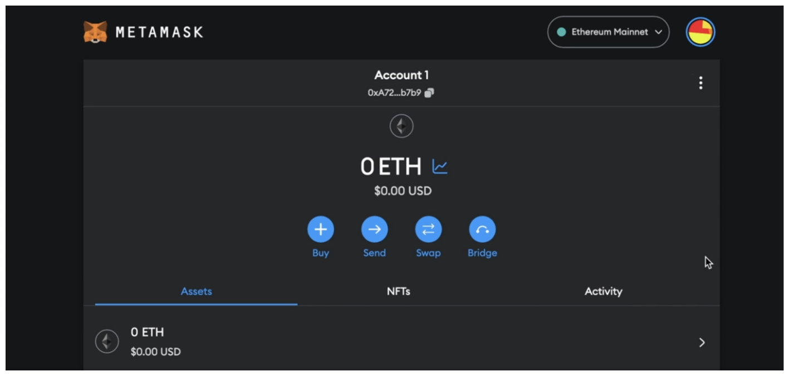

You can Pin MetaMask to the top of your browser for easy access to this view in future.

A couple things to note:

1. In MetaMask, you can create multiple accounts. Each account has a different address. You can do this by selected `Create Account` from the menu in the top right.
2. All accounts created in MetaMask share the same secret phrase but have different private keys.

    **Note**: Access to the secret phrase grants control to all accounts, while access to a private key only grants control to a single account.

### Selecting a Network

Near the top of the MetaMask interface, you’ll see “Ethereum Mainnet”. Click on it to see all the networks that MetaMask can access.

Ethereum Mainnet is a live blockchain where real money is used. For the purposes of this course, we're not going to be working with Ethereum Mainnet. Instead, we'll be leveraging a testnet, a development chain used for creating and testing smart contracts.

In addition to this, we'll also be covering how to test and deploy on a _local_ chain, which we'll quickly learn is the _preferred_ way to test our code in most circumstances!

By toggling the `show test networks` option, we can see which testnets come included by default.

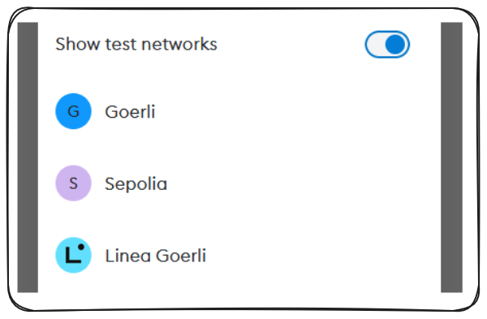

We're able to switch networks simply by clicking on any network on the available list. Try out Sepolia!

> Do note - Testnets change often, they're run out of the goodness in people's hearts. If a particular testnet is unavailable or changes, please checkout the course GitHub repo or the section Updates area on Updraft for the latest testnet.

Just like Mainnets, testnets have blockexplorers available to us as well. We can navigate to **[Sepolia Etherscan](https://sepolia.etherscan.io/)** to see records of all the transactions that are happening on Sepolia.

### First Transaction

In order to experience your first transaction, we're going to navigate to a `faucet`. Faucets are services which allow you to claim some free `testEth` (in our case SepoliaEth) and use it in development.

**[Sepolia Faucet](https://faucets.chain.link/sepolia)**

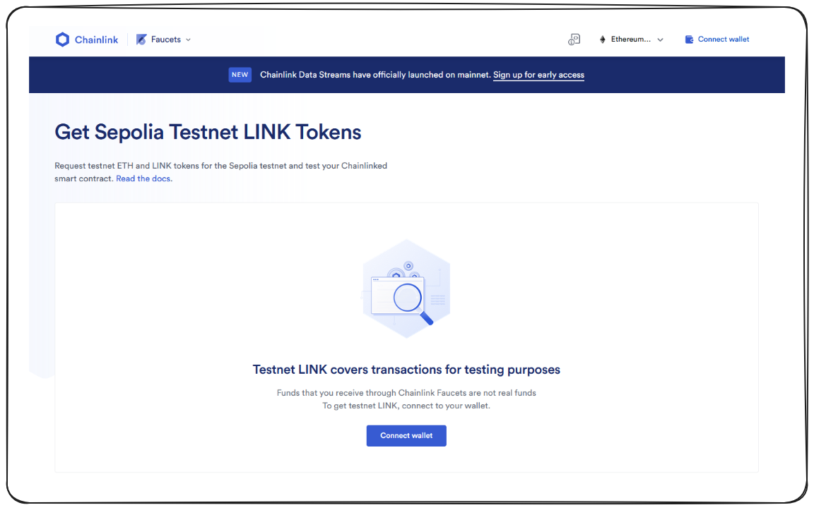

From this page you can connect your wallet with the click of a button. Once clicked, agree to the terms of service and select `MetaMask`.

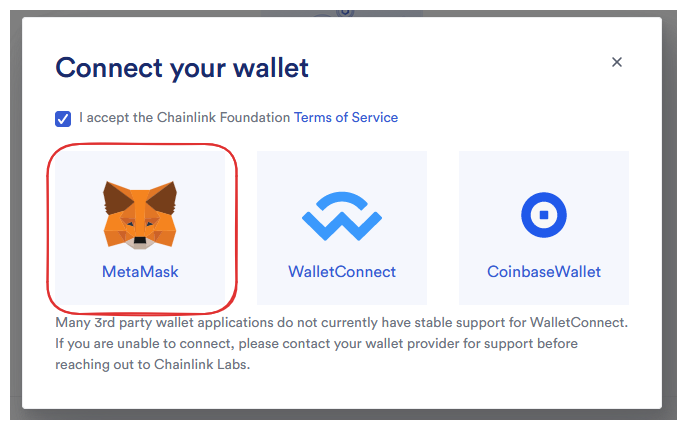

Your MetaMask should pop up and give you the option to select your account, following by a confirmation to connect your wallet.

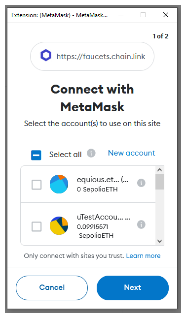

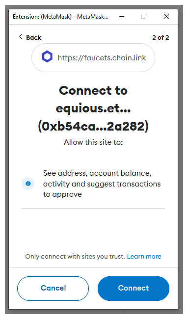

In order to request testnet native tokens (like SepoliaEth) you'll need to verify your GitHub account. Once that's done, you should be ready to send your request!

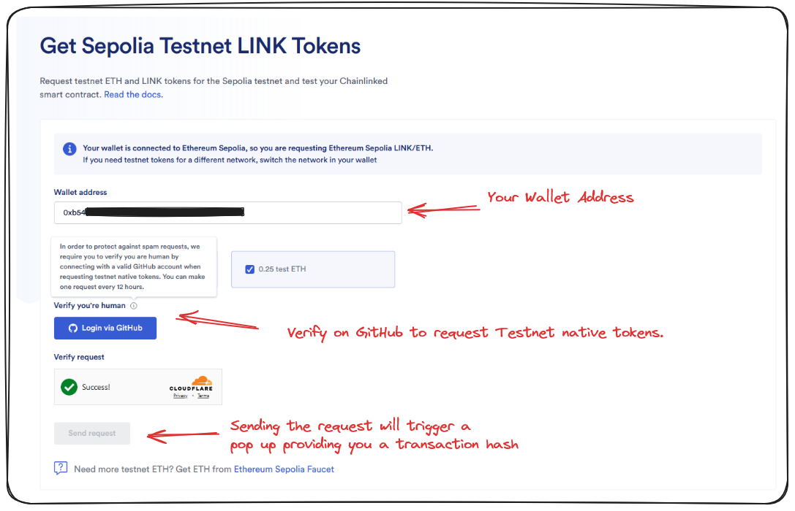

After a brief delay we should see something like this!

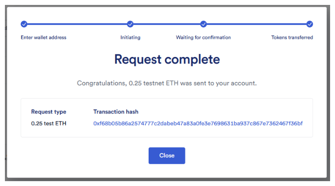

I encourage you to click the transaction hash, you'll be brought to Sepolia Etherscan and provided a tonne of information about the details of your transaction. Additionally, you should be able to open up your MetaMask wallet and confirm you did indeed receive your requested Sepolia Eth!

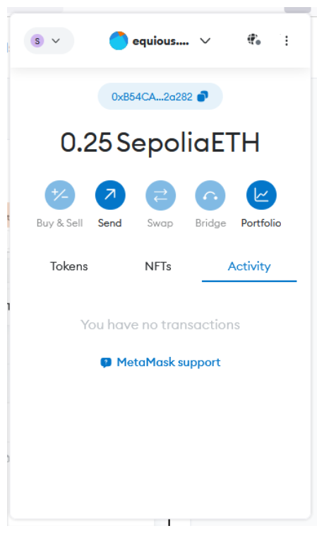

Try toggling your MetaMask wallet between networks now, you'll notice that it's only on Sepolia that you've gained your test ETH. If you want to practice further, there are additional testnet blockchains with faucets available for you to try.

### Transaction Details

Taking a brief look at some of the details of our transaction on Etherscan, we're given a lot of insight. Understanding these properties is a fundamental part of being a blockchain developer. Some of the basic details include:

-   Transaction Hash - This is a unique identifier for our transaction
-   From - The originating address of the transaction request
-   To - The address a transaction was sent to
-   Value - Any funds included with the transaction
-   Gas - The cost of the transaction to execute, we'll be looking into gas more closely in the next lesson.

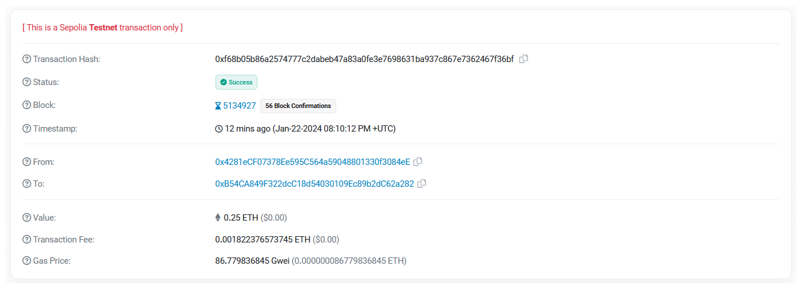

## Introduction to Gas

In this lesson, we will discuss important concepts ranging from transaction fees and gas prices, mining incentives, computational measures in transactions, to hands-on experience of sending a transaction in Ethereum’s test network.

Let's jump right in!

### Transaction Fee and Gas Price: What are they?

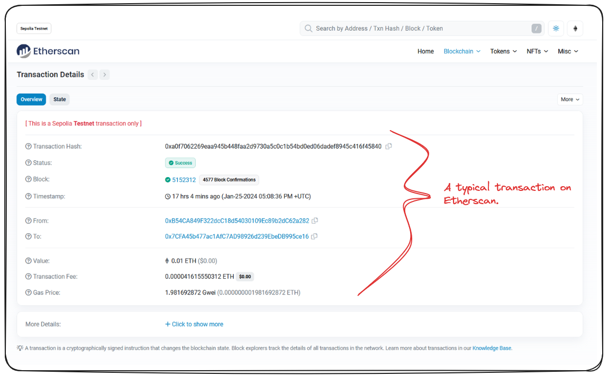

While inspecting an Ethereum transaction, two terms invariably catch the glance: "transaction fee" and "gas price". Let's clarify what they are and why they matter.

The `transaction fee` is the amount rewarded to the block producer for processing the transaction. It is paid in Ether or GWei. The `gas price`, also defined in either Ether or GWei, is the cost per unit of gas specified for the transaction. The higher the gas price, the greater the chance of the transaction being included in a block. [`Wei, Gwei, and Ether Converter`](https://eth-converter.com/)

> Gas price is not to be confused with gas. While gas refers to the computational effort required to execute the transaction, gas price is the cost per unit of that effort. [`Gas and Gas Fees`](https://ethereum.org/en/developers/docs/gas/)

When we click on "more details" in a transaction overview, we can see further information including the `Gas Limit and Usage by transaction`.

Now, let's address an important question: who gets these transaction fees and why?

### The Role of Nodes in Blockchain

Blockchains are run by a group of different nodes, sometimes referred to as miners or validators, depending on the network. These miners get incentivized for running the blockchain by earning a fraction of the native blockchain currency for processing transactions. For instance, Ethereum miners get paid in Ether, while those in Polygon get rewarded in MATIC, the native token of Polygon. This remuneration encourages people to continue running these nodes.

### Understanding Gas in Transactions

In the context of transactions, gas signifies a unit of computational complexity.

The higher a transaction's complexity, the more gas it requires. For instance, common transactions like sending Ether are less complex and require relatively small amounts of gas. However, more sophisticated transactions like minting an NFT, deploying a smart contract, or depositing funds into a DeFi protocol, demand more gas due to their complexity.

The total transaction fee can be calculated by multiplying the gas used with the gas price in Ether (not GWei). Therefore, `Transaction fee = gasPrice * gasUsed`.

### Hands-on: Sending an Ethereum Transaction

In any blockchain, making a transaction requires the payment of a transaction fee (in terms of the native token) to the blockchain nodes processing that transaction. Let's take an example of a transaction using the MetaMask extension, a popular Ethereum wallet.

Here are the steps:

1. Open MetaMask and click "Expand View".
2. Choose the account to use for the transaction.
3. Click on "Send".
4. Select "Transfer between my accounts".
5. Enter the account to send the Ether to, and the amount you wish to send.
6. Click "Next". MetaMask will automatically calculate the gas fee for you. The total amount to be paid is the sum of the Ether value you're sending and the gas fee.

Something of note, if you click the `market` link in MetaMask, you'll be shown some optional settings for gas in the transaction. You may wonder _Why would I choose to spend more gas?_

A simplified explanation of this is: if lots of people are trying to process transactions at the same time, the space on a given block is competitive, gas prices are increased to throttle and prioritize transactions during congestion.

1. Click "Confirm".

The transaction will now appear in the Activity tab of MetaMask. After a short while, the transaction gets processed, and you can view its details in a block explorer like Etherscan.

You have now executed your first blockchain transaction!

Despite its simplicity, knowing how to process transactions with MetaMask is vital and empowers you to interact with protocols on the Ethereum network and other blockchains. However, to fully understand Ethereum and the blockchain landscape, it's crucial to delve into the details behind these transactions and the fundamental mechanics of blockchains.

Remember, mastering the nuances of blockchain transactions and understanding the mechanics behind Ethereum will enable you to become a powerful developer in the decentralized world.

## How do blockchains work

In this lesson, we're going to break down blockchains, the process and the technology itself using a widely-praised and accessible demo available [here](https://andersbrownworth.com/blockchain/).

### Understanding Hash Functions

At its simplest, a hash is a unique, fixed-length string that serves to identify any piece of data. When you input any kind of data into a hash function, it produces a hash. In this demo, the hash algorithm we'll focus on is SHA-256.

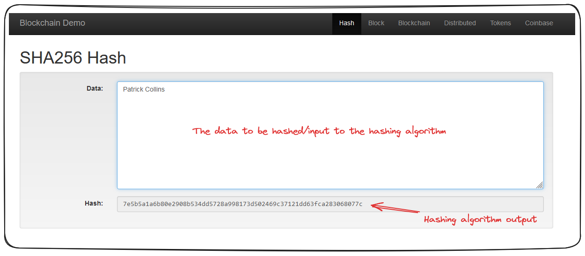

If I add `Mohammadreza Alirad` to our `SHA-256` algorithm, it will:

1. Convert the letters to numbers
2. Convert the numbers to a fixed-length “string” or “hash”

`Mohammadreza Alirad` gets converted to `8b343f541c502f5dccb064438a9fc82f516abab6a8adac81fb99f1c51a0beaa5`

Ethereum, uses its own version of a hashing algorithm (Keccak256) that isn't exactly SHA-256 but belongs to the SHA family. This doesn't change things significantly here as we're primarily concentrating on the concept of hashing.

In the application, whatever data you enter into the data section, undergoes processing by the SHA-256 hash algorithm resulting in a unique hash.

> For example, when I input my name as "Mohammadreza Alirad," the resulting hash uniquely represents "Mohammadreza Alirad." The fascinating aspect is, no matter how much data is input, the length of the generated hash string remains constant.

### Understanding Blocks

Now that we've grasped the concept of hashing and fixed-length string, let's inspect the structure of a blockchain. A collection of "blocks."

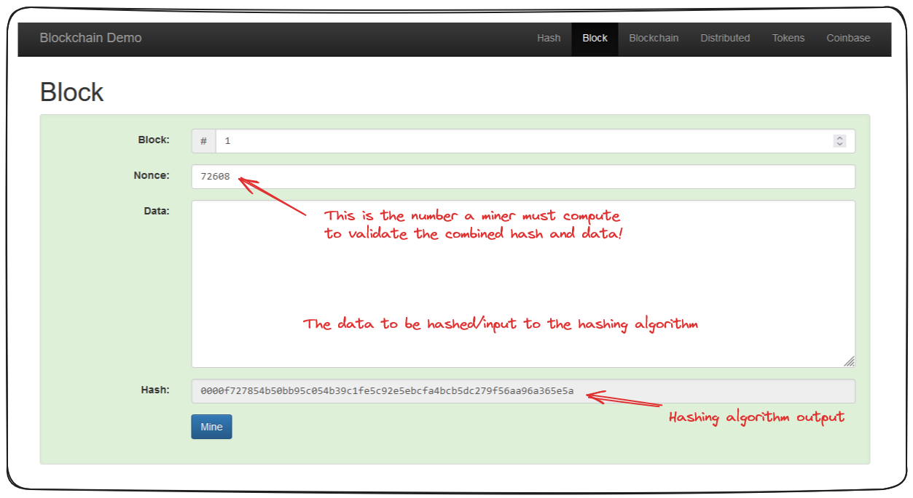

A block takes the same data input, but instead of a singular data field, a block is divided into 'block', 'nonce', and 'data.' All three are then run through the hash algorithm, producing the hash for that block. As a result, even a minor change in the data leads to an entirely different hash, hence, invalidating the block.

In essence, mining involves the computational trial and error process of finding an acceptable value to produce a hash which typically follows a certain pattern, such as starting with four zeros. The value found, which satisfies this criterion, is known as the 'nonce'.

The problem or criteria a miner has to solve will vary from blockchain to blockchain, but the concept is the same.

### The Inherent Beauty of Blockchain: Immutability

In a blockchain, which is essentially a sequence of blocks, each block is comprised of the previous elements - a block number, a nonce and data - as well as `the hash of the previous block`

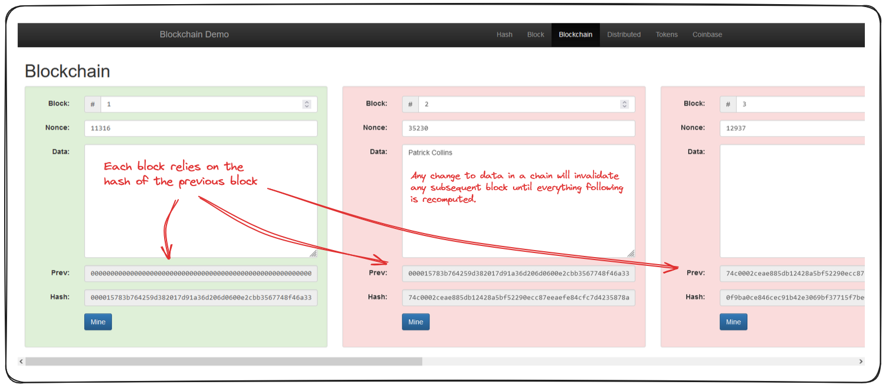

What this means in practice is that any changes to data, in any block of the chain, will invalidate every proceeding block, until they are recalculated, or re-mined.

> **Genesis Block:** This is the first block in a blockchain.

### Decentralized Distribution

Now, if a single entity were to control the blockchain, they could conceivably change any data they want, and then re-mine, or re-validate subsequent blocks. This is bad.

_Enter Decentralized Distribution._

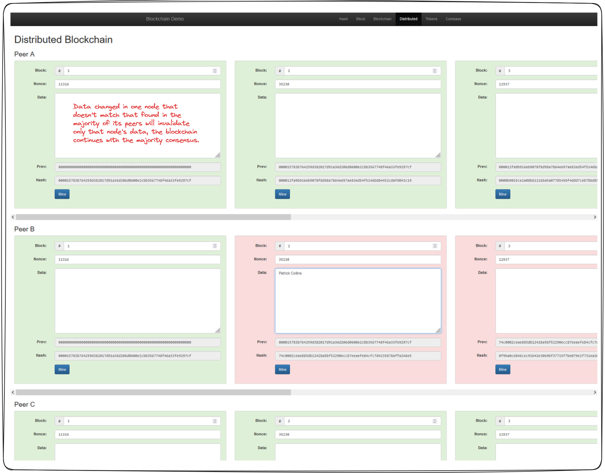

The crux of blockchain's power lies in its decentralization or distributed nature. Under this system, multiple entities or "peers" run the blockchain technology, each holding equal weight and power. In the event of disparity between the blockchains run by different peers (due to tampering or otherwise), the majority hash wins, as the majority of the network agrees on it.

Nodes that don't agree with the majority effectively fork the network, continuing on their own with their own history.

### Interplay of Blockchain & Transactions

Until now we've been considering the data passed in a block to be a random string of text, but the reality is - this data can be anything. In the token and coinbase sections of this demo you can see how each block is comprised of a number of transactions that all get hashed together. Any edits to any of these transactions is going to invalidate the chain!

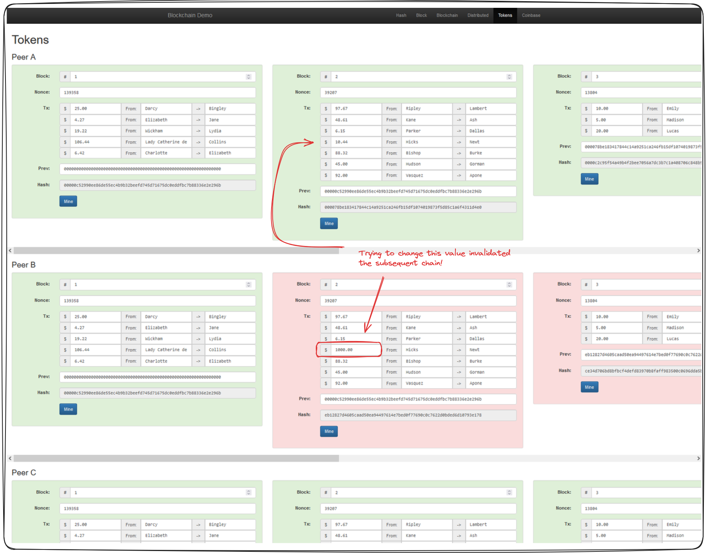

every transaction, block, and indeed the whole blockchain itself comes down to understanding the concept of a hash. This unique fixed-length string that is intrinsically linked with the original data. We've also underscored the importance of decentralization and highlighted how the concept of immutability plays into the system's security.

## Signing Transactions

To help understand the fundamentals of how concepts like public and private keys as well as signing transactions, we'll again be leveraging an incredible resource by **Anders Brownworth** available **[here](https://andersbrownworth.com/blockchain/public-private-keys/)**

### Public and Private Keys

In this lesson, all the pieces we learnt about with MetaMask should start coming together.

Understanding the relationship between private and public keys is essential to grasping the concept of blockchain transactions. In essence, a private key is a randomly generated secret key used to sign all transactions.

The private key is then passed through an algorithm (the **[Elliptic Curve Digital Signature Algorithm](https://en.wikipedia.org/wiki/Elliptic_Curve_Digital_Signature_Algorithm)** for Ethereum and Bitcoin) to create the corresponding public key. Both the private and public keys are central to the transaction process. However, while the private key must remain secret, the public key needs to be accessible to everyone.

When we send a transaction to the blockchain, we're passing a private key. This allows others to verify the transaction through the generated public key.

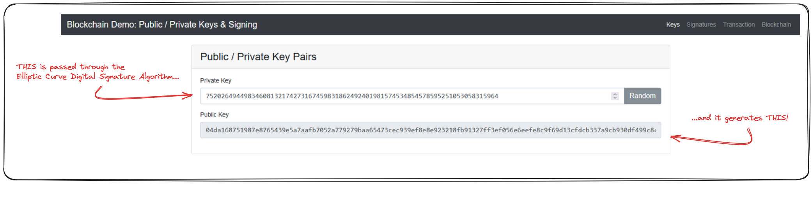

### How does Transaction Signing Happen?

When we sign a transaction on the blockchain, we're digitally signing some data with our private key. The hashing algorithm used makes it impossible for something to derive your private key from a message signature.

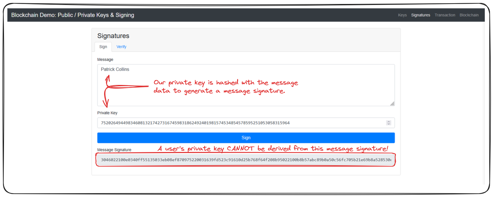

This signing method allows anyone to verify the validity of a transaction by comparing the message signature to a user's public key!

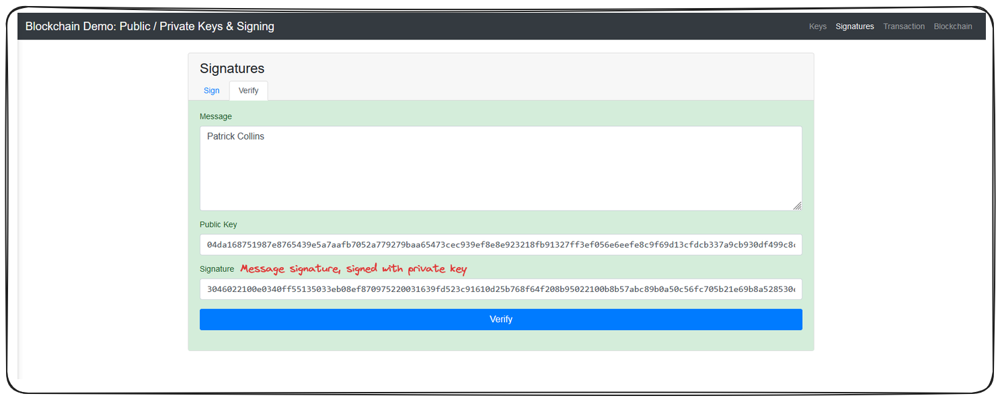

### Importance of Hiding Private Keys

Your MetaMask account's private key is accessible through `Account Details` > `Show Private Key`. You'll be asked to provide a password, again underscoring the importance of keeping this key safe.

Anyone with access to your private key can perform and sign transactions, on your behalf consequently making it absolutely vital to safeguard private keys.

> **Note:** As an interesting side note, wallet addresses, like the one MetaMask provided to you, are actually derived from your public key. A public key is passed through the Ethereum Hashing Algorithm, the last 20 bytes of the resulting hash is the address!

We discovered that transactions on the blockchain are signed using a user's `private key`. The generated `message signature` can then be verified by anyone through a comparison to a user's `public key`.

**KEEP YOUR PRIVATE KEY SECURE!**

-   Private Keys allow someone to sign a transaction, they should be kept secret and secure.

We learnt that `public keys` are generated by using the **[Elliptic Curve Digital Signature Algorithm](https://en.wikipedia.org/wiki/Elliptic_Curve_Digital_Signature_Algorithm)** on a user's private keys.

In addition to this, Ethereum addresses are derived from public keys by hashing a user's public keys with the Keccak256 algorithm.

The deeper we go, the more complicated things get, but you're doing great and we still have a ways to go. In the next lesson we'll look again at gas and investigate some of the more low level interactions of gas in a blockchain ecosystem.

## Gas In Depth

### Transactions and Gas

In this lesson we're going to take an even closer look at `gas`, how it functions and the purpose it serves on the blockchain.

Don't stress if this topic sounds complex; gas can absolutely be a confusing topic, but the more experience you gain and more examples we go through, it'll start to become clear.

**Note:** What we're covering here is applicable to Ethereum post implementation of **[EIP-1559](https://eips.ethereum.org/EIPS/eip-1559)** wherein gas limits, priority fees and the discussed burn mechanism were all introduced.

### Transaction Breakdown

Before we continue, there are a couple important terms to understand.

```Solidity
Wei:  1,000,000,000 Wei  = 1 Gwei (Gigawei)
Gwei: 1,000,000,000 Gwei = 1 Eth
```

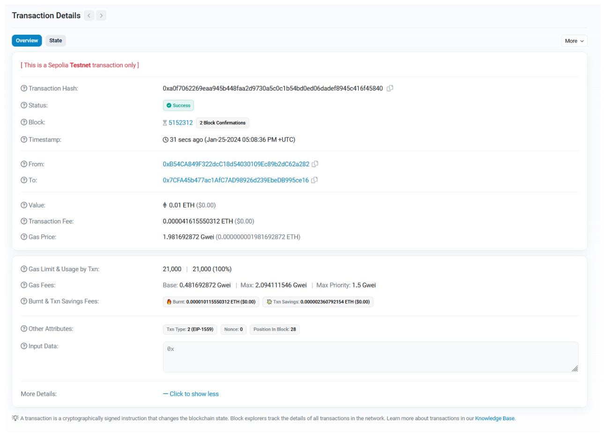

_Reference the above image, the labelled sections will be detailed below_

**1. Transaction Fee:** This is calculated as Total `Gas Used * Gas Price` where `Gas Used` represents the computational units required to perform the work and `Gas Price` is comprised of a `Base` and `Priority Fee`

**2. Gas Limit:** This is the maximum amount of gas allowed for the transaction. This can be set by the user prior to sending a transaction.

In Metamask, you can navigate to `Market > Advanced > Edit Gas Limit` in order to set this value.

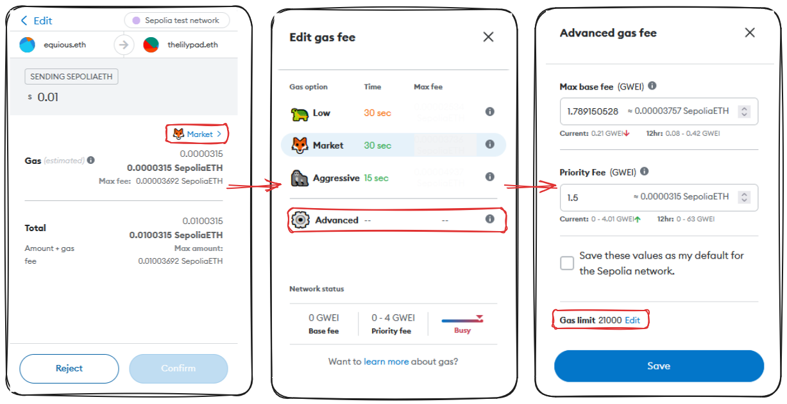

**3. Base Gas Fee:** The base fee of a transaction, represented in Gwei. Remember, this is cost per gas.

There are a couple important points to note regarding the Base Fee

-   The fee is burnt as of EIP-1559. Burning serves to remove the value from circulation, combating inflation on the protocol. The amount burnt can be seen beneath the `Base Fee` in the image above.
-   The fee is dynamic, under EIP-1559, if a block is more than 50% full, the `Base Gas Fee` is increased for the next block. Likewise, if a block is less then 50% full, the fee decreases. This serves to balance network demand and capacity.

**4. Max Gas Fee:** This is the maximum cost per cast the transaction has been configured to allow. This can again be configured prior to sending a transaction.

**5. Max Priority Fee:** Again, configurable prior to sending a transaction, this represents the maximum `tip` we're willing to give miners. This incentivizes the inclusion of our transaction within a block.

**6. Block Confirmations:** These are he number of blocks which have been mined or validated which have been confirmed to contain your transaction. The more confirmations the more sure we can be of the transaction's validity.

### Wrap Up

Lets recap some of what we've learnt about transactions on the blockchain!

We learnt that every transaction has a unique `transaction hash` that uniquely identifies the transaction on chain.

Pulling up a transaction in a block explorer like Etherscan can provide us a tonne of additional information, including:

-   The block which contains the transaction
-   The time stamp of when the transaction was requested
-   Where the transaction is originating
-   Where the transaction is being sent
-   The value included in a transaction

From here we can also see details about the `transactions fees` and `gas` costs.

`Gas` is a measure of computation required to perform a task, the cost of a transaction is derived from a `Gas Price` (made of `Base` and `Priority Fees`) and the amount of `gas` used.

We learnt that a `Gas Limit` can be set before a transaction is set and that the `Base Fee` on all Ethereum transactions is actually `burnt`, in order to reduce inflation and stabilize the network economy.

We also discovered that the Base Fee goes up and down depending on the congestion of a block. If a block is >50% full, the fee goes up, <50% and the fee goes down.

## Blockchain Fundamentals

### Traditional Networks vs Blockchain

Traditionally, when you run an application be it a website or something that connects to a server you are interacting with a centralized entity. This is the opposite of what you may recall from our distributed blockchain example, in that the server is controlled and run by a single centralized group.

Blockchains, as we saw, run on a network of independent nodes. In our previous example, each of the `Peers` was representative of an independent `node` operator. The term `node` typically refers to a single instance of a decentralized system, Peer A would be a `node`. This network, this combination of these nodes interacting with each other is what creates a blockchain. What makes these networks so potent, is that anybody can join. All anyone needs is a little bit of hardware and you can participate in securing a blockchain network. You could go to GitHub and start operating a node in a few seconds!

In the traditional world applications are run by centralized entities and if that entity goes down or is malicious or decides that they want to shut off - they just can. They're the ones that control everything.

Blockchains, by contrast, don't have this problem. If one node or one entity that runs several nodes goes down, since there are so many other independent nodes running, it doesn't matter, the blockchain and the system will persist so long as there is at least one node always running. Luckily for us, the most popular chains like Bitcoin and Ethereum have thousands and thousands of nodes. Malicious nodes are kicked from the network, or even punished in some cases. Majority rules when it comes to the blockchain.

This gives blockchains this incredibly potent immutability trait where nothing can be changed or corrupted so in essence we can think of a blockchain as a decentralized database. In the case of Ethereum it has an extra additional feature where it also can do computation in a decentralized manner now.

### Consensus

Let's talk consensus. This includes `Proof of Work` and `Proof of Stake`. You've probably heard these terms before and they're really important to how these blockchains work.

The `mining` feature of our previous blockchain example was an example of `Proof of Work`

`Proof of Work` and `Proof of Stake` fall under this umbrella of `consensus`. And `consensus` is a really important topic when it comes to blockchains.

> [`Consensus`](https://ethereum.org/en/developers/docs/consensus-mechanisms/) is defined as the mechanism used to reach an agreement on the state or a single value on the blockchain especially in a decentralized system.

Very roughly, a consensus protocol in a blockchain or decentralized system can be broken down into two pieces: a chain selection algorithm and a sybil resistance mechanism. Mining, or Proof of Work, is a sybil resistance mechanism. This is what Bitcoin currently uses.

`Proof of Work` is known as a sybil resistance mechanism because it defines a way to figure out who is the block author or which node did the work to mine a block. Sybil resistance is a blockchain's ability to defend against users creating a large number of pseudo-anonymous identities to gain a disproportionately advantageous influence over said system.

As mentioned, there are two primary types of sybil resistance:

-   Proof of Work
-   Proof of Stake

### Proof of Work

[`Proof of work`](https://ethereum.org/en/developers/docs/consensus-mechanisms/pow/) is a system of sybil resistance used in many blockchains, in its essence a miner needs to go through a very computationally heavy process (mining) to find the block's answer. As a result, it doesn't matter how many additional nodes you're running, each node is obligated to do this work in order to receive a reward. The playing field is kept fair.

> **Note:** Some blockchains may make their riddle or their block answer intentionally hard, or intentionally easy to adjust the block time - which is the average time it takes to mine a block. Blocktime is proportional to how difficult these algorithms are.

Proof of Work needs to be combined with a `chain selection rule` to create `consensus`.

A `chain selection rule` is implemented as a means to determine which blockchain is the _real_ blockchain. Bitcoin (and prior to the merge, Ethereum), both use something called `Nakomoto Consensus`. This is a combination of Proof of Work (Etherum has since switched to Proof of Stake) and the `longest chain rule`.

In the `longest chain rule`, the decentralized network decides that whichever chain has the most number of blocks will be the valid, or _real_ blockchain. When we saw `block confirmations` in Etherscan earlier, this was representing the number of blocks ahead of our transaction in the longest chain.

> You'll sometimes hear people use **Proof of Work** to describe a consensus mechanism, but it's a little bit inaccurate, it's really the combination of sybil resistance _and_ chain selection that create consensus.

`Proof of Work` also serves as a means to determine who receives transaction fees as we discussed earlier. These transaction fees are paid by whomever initiates the transaction. In a Proof of Work system, every node is competing against eachother to solve the block problem first. The first node to solve the problem gets paid the transaction fees accumulated in the block they mine. In addition to this, miners are also paid a `block reward`, the `block reward` is given by the blockchain itself.

> If you've previously heard of the Bitcoin Halving - this is the concept of the block reward being cut in half roughly every 4 years.

Block rewards are in the blockchains native currency - Bitcoin = BTC, Ethereum = ETH. This effectively increases the amount of that cryptocurrency in circulation.

### Blockchain Attacks

There are two major types of attacks that exist in the blockchain space.

-   Sybil Attack - When a user creates a number of pseudo-anonymous accounts to try to influence a network.
-   51% attack - Occurs when a single entity possesses both the longest chain and majority network control. This would allow the entity to `fork` the chain and bring the network onto the entities record of events, effectively allowing them to validate anything.

Blockchains are very democratic. The bigger a blockchain is, the more decentralized, the more secure it becomes.

I encourage you to look into running a node yourself to increase the security of the network!

Proof of Work does come with drawbacks. For example, Proof of Work consumes a LOT of electricity. When you have thousands of nodes all working as hard as they can to solve a block problem the energy consumption is HUGE and as such, so is the potential environmental impact.

With the above in mind, many protocols are choosing the shift to a different consensus mechanism that is more environmentally friendly. The most popular of which is...

### Proof of Stake

In contrast to trying to solve a block problem, [`Proof of Stake`](https://ethereum.org/en/developers/docs/consensus-mechanisms/pos/) nodes put up some collateral that they are going to behave honestly aka they `stake`. If a node is found to be misbehaving, it's stake is slashed. This serves as a very effective sybil resistance mechanism because for each account, the validator needs to put up more stake and misbehaving risks losing all that collateral.

> In a Proof of Stake system, `miners` are known as `validators`. They aren't actually mining blocks, they're validating other nodes.

Unlike in Proof of Work, where each node is racing to solve the block problem first, in Proof of Stake, validators are pseudo-randomly chosen to propose the next block and other nodes will validate it.

Proof of Stake of course comes with its own Pros and Cons.

Pros:

-   great sybil resistance mechanism
-   great for the environment, much less energy

Cons:

-   seen as less decentralized due to upfront staking costs

This raises the question of _how decentralized is decentralized enough?_ and I think I need to leave that to the community to decide.

### Layer 1 and Layer 2

I want to briefly touch on the concepts of Layer 1 and Layer 2 networks here as well.

1. `Layer 1` solutions: This refers to base layer blockchain implementations like Bitcoin or Ethereum.
2. `Layer 2` solutions: These are applications added on top of a layer one, like [Chainlink](https://chain.link/) or [Arbitrum](https://arbitrum.io/).

Layer 2s like Arbitrum and Optimism are special in that they're trying to solve the problem of scalability. These protocols leverage something called `rollups`. We won't go too deep, but the idea is that the protocols bundle their transactions to be processed by a Layer 1.

## L1s L2s and Rollups

### Blockchain layers

A **Layer 1 (L1)** blockchain is the base layer of the blockchain ecosystem, where nodes help the chain to reach consensus. It operates without any additional plugins and is often referred to as the _settlement layer_. Examples of L1 chains include Bitcoin, BNB Chain, Solana, and Avalanche. In this course, we primarily focus on Ethereum, which serves as the **hub** of the Ethereum ecosystem. Applications directly deployed on Ethereum, like Uniswap, are not considered L2s but rather dApps on L1.

A **Layer 2** is any application built on outside an L1 blockchain that _hooks back into it_. There are different types of Layer 2, for example **Chainlink**, a decentralized Oracle networks and event indexing networks like **The Graph**, which enable applications to access on-chain data. But the most popular type of L2 is the **rollup**, or **L2 chain**.

### Rollups

**Rollups** are L2 scaling solutions that enable to increase the number of transactions on Ethereum by bundling multiple transactions into one, reducing gas costs.

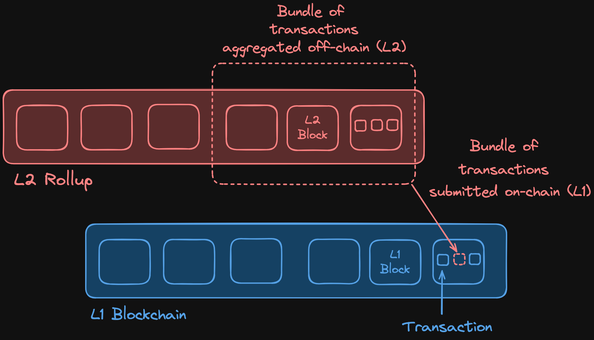

Rollups help solve the blockchain trilemma, which states that a blockchain can only achieve two out of three properties: _decentralization_, _security_, and _scalability_. In the case of Ethereum, **scalability** is sacrificed as it can only process approximately 15 transactions per second. Rollups, on the other hand, aim to enhance scalability without compromising security or decentralization.

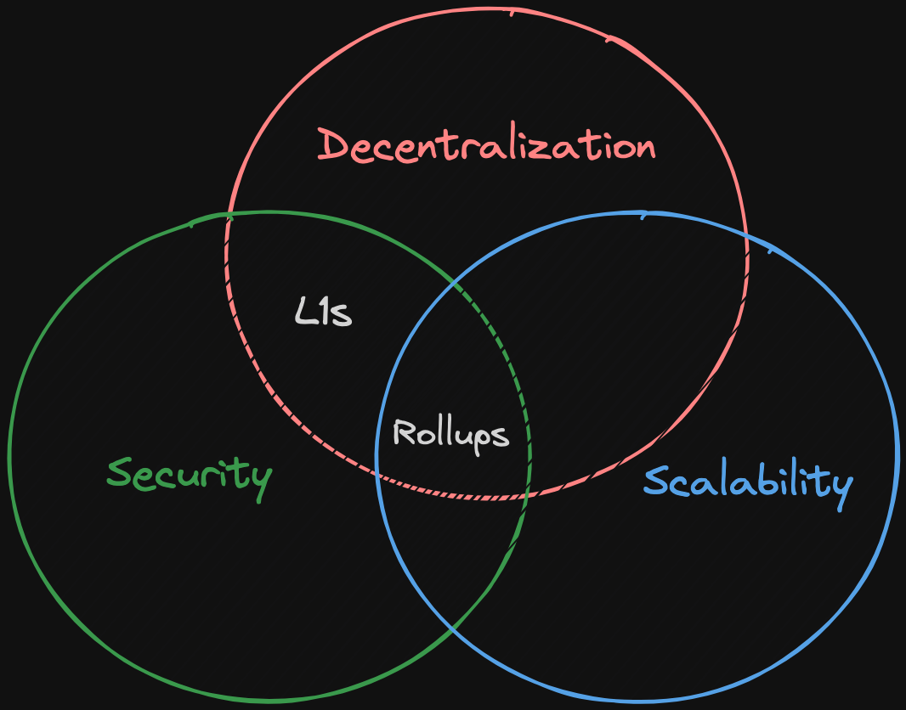

#### How Rollups Work

When a user [submits a transaction](https://docs.zksync.io/zk-stack/concepts/transaction-lifecycle) to a rollup, an **operator** (a node or entity responsible for processing transactions) picks it up, bundles it with other transactions, compresses them, and submits the batch back to the L1 blockchain. This process allows for efficient handling of transactions as gas costs associated with the transaction, are split among all the users that submitted the transactions in the batch.

There are two types of rollups, Optimistic and Zero-Knowledge rollups. The main difference between the two lies in how each rollup verifies the validity of the transactions.

### Optimistic Rollups

They assume that off-chain transactions are _valid by default_. Operators propose the **valid state** of the rollup chain, and during a **challenge period**, other operators can challenge potentially fraudulent transactions by computing a **fraud proof**.

This **fraud proof process** involves the operator engaging in a _call and response interaction_ with another operator to identify and isolate a specific computational step. This specific step is then executed on the Layer 1 blockchain: if the result differs from the original state, it indicates that the transaction was fraudulent. When the fraud proof succeeds, the rollup will re-execute the entire batch of transactions correctly, and the operator responsible for including the incorrect transaction will be penalized, usually by losing staked tokens (_slashing_).

### Zero-Knowledge (ZK) Rollups

ZK rollups use validity proofs, known as _zk proofs_, to verify transaction batches. In this process, the **prover** (operator) generates a zk proof to show that their inputs (the transactions) satisfy this equation. A **verifier** (an L1 contract) then checks this proof to ensure that the output matches the expected result. The solution that the prover uses to demostrate that their input satisfies the mathematical equation in the zk proof is commonly referred as the **witness**.

### Extra Links

-   [`Replay attacks`](https://www.cyfrin.io/blog/replay-attack-in-ethereum)
-   [`Sybil attacks`](https://www.cyfrin.io/blog/understanding-sybil-attacks-in-blockchain-and-smart-contracts)
-   [`Double-spending`](https://www.cyfrin.io/blog/understanding-double-spending-in-blockchain)
-   [`Zero-knowledge proofs`](https://ethereum.org/en/zero-knowledge-proofs/)

## Centralized Sequencers

In blockchain and cryptocurrency networks, the role of a **sequencer** is crucial for ordering and bundling transactions. Sequencers are operators that are responsible for organizing how transactions are processed. In many roll-up solutions, sequencers are centralized, controlled by a single entity.

### Centralization risks

**Censorship and Manipulation**. Centralized sequencers have the power to selectively block or delay specific transactions. For example, users might experience blocked withdrawal transactions, preventing them from accessing their funds. Additionally, centralized control enables the manipulation of transaction order for personal gain.

**Operational Downtime**. If a centralized sequencer experiences downtime, all transaction processing can halt. This means no transactions, including withdrawals, can be processed until the sequencer is back online.

To mitigate the issues associated with centralized sequencers, projects like **zkSync** are working towards _decentralizing_ their sequencer operations, distributing control among multiple entities or nodes.

## Rollup Stages

A Layer 2 (L2) chain's maturity is evaluated based on specific properties and categorized into **stages**. The [L2B team](https://l2beat.com/scaling/summary) provides an opinionated assessment to encourage a progression towards a greater decentralization.

### Rollup Stages

1. **Stage 0**: In this initial stage, the rollup's governance is largely in the hands of the operators and a security council, ensuring that critical decisions and actions are overseen by a _trusted group_. The open-source software allows for the reconstruction of the state from L1 data, ensuring transparency and accessibility. Users in this stage have an exit mechanism that allows them to leave the rollup within seven days. However, this often requires actions from an entity/operator.

2. **Stage 1**: In this stage, governance evolves to be managed by _smart contracts_, although the _security council_ still plays an important role (e.g. solving bugs). At this stage, the proof system becomes fully functional, enabling decentralized submission of validity proofs. The exit mechanism is improved, allowing users to exit independently without needing operator coordination.

3. **Stage 2**: In this final stage, the rollup achieves full decentralization with governance entirely managed by smart contracts, removing the need for operators or council interventions in everyday operations. The proof system at this stage is permissionless and the exit mechanism is also fully decentralized. The security council's role is now strictly limited to addressing any errors that occur on-chain, ensuring that the system remains fair without being overly reliant on centralized entities.

### ZKSync Risk Analysis

In the [L2Beat summary](https://l2beat.com/scaling/summary) it's possible to see the actual stage of each rollup:

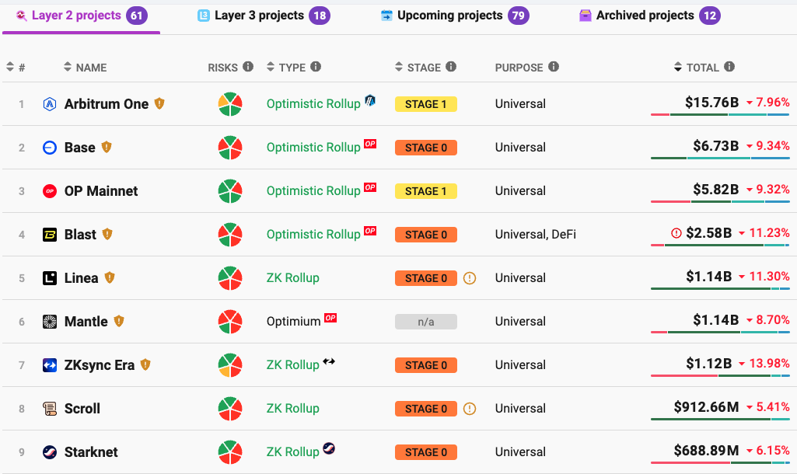

Currently, [Zksync Era](https://l2beat.com/scaling/projects/zksync-era) is operating as a `Stage 0` rollup. In the dedicated page on L2, we can find a risk analysis:

-   **Data Availability**: refers to the ability to reconstruct the L2 state from L1 data, ensuring that anyone can verify and rebuild the L2 state if necessary.

-   **State Validation**: involves verifying the legitimacy of a set of bundled transactions. For ZK Sync, this is done using zero-knowledge proofs through an algorithm known as PLONK (Permutations over Lagrange-bases for Oecumenical Noninteractive arguments of Knowledge).

-   **Sequencer Failure**: describes the ability to process transactions even if the sequencer is down. In ZK Sync, transactions can still be submitted to L1, though not necessarily enforced immediately.

    > 🗒️ **NOTE**
    >
    > The sequencer is the operator responsible for _ordering_ user transactions and often _batching_ them before committing them to Layer 1.

-   **Proposer Failure**: describes the ability to process transactions even if the proposer is down. In this case, ZK Sync will halt all withdrawals and transactions executions.

-   **Exit Window**: In the current ZK Sync stage, there is no window for exit during unwanted upgrades.

The stages of rollups provide a framework for assessing and encouraging the maturity and decentralization of L2 chains. Understanding these stages and their requirements is crucial for evaluating the progress and risks associated with different rollups.

## Making Your First Transaction On zkSync

In this lesson, we will execute a transaction on the **zkSync testnet**, also known as _zkSync Sepolia_ or _zkSync Era_ testnet. We will start by adding zkSync Sepolia to MetaMask, followed by bridging funds to this network, and finally verifying the transaction details.

### Adding zkSync Sepolia to MetaMask

1. **Add the Network**: search for "zkSync Sepolia Testnet" on [Chainlist](https://chainlist.org/), connect it to your wallet, and add the network by following the confirmation dialogs. Ensure testnets are included in your search.
2. **Check Balance**: you can view your Sepolia balance on MetaMask or on [zkSync Era Sepolia Block Explorer](https://sepolia.explorer.zksync.io/). To view your account summary you can copy your MetaMask address and paste it into the Block Explorer.

### Bridging Funds

Our first transaction involves receiving funds. There are two ways to receive funds on zkSync:

1. **Using a Faucet**: This method requires the use of APIs or GitHub sign-in.

2. **Bridging**: Our recommended method, that involves transferring funds from one chain (Sepolia) to another (zkSync Sepolia). There are two types of bridging mechanisms:

    - **Locking and Unlocking**: Tokens are locked on the source chain and unlocked on the destination chain.
      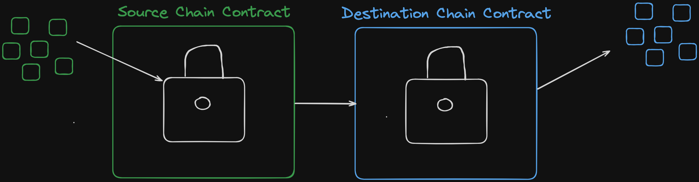
    - **Minting and Burning**: Tokens are burned on the source chain and minted on the destination chain. The bridge protocol must control the token supply to manage this process. An example is [CCTV](https://www.circle.com/en/cross-chain-transfer-protocol) by the Circle team, where USDC is burned and minted to facilitate bridging.
      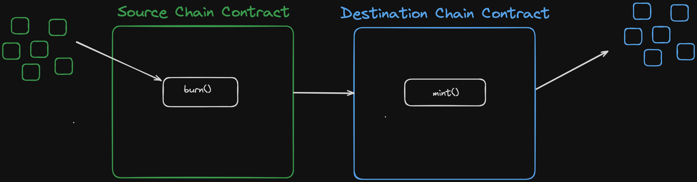

3. **Get Sepolia ETH**: Use the [recommended faucet](https://cloud.google.com/application/web3/faucet/ethereum/sepolia) to obtain Sepolia ETH. With 0.05 Sepolia ETH, you're ready to transfer to zkSync Sepolia.

    - Note: If you encounter a message requiring 0.001 ETH on the mainnet, wait 10-20 minutes before trying again.

4. **Use the zkSync Bridge**: Visit the [zkSync bridge](https://portal.zksync.io/bridge) and ensure you are on the testnet. Connect MetaMask to the bridge and confirm a transaction (e.g., 0.025 Sepolia ETH).

5. **Verify the Transaction**: Check the transaction on the zkSync Sepolia block explorer by pasting your wallet address into the search bar to see the transaction details and status.
    - **Transaction Status**: Once processed, you can view the transaction information, including its _status_.
    - **Finality**: As per the [zkSync documentation on finality](https://docs.zksync.io/zk-stack/concepts/finality), this term refers to the time from sending the transaction to when it is considered settled. On Ethereum, this takes about 13 minutes, but on zkSync it can take approximately 24 hours.
      During this period, transactions are displayed **instantly** in the UI and can be further transferred, but full finality should be awaited to ensure they are fully received and validated using ZK proofs.

## Why zkSync

At Cyfrin, we're committed to providing the best tools and platforms to excel as a smart contract developer. This course is proudly sponsored by ZKsync, a leading solution we believe in and use ourselves. Here's why we're choosing ZKsync Era, a layer 2 ZK roll-up, for our smart contract deployment throughout this course.

### Key Reasons to Use ZKsync Era

🔒 **Security**: ZKsync Era inherits its security directly from Ethereum. This means if Ethereum detects an issue and rolls back, ZKsync Era will follow. Transactions are legitimate and authentic thanks to cryptographic validity proofs.

🛠️ **EVM Compatibility**: ZKsync Era is compatible with Ethereum Virtual Machine (EVM). Although it compiles smart contracts into Era VM bytecode rather than EVM bytecode, this transition is seamless. You can deploy your Solidity-written smart contracts on ZKsync Era with minimal adjustments.

🔑 **Ethereum Wallet Support**: ZKsync supports Ethereum wallets out of the box. You can continue using your existing Ethereum wallet, like MetaMask, without creating a new one. Your address remains the same across both Ethereum and ZKsync Era, simplifying your user experience.

💸 **Low Cost and Scalability**: One of the standout features of ZKsync Era is its low transaction costs due to the transactions bundling. This not only reduces gas fees but also ensures scalability as the network grows. By deploying on ZKsync, your protocol will remain efficient and cost-effective even as the number of users increase.
-->
