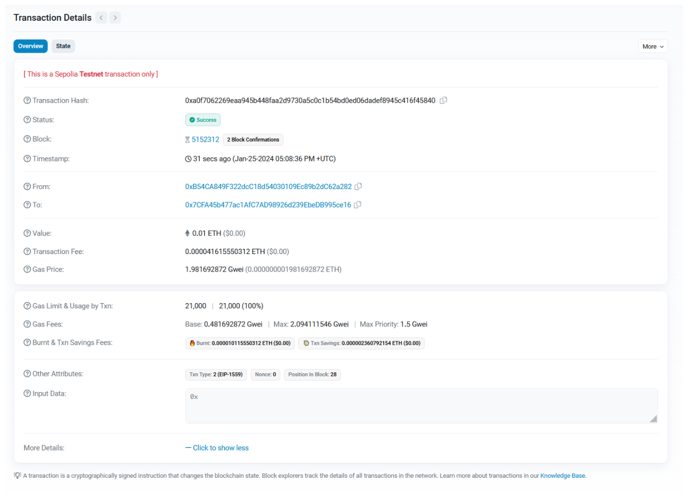
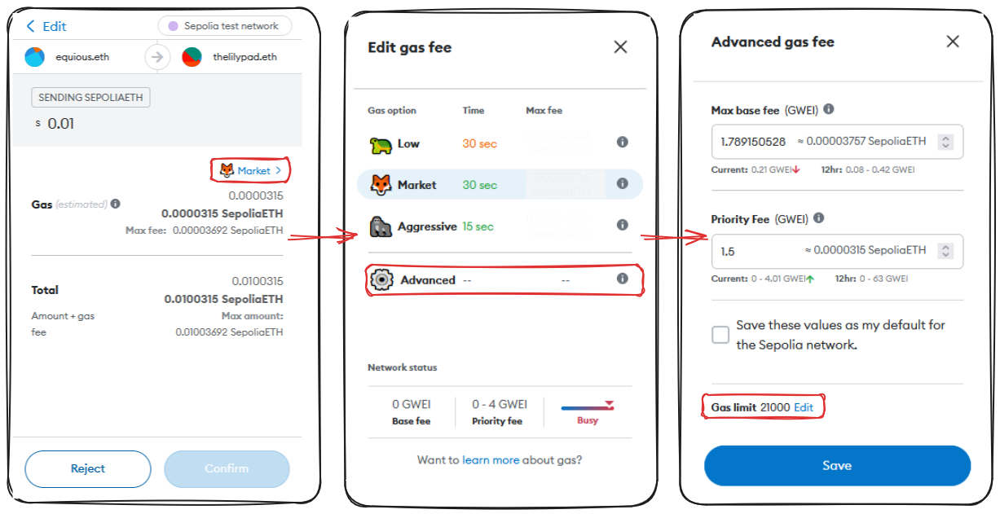
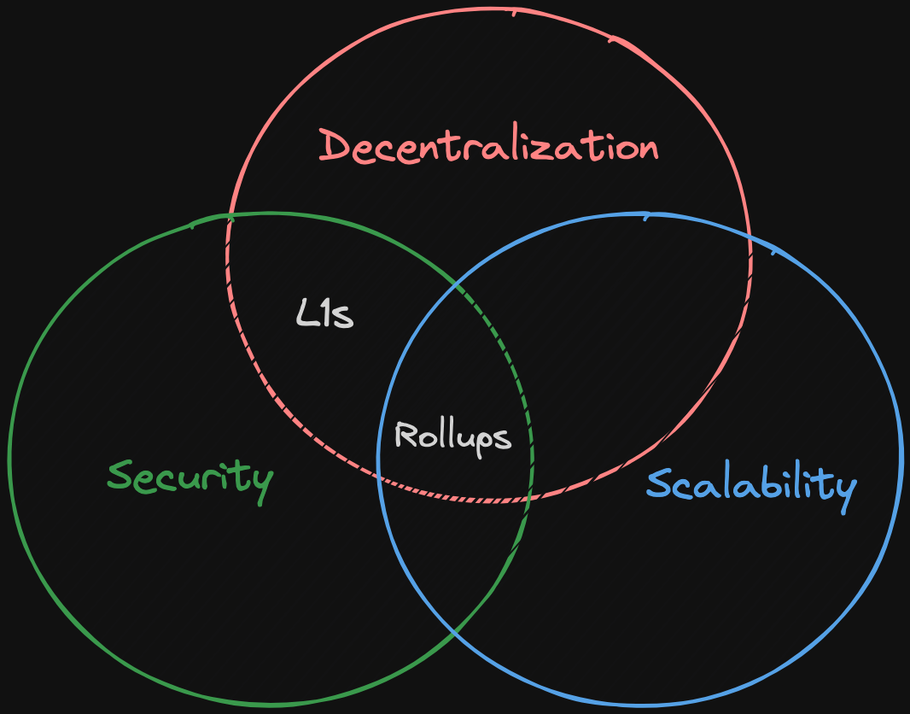
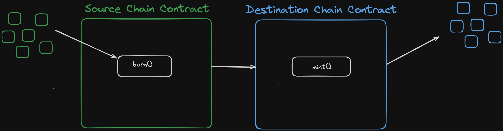

# Blockchain Basics

## What is a Blockchain?

[`Blockchain`](https://www.investopedia.com/terms/b/blockchain.asp) is a decentralized digital ledger that securely stores records across a network of computers in a way that is transparent, immutable, and resistant to tampering. Each "block" contains data, and blocks are linked in a chronological "chain."

### Bitcoin and Blockchain

You might be familiar with `Bitcoin`, which is one of the first protocols to utilize the revolutionary blockchain technology. The Bitcoin Whitepaper, authored by the pseudonymous `Satoshi Nakamoto`, described how Bitcoin could facilitate peer-to-peer transactions within a decentralized network using cryptography. This gave rise to censorship-resistant finance and presented `Bitcoin` as a superior digital store of value, often referred to as _digital gold_. There is a fixed amount of Bitcoin, similar to the scarcity of gold. You can learn more about this in the [Bitcoin Whitepaper](https://bitcoin.org/bitcoin.pdf).

### Ethereum and Smart Contracts

A few years after Bitcoin's creation, Vitalik Buterin and others founded `Ethereum`, which builds upon the blockchain infrastructure, but with additional capabilities. With Ethereum, you can create decentralized transactions, organizations, and agreements without a centralized intermediary. This was achieved through the addition of `smart contracts`.

Though the concept of smart contracts was originally conceived in 1994 by **[Nick Szabo](https://en.wikipedia.org/wiki/Nick_Szabo)**, Ethereum made it a reality.

> [`Smart contracts`](https://chain.link/education/smart-contracts) are a set of instructions executed in a decentralized way without the need for a centralized or third party intermediary.

Smart Contract functionality is the primary difference between blockchains like `Ethereum` and `Bitcoin`. Technically `Bitcoin` does have smart contracts but they're intentionally `turing incomplete`.

### The Oracle Problem

However, smart contracts face a significant limitation – they cannot interact with or access data from the real world. This is known as the [`Oracle Problem`](https://betterprogramming.pub/what-is-a-blockchain-oracle-f5ccab8dbd72?source=friends_link&sk=d921a38466df8a9176ed8dd767d8c77d).

Blockchains are deterministic systems, so everything happens within their ecosystem. To make smart contracts more useful and capable of handling real-world data, they need external data and computation.

Oracles serve this purpose. They are devices or services that provide data to blockchains or run external computation. To maintain decentralization, it's necessary to use a decentralized Oracle network rather than relying on a single source. This combination of on-chain logic with off-chain data leads to [`hybrid smart contracts`](https://chain.link/education-hub/hybrid-smart-contracts).

> **Note:** Most of this course will assume we're working with an Ethereum or EVM environment. The skills you learn here will be compatible with the vast majority of blockchain architectures!

### Chainlink

**[Chainlink](https://chain.link/)** is a popular decentralized Oracle network that enables smart contracts to access external data and computation. Chainlink is also blockchain agnostic - so it's going to work with any chain out there.

### Layer 2 Scaling Solutions

As blockchains grow, they face scaling issues. Layer 2, or L2, solutions have been developed to address this. L2 solutions involve other blockchains hooking into the main blockchain, essentially allowing it to scale. There are two primary types of L2 solutions:

-   **Optimistic Rollups:** eg. Optimism, Arbitrum
-   **Zero-Knowledge Rollups:** eg. ZKsync, Polygon ZK EVM

Don't worry too much about this now. Once we understand how blockchains work 'under the hood', we'll go further into Layer 2's then.

### Terminology

You're going to hear some terms used in blockchain (and the community as a whole) a little interchangeably. Maybe you haven't heard these terms before. I hope this offers a bit of clarification. [`terminology`](https://connect.comptia.org/content/articles/blockchain-terminology)

Common Terms:

1. **Blockchain**: In web3, a blockchain is a digital ledger that records transactions across many computers in a secure and decentralized manner. Each block contains a number of transactions, and every new block is linked to the previous one, forming a chain. This makes the data tamper-resistant. _Example_: Bitcoin's blockchain records all BTC transactions.

2. **Oracle**: Oracles in web3 are intermediaries that provide smart contracts with external data. They act as bridges between blockchains and the outside world, allowing smart contracts to execute based on real-world events and data. _Example_: A weather oracle provides data for a smart contract that triggers crop insurance payments based on rainfall data.

3. **Layer 2**: Layer 2 solutions in web3 are technologies built on top of a blockchain (Layer 1) to improve its scalability and efficiency. These solutions handle transactions off the main chain, reducing congestion and fees, and then settle the final state on the main chain. _Example_: The Lightning Network for Bitcoin.

4. **Dapp (Decentralized Application)**: A Dapp is an application that runs on a decentralized network, typically a blockchain. It is powered by smart contracts and operates without a central authority. Dapps can serve various purposes, from finance to gaming. _Example_: Uniswap, a decentralized finance application.

5. **Smart Contract**: In web3, a smart contract is a self-executing contract with the terms of the agreement directly written into code. They run on blockchains and automatically execute when predetermined conditions are met, without the need for intermediaries. _Example_: A smart contract for an escrow service.

6. **Hybrid Smart Contract**: Hybrid smart contracts combine on-chain code (running on a blockchain) with off-chain data and computations provided by oracles. This allows the contracts to interact with data and systems outside their native blockchain. _Example_: A smart contract for insurance that uses real-world data (like weather or flight delays) provided by oracles.

7. **Ethereum/EVM (Ethereum Virtual Machine)**: Ethereum is a blockchain platform known for its smart contract functionality. The Ethereum Virtual Machine (EVM) is its computation engine that executes smart contracts. Ethereum allows developers to build decentralized applications and is the basis for many web3 projects. _Example_: ERC-20 tokens, a standard for creating fungible tokens on Ethereum.

### Web3

[`Web3`](https://en.wikipedia.org/wiki/Web3) is a term used to describe the new paradigm of the internet powered by blockchain and smart contracts. Unlike the previous versions of the web, web3 is permissionless and relies on decentralized networks rather than centralized servers. This ushers in an era of censorship-resistant and transparent agreements and transactions, often called an ownership economy.

**Web1:** The permissionless open sources web with static content

**Web2:** The permissioned web, with dynamic content where companies run your agreements on their servers.

**Web3:** The permissionless web with dynamic content.

-   Decentralized censorship resistant networks run your agreements and code.
-   User owned ecosystems where one owns a portion of the protocol they interact with - instead of solely being the product

## The Purpose of Smart Contracts

### The Essence of Blockchain and Smart Contracts

Almost every interaction or transaction in our lives involves some form of agreement or contract. For instance, purchasing a chair involves a contract to buy lumber, assemble it, and sell the finished product. Your electricity supply is also based on an agreement between you and the electric company. When you get an oil change for your car, you're promised a service in exchange for money.

Almost everything we do in modern life relates to an agreement or contract in some way.

To make it more relatable, think of contracts and agreements as promises. Traditional contracts, however, require trust between parties, and this doesn’t always work in favor of honesty and fairness.

### The Problem with Traditional Agreements

Lets consider some real world examples of where trust leveraged agreements can go wrong and why blockchain technology and smart contracts mitigate these risks.

### Consumer Trust

In the 80s and 90s, McDonald’s Monopoly game promised customers a chance to win money through game cards obtained with purchases. However, it turned out that the game was rigged by insiders who manipulated the system for their gain. Essentially, McDonald’s failed to keep its promise.

This example demonstrates that relying on trust within agreements can lead to fraudulent activities and broken promises.

With smart contracts, we can eliminate the need for trust. A smart contract is an agreement or a set of instructions that are deployed on a decentralized blockchain. Once deployed, it cannot be altered, it automatically executes, and everyone can see its terms.

Imagine if McDonald’s Monopoly game was operated on a blockchain through a smart contract. The fraudulent activities would have been impossible due to the immutable, decentralized, and transparent nature of smart contracts.

### Banking and Trust

Traditional banks have sometimes failed to keep the promise of safeguarding people's money, as seen during the Great Depression. Blockchain and smart contracts can ensure transparency and execute automated solvency checks, preventing the bank from becoming insolvent.

The core of blockchain and smart contracts lies in creating a trustless system where agreements are transparent, unchangeable, and executed without human intervention. This technology holds the potential to revolutionize industries and everyday agreements by ensuring honesty and fairness.

### Financial Markets Access

Centralized bodies, like traditional exchanges, have the power to restrict access to financial markets. This was evident when Robinhood restricted trading on certain assets in 2021. With decentralized exchanges like Uniswap, there is no central authority that can alter or limit market access. This introduces fairness and openness to the financial markets.

### To Summarize

-   Traditional Agreements: Require trust in a centralized entity.
-   Smart Contracts: Transparent, decentralized, and tamper-proof.

In a scenario where you have to choose, smart contracts are an obvious choice as they cannot be manipulated or altered in anyone's favor.

Smart contracts are _the_ solution to minimizing the reliance on trust based systems that have historically failed us time and time again.

### Under the Hood

Smart contracts are relatively new, but have already started transforming various markets. They do this by representing 'promises' as code on the blockchain. This code is executed by a decentralized collective, such that no single entity can alter the agreemeent in any way! The agreement and its terms are public knowledge and will automatically execute without human intervention.

More industries are adopting smart contracts and blockchain due to the numerous advantages they offer. This results in trust-minimized agreements or what can be simply termed as unbreakable promises.

### Beyond Trust Minimization

It is important to note that blockchain, smart contracts, and cryptocurrencies are not just about trust-minimized agreements. They offer security benefits, uptime advantages, execution speed, and **much more**.

### Caution: Not All Are Equal

However, beware of platforms that claim to be decentralized but are not in practice. An example from 2022 is the `SBF's FTX platform`. It presented itself as a Web3 platform, but was essentially a traditional Web2 company using cryptocurrency without the benefits of smart contracts.

As an emerging developer or user in this space, it's important to discern between legitimate projects and those that aren't contributing to the ethos of Web3. I want you to be successful, but I want you to be successful because you're creating value. Platforms like `FTX` were pretending to bring value to the space and leeching value from it.

## Features of Smart Contracts

Smart contracts come with various features that distinguish them from traditional agreements.

### Decentralization

The first feature is decentralization; smart contracts do not rely on any centralized intermediary. Instead, they run on a blockchain which is maintained by thousands of individuals known as node operators. It's the collective effort of these node operators running the smart contracts that make the network decentralized. This aspect will be discussed more in-depth later.

### Transparency and Flexibility

Transparency is inherent to blockchain networks. Since all node operators can see everything happening on-chain, there is no room for unfair or hidden deals. This transparency ensures that everyone has access to the same information and plays by the same rules.

It is important to note that this transparency does not necessarily compromise privacy. Blockchain is pseudo-anonymous, meaning that your transactions are not directly tied to your real-world identity.

### Speed and Efficiency

Smart contracts and blockchain transactions are incredibly fast and efficient compared to traditional banking systems. For example, bank transfers, especially international ones, can take up to several weeks, whereas blockchain transactions happen almost instantly. This speed is not only convenient but also allows for more efficient interactions between parties.

### Security and Immutability

Once a smart contract is deployed, it cannot be altered or tampered with. This immutability ensures that the terms of the contract are set in stone. This is a stark contrast to centralized systems where a server or database can be hacked, and data can be altered. The decentralized nature of blockchain makes hacking nearly impossible since an attacker would have to take control of more than half the nodes, which is significantly more challenging than compromising a single centralized server.

Additionally, the data on a blockchain is resilient. In a traditional system, if your computer and backups fail, you lose all your data. In contrast, in a blockchain, your data is replicated across thousands of nodes. Even if several nodes were to go down, your data would remain secure as long as there is at least one copy of the blockchain.

### Elimination of Counterparty Risk

Smart contracts eliminate the need for trust in transactions. Once a smart contract is deployed, its terms cannot be changed. This means that parties cannot alter the agreement based on greed or any other factors. This ensures that the agreement is enforced as originally intended.

In traditional systems, there is always a risk that the other party might not fulfill their end of the bargain. With smart contracts, this risk is eliminated, and agreements are enforced programmatically.

## Applications of Smart Contracts

Smart contracts have given rise to new industries and revolutionized existing ones.

### Decentralized Finance (DeFi)

DeFi, or Decentralized Finance, allows users to engage with financial markets without relying on centralized intermediaries. With smart contracts, users have transparent access to financial markets and can engage with sophisticated financial products efficiently and securely. We will provide practical examples of how to build and interact with DeFi protocols in upcoming lessons.

### Decentralized Autonomous Organizations (DAOs)

DAOs are governed entirely by smart contracts and operate in a decentralized manner. This structure offers benefits such as transparent governance, efficient engagement, and clear rules. DAOs are an evolution in politics and governance, and we will cover how to build and work with DAOs in future lessons.

### Non-Fungible Tokens (NFTs)

NFTs, or Non-Fungible Tokens, can be thought of as digital art or unique assets. NFTs have created new avenues for artists and creators to monetize their work. We will also cover how to create and interact with NFTs in this course.

## Setting up MetaMask for Ethereum Transactions

In this lesson, we will learn how to make a transaction on a test Ethereum blockchain using MetaMask, a popular cryptocurrency wallet.

### Visiting Ethereum Website

-   Go to the Ethereum website [ethereum.org](https://ethereum.org).

### Understanding Blockchains

-   We will make our first transaction on a test Ethereum blockchain.
-   This process works the same across all EVM (Ethereum Virtual Machine) compatible blockchains and layer 2 solutions like Arbitrum, Ethereum, ZKsync, etc.
-   EVM compatibility will be explained later.

### Setting up MetaMask Wallet

To set up a wallet, we really just need to follow these steps:

1. To send a transaction on EVM chains, set up a wallet. We'll use MetaMask as it's one of the most popular and easiest wallets to start with.
2. Go to [MetaMask](https://metamask.io).
3. Install the MetaMask extension for your browser (e.g., Chrome, Firefox, or Brave).
4. Once installed, you’ll see the extension in the top-right corner of your browser.
5. Click "Get Started".
6. Select "Create a New Wallet".
7. Agree to help MetaMask improve (optional).
8. Create a password. Make sure it’s secure.

    > **Note**: This wallet will be for development purposes, so you may use a weaker password. But never put real money into this wallet. Treat it as a real wallet to familiarize yourself with good wallet safety.

### Secret Recovery Phrase (Master Key)

MetaMask is going to provide you with a secret recovery phrase. This is a series of 12 words generated when you first set up MetaMask. Ultimately this phrase will allow you to recover your wallet and funds within, should you ever lose access.

This recovery phrase (sometimes referred to as a mnemonic) is your master key, so keep it safe. Write it down, store it in a safe deposit box, or use a secure password manager. Some even engrave their phrase on a metal plate.

> **Warning**: If anyone gets access to your secret recovery phrase, they can access and take all your funds. No one, including the MetaMask team, can help you recover your wallet if you lose the phrase.

1. Watch the Video offered by MetaMask detailing how to keep your wallet secure.
2. Select "Secure My Wallet".
3. Write down your secret recovery phrase and save it securely.
4. Confirm by re-entering your phrase.
5. Click "Got it" after creating your wallet.

> **Note AGAIN:** This wallet will be your **development wallet** do not add real funds!

### Understanding the MetaMask Interface

From this point, you should be able to see your MetaMask interface. It should look something like this:


You can Pin MetaMask to the top of your browser for easy access to this view in future.

A couple things to note:

1. In MetaMask, you can create multiple accounts. Each account has a different address. You can do this by selected `Create Account` from the menu in the top right.
2. All accounts created in MetaMask share the same secret phrase but have different private keys.

    **Note**: Access to the secret phrase grants control to all accounts, while access to a private key only grants control to a single account.

### Selecting a Network

Near the top of the MetaMask interface, you’ll see “Ethereum Mainnet”. Click on it to see all the networks that MetaMask can access.

Ethereum Mainnet is a live blockchain where real money is used. For the purposes of this course, we're not going to be working with Ethereum Mainnet. Instead, we'll be leveraging a testnet, a development chain used for creating and testing smart contracts.

In addition to this, we'll also be covering how to test and deploy on a _local_ chain, which we'll quickly learn is the _preferred_ way to test our code in most circumstances!

By toggling the `show test networks` option, we can see which testnets come included by default.


We're able to switch networks simply by clicking on any network on the available list. Try out Sepolia!

> Do note - Testnets change often, they're run out of the goodness in people's hearts. If a particular testnet is unavailable or changes, please checkout the course GitHub repo or the section Updates area on Updraft for the latest testnet.

Just like Mainnets, testnets have blockexplorers available to us as well. We can navigate to **[Sepolia Etherscan](https://sepolia.etherscan.io/)** to see records of all the transactions that are happening on Sepolia.

### First Transaction

In order to experience your first transaction, we're going to navigate to a `faucet`. Faucets are services which allow you to claim some free `testEth` (in our case SepoliaEth) and use it in development.

**[Sepolia Faucet](https://faucets.chain.link/sepolia)**


From this page you can connect your wallet with the click of a button. Once clicked, agree to the terms of service and select `MetaMask`.


Your MetaMask should pop up and give you the option to select your account, following by a confirmation to connect your wallet.


In order to request testnet native tokens (like SepoliaEth) you'll need to verify your GitHub account. Once that's done, you should be ready to send your request!


After a brief delay we should see something like this!


I encourage you to click the transaction hash, you'll be brought to Sepolia Etherscan and provided a tonne of information about the details of your transaction. Additionally, you should be able to open up your MetaMask wallet and confirm you did indeed receive your requested Sepolia Eth!


Try toggling your MetaMask wallet between networks now, you'll notice that it's only on Sepolia that you've gained your test ETH. If you want to practice further, there are additional testnet blockchains with faucets available for you to try.

### Transaction Details

Taking a brief look at some of the details of our transaction on Etherscan, we're given a lot of insight. Understanding these properties is a fundamental part of being a blockchain developer. Some of the basic details include:

-   Transaction Hash - This is a unique identifier for our transaction
-   From - The originating address of the transaction request
-   To - The address a transaction was sent to
-   Value - Any funds included with the transaction
-   Gas - The cost of the transaction to execute, we'll be looking into gas more closely in the next lesson.


## Introduction to Gas

In this lesson, we will discuss important concepts ranging from transaction fees and gas prices, mining incentives, computational measures in transactions, to hands-on experience of sending a transaction in Ethereum’s test network.

Let's jump right in!

### Transaction Fee and Gas Price: What are they?


While inspecting an Ethereum transaction, two terms invariably catch the glance: "transaction fee" and "gas price". Let's clarify what they are and why they matter.

The `transaction fee` is the amount rewarded to the block producer for processing the transaction. It is paid in Ether or GWei. The `gas price`, also defined in either Ether or GWei, is the cost per unit of gas specified for the transaction. The higher the gas price, the greater the chance of the transaction being included in a block. [`Wei, Gwei, and Ether Converter`](https://eth-converter.com/)

> Gas price is not to be confused with gas. While gas refers to the computational effort required to execute the transaction, gas price is the cost per unit of that effort. [`Gas and Gas Fees`](https://ethereum.org/en/developers/docs/gas/)

When we click on "more details" in a transaction overview, we can see further information including the `Gas Limit and Usage by transaction`.

Now, let's address an important question: who gets these transaction fees and why?

### The Role of Nodes in Blockchain

Blockchains are run by a group of different nodes, sometimes referred to as miners or validators, depending on the network. These miners get incentivized for running the blockchain by earning a fraction of the native blockchain currency for processing transactions. For instance, Ethereum miners get paid in Ether, while those in Polygon get rewarded in MATIC, the native token of Polygon. This remuneration encourages people to continue running these nodes.

### Understanding Gas in Transactions

In the context of transactions, gas signifies a unit of computational complexity.

The higher a transaction's complexity, the more gas it requires. For instance, common transactions like sending Ether are less complex and require relatively small amounts of gas. However, more sophisticated transactions like minting an NFT, deploying a smart contract, or depositing funds into a DeFi protocol, demand more gas due to their complexity.

The total transaction fee can be calculated by multiplying the gas used with the gas price in Ether (not GWei). Therefore, `Transaction fee = gasPrice * gasUsed`.

### Hands-on: Sending an Ethereum Transaction

In any blockchain, making a transaction requires the payment of a transaction fee (in terms of the native token) to the blockchain nodes processing that transaction. Let's take an example of a transaction using the MetaMask extension, a popular Ethereum wallet.

Here are the steps:

1. Open MetaMask and click "Expand View".
2. Choose the account to use for the transaction.
3. Click on "Send".
4. Select "Transfer between my accounts".
5. Enter the account to send the Ether to, and the amount you wish to send.
6. Click "Next". MetaMask will automatically calculate the gas fee for you. The total amount to be paid is the sum of the Ether value you're sending and the gas fee.

Something of note, if you click the `market` link in MetaMask, you'll be shown some optional settings for gas in the transaction. You may wonder _Why would I choose to spend more gas?_

A simplified explanation of this is: if lots of people are trying to process transactions at the same time, the space on a given block is competitive, gas prices are increased to throttle and prioritize transactions during congestion.

1. Click "Confirm".

The transaction will now appear in the Activity tab of MetaMask. After a short while, the transaction gets processed, and you can view its details in a block explorer like Etherscan.

You have now executed your first blockchain transaction!

Despite its simplicity, knowing how to process transactions with MetaMask is vital and empowers you to interact with protocols on the Ethereum network and other blockchains. However, to fully understand Ethereum and the blockchain landscape, it's crucial to delve into the details behind these transactions and the fundamental mechanics of blockchains.

Remember, mastering the nuances of blockchain transactions and understanding the mechanics behind Ethereum will enable you to become a powerful developer in the decentralized world.

## How do blockchains work

In this lesson, we're going to break down blockchains, the process and the technology itself using a widely-praised and accessible demo available [here](https://andersbrownworth.com/blockchain/).

### Understanding Hash Functions

At its simplest, a hash is a unique, fixed-length string that serves to identify any piece of data. When you input any kind of data into a hash function, it produces a hash. In this demo, the hash algorithm we'll focus on is SHA-256.


If I add `Mohammadreza Alirad` to our `SHA-256` algorithm, it will:

1. Convert the letters to numbers
2. Convert the numbers to a fixed-length “string” or “hash”

`Mohammadreza Alirad` gets converted to `8b343f541c502f5dccb064438a9fc82f516abab6a8adac81fb99f1c51a0beaa5`

Ethereum, uses its own version of a hashing algorithm (Keccak256) that isn't exactly SHA-256 but belongs to the SHA family. This doesn't change things significantly here as we're primarily concentrating on the concept of hashing.

In the application, whatever data you enter into the data section, undergoes processing by the SHA-256 hash algorithm resulting in a unique hash.

> For example, when I input my name as "Mohammadreza Alirad," the resulting hash uniquely represents "Mohammadreza Alirad." The fascinating aspect is, no matter how much data is input, the length of the generated hash string remains constant.

### Understanding Blocks

Now that we've grasped the concept of hashing and fixed-length string, let's inspect the structure of a blockchain. A collection of "blocks."


A block takes the same data input, but instead of a singular data field, a block is divided into 'block', 'nonce', and 'data.' All three are then run through the hash algorithm, producing the hash for that block. As a result, even a minor change in the data leads to an entirely different hash, hence, invalidating the block.

In essence, mining involves the computational trial and error process of finding an acceptable value to produce a hash which typically follows a certain pattern, such as starting with four zeros. The value found, which satisfies this criterion, is known as the 'nonce'.

The problem or criteria a miner has to solve will vary from blockchain to blockchain, but the concept is the same.

### The Inherent Beauty of Blockchain: Immutability

In a blockchain, which is essentially a sequence of blocks, each block is comprised of the previous elements - a block number, a nonce and data - as well as `the hash of the previous block`


What this means in practice is that any changes to data, in any block of the chain, will invalidate every proceeding block, until they are recalculated, or re-mined.

> **Genesis Block:** This is the first block in a blockchain.

### Decentralized Distribution

Now, if a single entity were to control the blockchain, they could conceivably change any data they want, and then re-mine, or re-validate subsequent blocks. This is bad.

_Enter Decentralized Distribution._


The crux of blockchain's power lies in its decentralization or distributed nature. Under this system, multiple entities or "peers" run the blockchain technology, each holding equal weight and power. In the event of disparity between the blockchains run by different peers (due to tampering or otherwise), the majority hash wins, as the majority of the network agrees on it.

Nodes that don't agree with the majority effectively fork the network, continuing on their own with their own history.

### Interplay of Blockchain & Transactions

Until now we've been considering the data passed in a block to be a random string of text, but the reality is - this data can be anything. In the token and coinbase sections of this demo you can see how each block is comprised of a number of transactions that all get hashed together. Any edits to any of these transactions is going to invalidate the chain!


every transaction, block, and indeed the whole blockchain itself comes down to understanding the concept of a hash. This unique fixed-length string that is intrinsically linked with the original data. We've also underscored the importance of decentralization and highlighted how the concept of immutability plays into the system's security.

## Signing Transactions

To help understand the fundamentals of how concepts like public and private keys as well as signing transactions, we'll again be leveraging an incredible resource by **Anders Brownworth** available **[here](https://andersbrownworth.com/blockchain/public-private-keys/)**

### Public and Private Keys

In this lesson, all the pieces we learnt about with MetaMask should start coming together.

Understanding the relationship between private and public keys is essential to grasping the concept of blockchain transactions. In essence, a private key is a randomly generated secret key used to sign all transactions.

The private key is then passed through an algorithm (the **[Elliptic Curve Digital Signature Algorithm](https://en.wikipedia.org/wiki/Elliptic_Curve_Digital_Signature_Algorithm)** for Ethereum and Bitcoin) to create the corresponding public key. Both the private and public keys are central to the transaction process. However, while the private key must remain secret, the public key needs to be accessible to everyone.

When we send a transaction to the blockchain, we're passing a private key. This allows others to verify the transaction through the generated public key.


### How does Transaction Signing Happen?

When we sign a transaction on the blockchain, we're digitally signing some data with our private key. The hashing algorithm used makes it impossible for something to derive your private key from a message signature.


This signing method allows anyone to verify the validity of a transaction by comparing the message signature to a user's public key!


### Importance of Hiding Private Keys

Your MetaMask account's private key is accessible through `Account Details` > `Show Private Key`. You'll be asked to provide a password, again underscoring the importance of keeping this key safe.

Anyone with access to your private key can perform and sign transactions, on your behalf consequently making it absolutely vital to safeguard private keys.

> **Note:** As an interesting side note, wallet addresses, like the one MetaMask provided to you, are actually derived from your public key. A public key is passed through the Ethereum Hashing Algorithm, the last 20 bytes of the resulting hash is the address!

We discovered that transactions on the blockchain are signed using a user's `private key`. The generated `message signature` can then be verified by anyone through a comparison to a user's `public key`.

**KEEP YOUR PRIVATE KEY SECURE!**

-   Private Keys allow someone to sign a transaction, they should be kept secret and secure.

We learnt that `public keys` are generated by using the **[Elliptic Curve Digital Signature Algorithm](https://en.wikipedia.org/wiki/Elliptic_Curve_Digital_Signature_Algorithm)** on a user's private keys.

In addition to this, Ethereum addresses are derived from public keys by hashing a user's public keys with the Keccak256 algorithm.

The deeper we go, the more complicated things get, but you're doing great and we still have a ways to go. In the next lesson we'll look again at gas and investigate some of the more low level interactions of gas in a blockchain ecosystem.

## Gas In Depth

### Transactions and Gas

In this lesson we're going to take an even closer look at `gas`, how it functions and the purpose it serves on the blockchain.

Don't stress if this topic sounds complex; gas can absolutely be a confusing topic, but the more experience you gain and more examples we go through, it'll start to become clear.

**Note:** What we're covering here is applicable to Ethereum post implementation of **[EIP-1559](https://eips.ethereum.org/EIPS/eip-1559)** wherein gas limits, priority fees and the discussed burn mechanism were all introduced.

### Transaction Breakdown

Before we continue, there are a couple important terms to understand.

```Solidity
Wei:  1,000,000,000 Wei  = 1 Gwei (Gigawei)
Gwei: 1,000,000,000 Gwei = 1 Eth
```



_Reference the above image, the labelled sections will be detailed below_

**1. Transaction Fee:** This is calculated as Total `Gas Used * Gas Price` where `Gas Used` represents the computational units required to perform the work and `Gas Price` is comprised of a `Base` and `Priority Fee`

**2. Gas Limit:** This is the maximum amount of gas allowed for the transaction. This can be set by the user prior to sending a transaction.

In Metamask, you can navigate to `Market > Advanced > Edit Gas Limit` in order to set this value.



**3. Base Gas Fee:** The base fee of a transaction, represented in Gwei. Remember, this is cost per gas.

There are a couple important points to note regarding the Base Fee

-   The fee is burnt as of EIP-1559. Burning serves to remove the value from circulation, combating inflation on the protocol. The amount burnt can be seen beneath the `Base Fee` in the image above.
-   The fee is dynamic, under EIP-1559, if a block is more than 50% full, the `Base Gas Fee` is increased for the next block. Likewise, if a block is less then 50% full, the fee decreases. This serves to balance network demand and capacity.

**4. Max Gas Fee:** This is the maximum cost per cast the transaction has been configured to allow. This can again be configured prior to sending a transaction.

**5. Max Priority Fee:** Again, configurable prior to sending a transaction, this represents the maximum `tip` we're willing to give miners. This incentivizes the inclusion of our transaction within a block.

**6. Block Confirmations:** These are he number of blocks which have been mined or validated which have been confirmed to contain your transaction. The more confirmations the more sure we can be of the transaction's validity.

### Wrap Up

Lets recap some of what we've learnt about transactions on the blockchain!

We learnt that every transaction has a unique `transaction hash` that uniquely identifies the transaction on chain.

Pulling up a transaction in a block explorer like Etherscan can provide us a tonne of additional information, including:

-   The block which contains the transaction
-   The time stamp of when the transaction was requested
-   Where the transaction is originating
-   Where the transaction is being sent
-   The value included in a transaction

From here we can also see details about the `transactions fees` and `gas` costs.

`Gas` is a measure of computation required to perform a task, the cost of a transaction is derived from a `Gas Price` (made of `Base` and `Priority Fees`) and the amount of `gas` used.

We learnt that a `Gas Limit` can be set before a transaction is set and that the `Base Fee` on all Ethereum transactions is actually `burnt`, in order to reduce inflation and stabilize the network economy.

We also discovered that the Base Fee goes up and down depending on the congestion of a block. If a block is >50% full, the fee goes up, <50% and the fee goes down.

## Blockchain Fundamentals

### Traditional Networks vs Blockchain

Traditionally, when you run an application be it a website or something that connects to a server you are interacting with a centralized entity. This is the opposite of what you may recall from our distributed blockchain example, in that the server is controlled and run by a single centralized group.

Blockchains, as we saw, run on a network of independent nodes. In our previous example, each of the `Peers` was representative of an independent `node` operator. The term `node` typically refers to a single instance of a decentralized system, Peer A would be a `node`. This network, this combination of these nodes interacting with each other is what creates a blockchain. What makes these networks so potent, is that anybody can join. All anyone needs is a little bit of hardware and you can participate in securing a blockchain network. You could go to GitHub and start operating a node in a few seconds!

In the traditional world applications are run by centralized entities and if that entity goes down or is malicious or decides that they want to shut off - they just can. They're the ones that control everything.

Blockchains, by contrast, don't have this problem. If one node or one entity that runs several nodes goes down, since there are so many other independent nodes running, it doesn't matter, the blockchain and the system will persist so long as there is at least one node always running. Luckily for us, the most popular chains like Bitcoin and Ethereum have thousands and thousands of nodes. Malicious nodes are kicked from the network, or even punished in some cases. Majority rules when it comes to the blockchain.

This gives blockchains this incredibly potent immutability trait where nothing can be changed or corrupted so in essence we can think of a blockchain as a decentralized database. In the case of Ethereum it has an extra additional feature where it also can do computation in a decentralized manner now.

### Consensus

Let's talk consensus. This includes `Proof of Work` and `Proof of Stake`. You've probably heard these terms before and they're really important to how these blockchains work.

The `mining` feature of our previous blockchain example was an example of `Proof of Work`

`Proof of Work` and `Proof of Stake` fall under this umbrella of `consensus`. And `consensus` is a really important topic when it comes to blockchains.

> [`Consensus`](https://ethereum.org/en/developers/docs/consensus-mechanisms/) is defined as the mechanism used to reach an agreement on the state or a single value on the blockchain especially in a decentralized system.

Very roughly, a consensus protocol in a blockchain or decentralized system can be broken down into two pieces: a chain selection algorithm and a sybil resistance mechanism. Mining, or Proof of Work, is a sybil resistance mechanism. This is what Bitcoin currently uses.

`Proof of Work` is known as a sybil resistance mechanism because it defines a way to figure out who is the block author or which node did the work to mine a block. Sybil resistance is a blockchain's ability to defend against users creating a large number of pseudo-anonymous identities to gain a disproportionately advantageous influence over said system.

As mentioned, there are two primary types of sybil resistance:

-   Proof of Work
-   Proof of Stake

### Proof of Work

[`Proof of work`](https://ethereum.org/en/developers/docs/consensus-mechanisms/pow/) is a system of sybil resistance used in many blockchains, in its essence a miner needs to go through a very computationally heavy process (mining) to find the block's answer. As a result, it doesn't matter how many additional nodes you're running, each node is obligated to do this work in order to receive a reward. The playing field is kept fair.

> **Note:** Some blockchains may make their riddle or their block answer intentionally hard, or intentionally easy to adjust the block time - which is the average time it takes to mine a block. Blocktime is proportional to how difficult these algorithms are.

Proof of Work needs to be combined with a `chain selection rule` to create `consensus`.

A `chain selection rule` is implemented as a means to determine which blockchain is the _real_ blockchain. Bitcoin (and prior to the merge, Ethereum), both use something called `Nakomoto Consensus`. This is a combination of Proof of Work (Etherum has since switched to Proof of Stake) and the `longest chain rule`.

In the `longest chain rule`, the decentralized network decides that whichever chain has the most number of blocks will be the valid, or _real_ blockchain. When we saw `block confirmations` in Etherscan earlier, this was representing the number of blocks ahead of our transaction in the longest chain.

> You'll sometimes hear people use **Proof of Work** to describe a consensus mechanism, but it's a little bit inaccurate, it's really the combination of sybil resistance _and_ chain selection that create consensus.

`Proof of Work` also serves as a means to determine who receives transaction fees as we discussed earlier. These transaction fees are paid by whomever initiates the transaction. In a Proof of Work system, every node is competing against eachother to solve the block problem first. The first node to solve the problem gets paid the transaction fees accumulated in the block they mine. In addition to this, miners are also paid a `block reward`, the `block reward` is given by the blockchain itself.

> If you've previously heard of the Bitcoin Halving - this is the concept of the block reward being cut in half roughly every 4 years.

Block rewards are in the blockchains native currency - Bitcoin = BTC, Ethereum = ETH. This effectively increases the amount of that cryptocurrency in circulation.

### Blockchain Attacks

There are two major types of attacks that exist in the blockchain space.

-   Sybil Attack - When a user creates a number of pseudo-anonymous accounts to try to influence a network.
-   51% attack - Occurs when a single entity possesses both the longest chain and majority network control. This would allow the entity to `fork` the chain and bring the network onto the entities record of events, effectively allowing them to validate anything.

Blockchains are very democratic. The bigger a blockchain is, the more decentralized, the more secure it becomes.

I encourage you to look into running a node yourself to increase the security of the network!

Proof of Work does come with drawbacks. For example, Proof of Work consumes a LOT of electricity. When you have thousands of nodes all working as hard as they can to solve a block problem the energy consumption is HUGE and as such, so is the potential environmental impact.

With the above in mind, many protocols are choosing the shift to a different consensus mechanism that is more environmentally friendly. The most popular of which is...

### Proof of Stake

In contrast to trying to solve a block problem, [`Proof of Stake`](https://ethereum.org/en/developers/docs/consensus-mechanisms/pos/) nodes put up some collateral that they are going to behave honestly aka they `stake`. If a node is found to be misbehaving, it's stake is slashed. This serves as a very effective sybil resistance mechanism because for each account, the validator needs to put up more stake and misbehaving risks losing all that collateral.

> In a Proof of Stake system, `miners` are known as `validators`. They aren't actually mining blocks, they're validating other nodes.

Unlike in Proof of Work, where each node is racing to solve the block problem first, in Proof of Stake, validators are pseudo-randomly chosen to propose the next block and other nodes will validate it.

Proof of Stake of course comes with its own Pros and Cons.

Pros:

-   great sybil resistance mechanism
-   great for the environment, much less energy

Cons:

-   seen as less decentralized due to upfront staking costs

This raises the question of _how decentralized is decentralized enough?_ and I think I need to leave that to the community to decide.

### Layer 1 and Layer 2

I want to briefly touch on the concepts of Layer 1 and Layer 2 networks here as well.

1. `Layer 1` solutions: This refers to base layer blockchain implementations like Bitcoin or Ethereum.
2. `Layer 2` solutions: These are applications added on top of a layer one, like [Chainlink](https://chain.link/) or [Arbitrum](https://arbitrum.io/).

Layer 2s like Arbitrum and Optimism are special in that they're trying to solve the problem of scalability. These protocols leverage something called `rollups`. We won't go too deep, but the idea is that the protocols bundle their transactions to be processed by a Layer 1.

## L1s L2s and Rollups

### Blockchain layers

A **Layer 1 (L1)** blockchain is the base layer of the blockchain ecosystem, where nodes help the chain to reach consensus. It operates without any additional plugins and is often referred to as the _settlement layer_. Examples of L1 chains include Bitcoin, BNB Chain, Solana, and Avalanche. In this course, we primarily focus on Ethereum, which serves as the **hub** of the Ethereum ecosystem. Applications directly deployed on Ethereum, like Uniswap, are not considered L2s but rather dApps on L1.

A **Layer 2** is any application built on outside an L1 blockchain that _hooks back into it_. There are different types of Layer 2, for example **Chainlink**, a decentralized Oracle networks and event indexing networks like **The Graph**, which enable applications to access on-chain data. But the most popular type of L2 is the **rollup**, or **L2 chain**.

### Rollups

**Rollups** are L2 scaling solutions that enable to increase the number of transactions on Ethereum by bundling multiple transactions into one, reducing gas costs.


Rollups help solve the blockchain trilemma, which states that a blockchain can only achieve two out of three properties: _decentralization_, _security_, and _scalability_. In the case of Ethereum, **scalability** is sacrificed as it can only process approximately 15 transactions per second. Rollups, on the other hand, aim to enhance scalability without compromising security or decentralization.



#### How Rollups Work

When a user [submits a transaction](https://docs.zksync.io/zk-stack/concepts/transaction-lifecycle) to a rollup, an **operator** (a node or entity responsible for processing transactions) picks it up, bundles it with other transactions, compresses them, and submits the batch back to the L1 blockchain. This process allows for efficient handling of transactions as gas costs associated with the transaction, are split among all the users that submitted the transactions in the batch.

There are two types of rollups, Optimistic and Zero-Knowledge rollups. The main difference between the two lies in how each rollup verifies the validity of the transactions.

### Optimistic Rollups

They assume that off-chain transactions are _valid by default_. Operators propose the **valid state** of the rollup chain, and during a **challenge period**, other operators can challenge potentially fraudulent transactions by computing a **fraud proof**.

This **fraud proof process** involves the operator engaging in a _call and response interaction_ with another operator to identify and isolate a specific computational step. This specific step is then executed on the Layer 1 blockchain: if the result differs from the original state, it indicates that the transaction was fraudulent. When the fraud proof succeeds, the rollup will re-execute the entire batch of transactions correctly, and the operator responsible for including the incorrect transaction will be penalized, usually by losing staked tokens (_slashing_).

### Zero-Knowledge (ZK) Rollups

ZK rollups use validity proofs, known as _zk proofs_, to verify transaction batches. In this process, the **prover** (operator) generates a zk proof to show that their inputs (the transactions) satisfy this equation. A **verifier** (an L1 contract) then checks this proof to ensure that the output matches the expected result. The solution that the prover uses to demostrate that their input satisfies the mathematical equation in the zk proof is commonly referred as the **witness**.

### Extra Links

-   [`Replay attacks`](https://www.cyfrin.io/blog/replay-attack-in-ethereum)
-   [`Sybil attacks`](https://www.cyfrin.io/blog/understanding-sybil-attacks-in-blockchain-and-smart-contracts)
-   [`Double-spending`](https://www.cyfrin.io/blog/understanding-double-spending-in-blockchain)
-   [`Zero-knowledge proofs`](https://ethereum.org/en/zero-knowledge-proofs/)

## Centralized Sequencers

In blockchain and cryptocurrency networks, the role of a **sequencer** is crucial for ordering and bundling transactions. Sequencers are operators that are responsible for organizing how transactions are processed. In many roll-up solutions, sequencers are centralized, controlled by a single entity.

### Centralization risks

**Censorship and Manipulation**. Centralized sequencers have the power to selectively block or delay specific transactions. For example, users might experience blocked withdrawal transactions, preventing them from accessing their funds. Additionally, centralized control enables the manipulation of transaction order for personal gain.

**Operational Downtime**. If a centralized sequencer experiences downtime, all transaction processing can halt. This means no transactions, including withdrawals, can be processed until the sequencer is back online.

To mitigate the issues associated with centralized sequencers, projects like **zkSync** are working towards _decentralizing_ their sequencer operations, distributing control among multiple entities or nodes.

## Rollup Stages

A Layer 2 (L2) chain's maturity is evaluated based on specific properties and categorized into **stages**. The [L2B team](https://l2beat.com/scaling/summary) provides an opinionated assessment to encourage a progression towards a greater decentralization.

### Rollup Stages

1. **Stage 0**: In this initial stage, the rollup's governance is largely in the hands of the operators and a security council, ensuring that critical decisions and actions are overseen by a _trusted group_. The open-source software allows for the reconstruction of the state from L1 data, ensuring transparency and accessibility. Users in this stage have an exit mechanism that allows them to leave the rollup within seven days. However, this often requires actions from an entity/operator.

2. **Stage 1**: In this stage, governance evolves to be managed by _smart contracts_, although the _security council_ still plays an important role (e.g. solving bugs). At this stage, the proof system becomes fully functional, enabling decentralized submission of validity proofs. The exit mechanism is improved, allowing users to exit independently without needing operator coordination.

3. **Stage 2**: In this final stage, the rollup achieves full decentralization with governance entirely managed by smart contracts, removing the need for operators or council interventions in everyday operations. The proof system at this stage is permissionless and the exit mechanism is also fully decentralized. The security council's role is now strictly limited to addressing any errors that occur on-chain, ensuring that the system remains fair without being overly reliant on centralized entities.

### ZKSync Risk Analysis

In the [L2Beat summary](https://l2beat.com/scaling/summary) it's possible to see the actual stage of each rollup:


Currently, [Zksync Era](https://l2beat.com/scaling/projects/zksync-era) is operating as a `Stage 0` rollup. In the dedicated page on L2, we can find a risk analysis:

-   **Data Availability**: refers to the ability to reconstruct the L2 state from L1 data, ensuring that anyone can verify and rebuild the L2 state if necessary.

-   **State Validation**: involves verifying the legitimacy of a set of bundled transactions. For ZK Sync, this is done using zero-knowledge proofs through an algorithm known as PLONK (Permutations over Lagrange-bases for Oecumenical Noninteractive arguments of Knowledge).

-   **Sequencer Failure**: describes the ability to process transactions even if the sequencer is down. In ZK Sync, transactions can still be submitted to L1, though not necessarily enforced immediately.

    > 🗒️ **NOTE**
    >
    > The sequencer is the operator responsible for _ordering_ user transactions and often _batching_ them before committing them to Layer 1.

-   **Proposer Failure**: describes the ability to process transactions even if the proposer is down. In this case, ZK Sync will halt all withdrawals and transactions executions.

-   **Exit Window**: In the current ZK Sync stage, there is no window for exit during unwanted upgrades.

The stages of rollups provide a framework for assessing and encouraging the maturity and decentralization of L2 chains. Understanding these stages and their requirements is crucial for evaluating the progress and risks associated with different rollups.

## Making Your First Transaction On zkSync

In this lesson, we will execute a transaction on the **zkSync testnet**, also known as _zkSync Sepolia_ or _zkSync Era_ testnet. We will start by adding zkSync Sepolia to MetaMask, followed by bridging funds to this network, and finally verifying the transaction details.

### Adding zkSync Sepolia to MetaMask

1. **Add the Network**: search for "zkSync Sepolia Testnet" on [Chainlist](https://chainlist.org/), connect it to your wallet, and add the network by following the confirmation dialogs. Ensure testnets are included in your search.
2. **Check Balance**: you can view your Sepolia balance on MetaMask or on [zkSync Era Sepolia Block Explorer](https://sepolia.explorer.zksync.io/). To view your account summary you can copy your MetaMask address and paste it into the Block Explorer.

### Bridging Funds

Our first transaction involves receiving funds. There are two ways to receive funds on zkSync:

1. **Using a Faucet**: This method requires the use of APIs or GitHub sign-in.

2. **Bridging**: Our recommended method, that involves transferring funds from one chain (Sepolia) to another (zkSync Sepolia). There are two types of bridging mechanisms:

    - **Locking and Unlocking**: Tokens are locked on the source chain and unlocked on the destination chain.
      
    - **Minting and Burning**: Tokens are burned on the source chain and minted on the destination chain. The bridge protocol must control the token supply to manage this process. An example is [CCTV](https://www.circle.com/en/cross-chain-transfer-protocol) by the Circle team, where USDC is burned and minted to facilitate bridging.
      

3. **Get Sepolia ETH**: Use the [recommended faucet](https://cloud.google.com/application/web3/faucet/ethereum/sepolia) to obtain Sepolia ETH. With 0.05 Sepolia ETH, you're ready to transfer to zkSync Sepolia.

    - Note: If you encounter a message requiring 0.001 ETH on the mainnet, wait 10-20 minutes before trying again.

4. **Use the zkSync Bridge**: Visit the [zkSync bridge](https://portal.zksync.io/bridge) and ensure you are on the testnet. Connect MetaMask to the bridge and confirm a transaction (e.g., 0.025 Sepolia ETH).

5. **Verify the Transaction**: Check the transaction on the zkSync Sepolia block explorer by pasting your wallet address into the search bar to see the transaction details and status.
    - **Transaction Status**: Once processed, you can view the transaction information, including its _status_.
    - **Finality**: As per the [zkSync documentation on finality](https://docs.zksync.io/zk-stack/concepts/finality), this term refers to the time from sending the transaction to when it is considered settled. On Ethereum, this takes about 13 minutes, but on zkSync it can take approximately 24 hours.
      During this period, transactions are displayed **instantly** in the UI and can be further transferred, but full finality should be awaited to ensure they are fully received and validated using ZK proofs.
